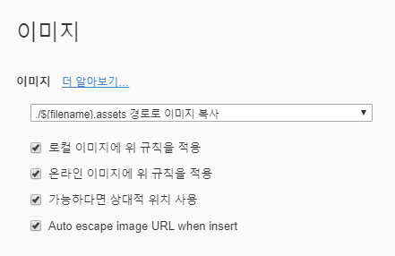
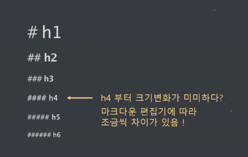
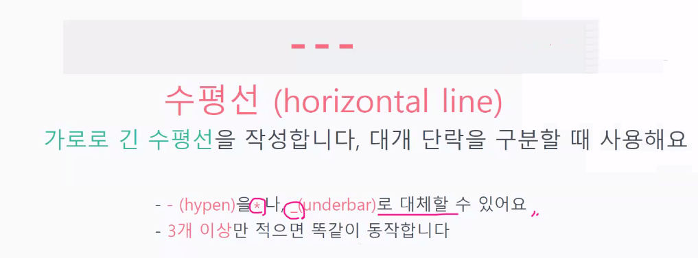
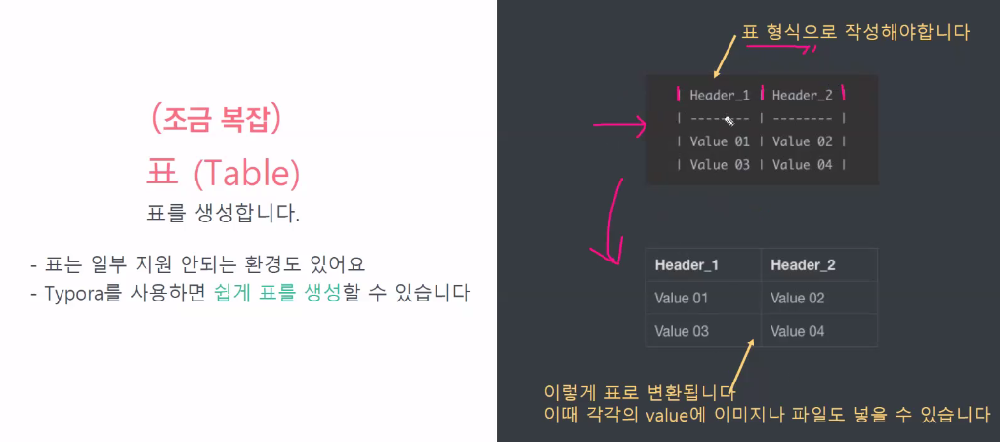
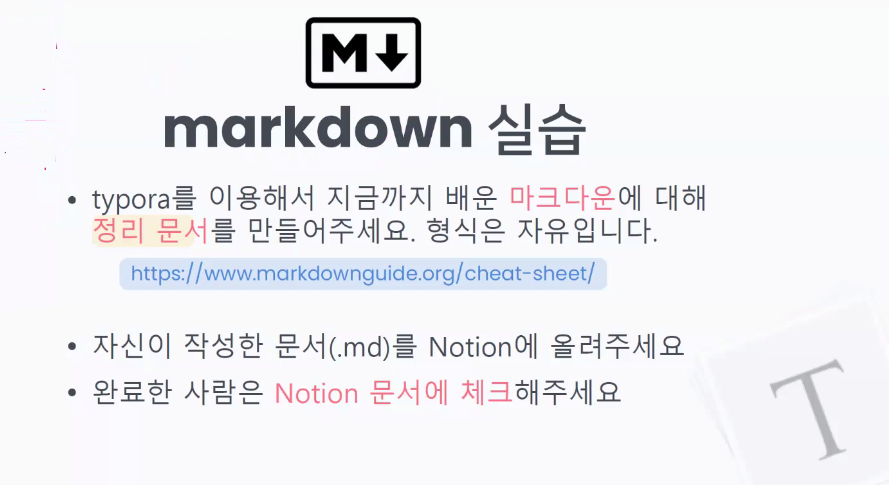

# 20220112_수요일

## 1. 마크다운

- 텍스트 기반의 마크업 문법
- 태그(Tag)와 텍스트로 문서의 구조를 잡아줌

- 텍스트에디터, 웹 환경 등에서 태그를 이용해서 마크다운으로 쓰게 된다.
- [마크다운 가이드](https://www.markdownguide.org/cheat-sheet)


## 2. 타이포라 다운로드 시 유의 사항

- 타이포라 유료화되어, 베타버전으로 사용해야 무료임 (자동 업데이트 적용 X 하기)

- 이미지 경로 설정 주의

  

## 3. 마크다운 태그의 종류

1. 헤딩 : #의 개수에 따라 제목 수준을 구별 (h1~h6)



2. 리스트
   * 순서가 있는 리스트 : 숫자 1, 1)
   
   * 순서가 없는 리스트 : *, -
   
3. Tab <-> Shift Tab


4. 코드 블럭

   1) ` 세 개 = 코드 블럭
   
   Syntax Highlighting이 되는데 ````언어이름`적어주면 그 언어 코드 블럭이 됨
   
   ```python
   def test():
       print("git")
   ```
   
   ```python
   import time
   ```
   
   

​		2) ` 한 개  = 인라인 코드 블럭 (구문 강조를 지원하지 않는다)

​		`dd`


5. string url : [링크이름] (link 주소)

   [구글](https://www.google.com)

* 다른 페이지로 이동하는 링크 삽입
* 다운로드 가능한 링크도 만들 수 있음


6. img url : 

.jpeg)


7. 텍스트 강조


8. 수평선




9. 인용문 : > 

>인용문
>
>> 인용문의 인용문


10. 표 (ctrl + shift + t)




## 4. 마크다운 실습

