# stack (LIFO, 가장 위에서만 삽입 삭제가 가능하다)

* 재귀함수를 처리하기 위해 만들어진 것이 stack

* 웹페이지, 재귀함수일 때도 stack이 사용됨

* stack의 특징은 가장 마지막에 들어간 것이 가장 처음 나옴/ 가장위에서만 데이터의 삽입 , 삭제가 일어남 (두가지만 알면 된다.)

* 재귀함수일때 함수 콜 스택

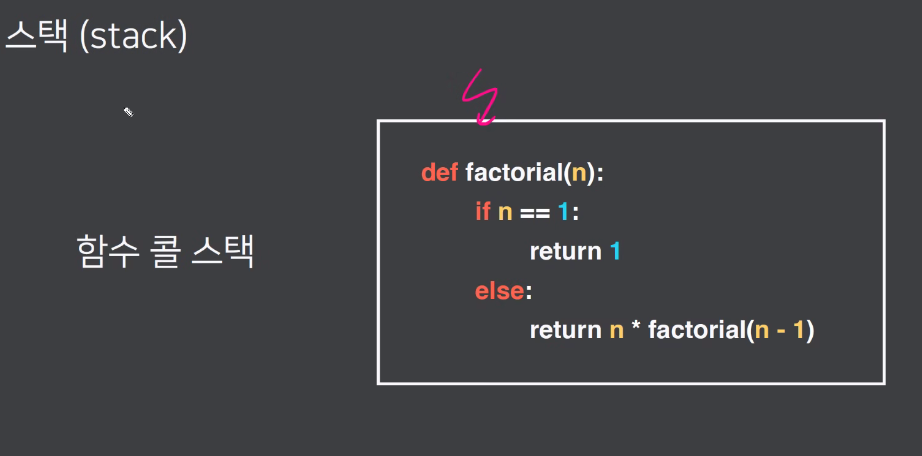

* 가장 먼저 종료되는 함수는 factorial(1)부터 종료됨, 가장 마지막에 호출된 함수부터 종료됨

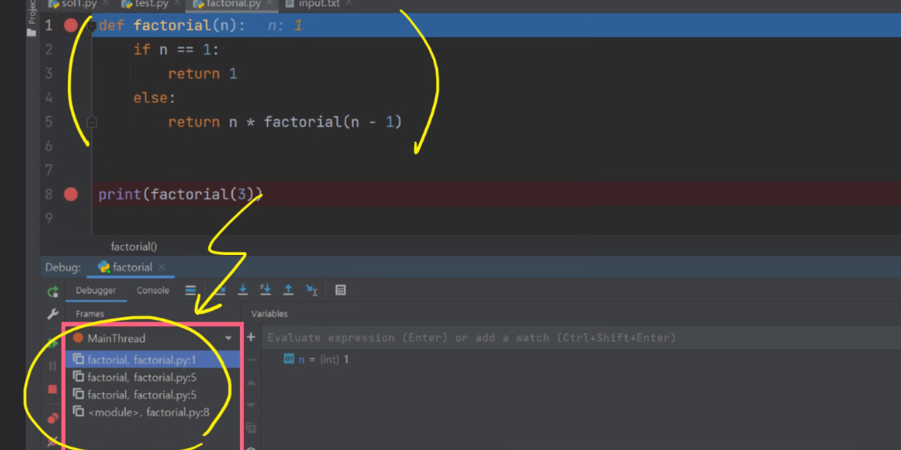

* 디버깅할 때 동그라미 친 부분에 함수 콜스택이 쌓임 

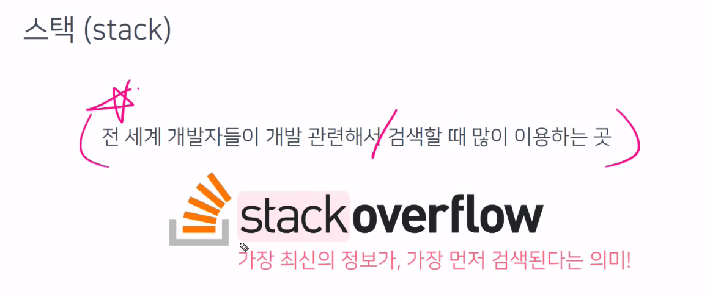

* 스택의 의미

## stack --> ADT (로 표현하자면?) 

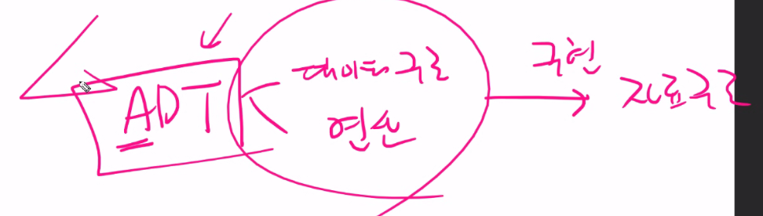

* 데이터 구조와 연산을 구현하면 자료구조가 된다.

1. 스택을 생성할 때 연산과 size가 필요하다
2. 학생들이 pop, peek을 헷갈려함 pop은 제거하는것이고 peek은 접근만 하는 것 (pop은 A를 리턴하고 제거함, peek은 걍 고르기만)

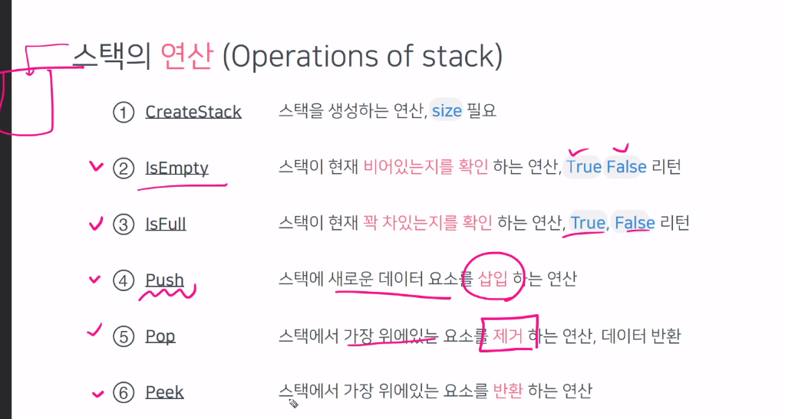

* 스택의 데이터 구조

* top은 일단 -1로 초기화 해둠
* items는 아무것도 없는 걸 사이즈만큼 만들어놓고 push할때마다 top위치로 넣어줌

## 직접 스택을 만들어보자

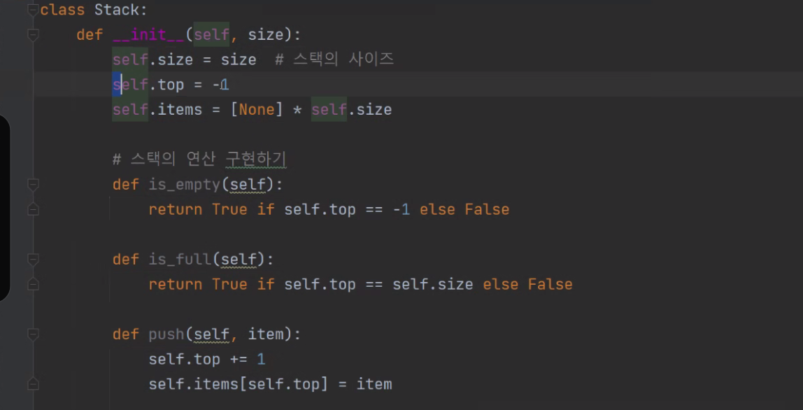

여기서,  다 찼을 때는 에러발생. Exception은 가장 상위 에러. 

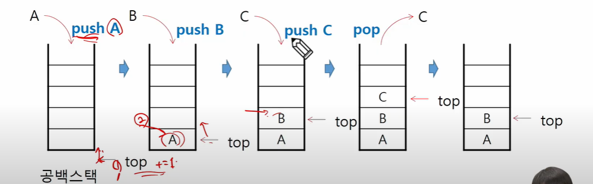

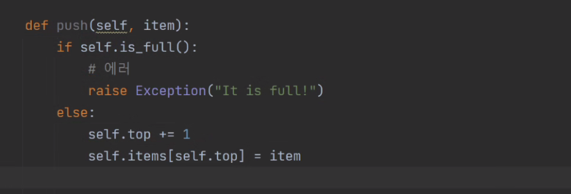

peek 구현 (인덴트는 def랑 맞춰서)

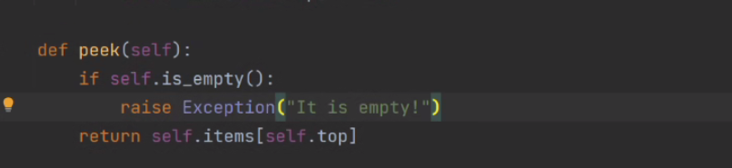

pop

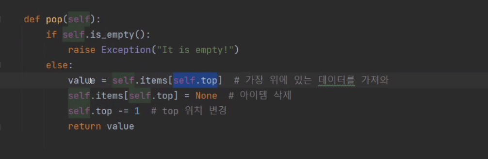

실행

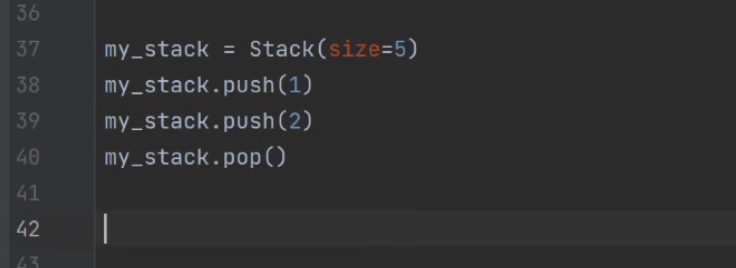

실행하면 1이 남아있음..

프린트를 찍으면 object로 나옴

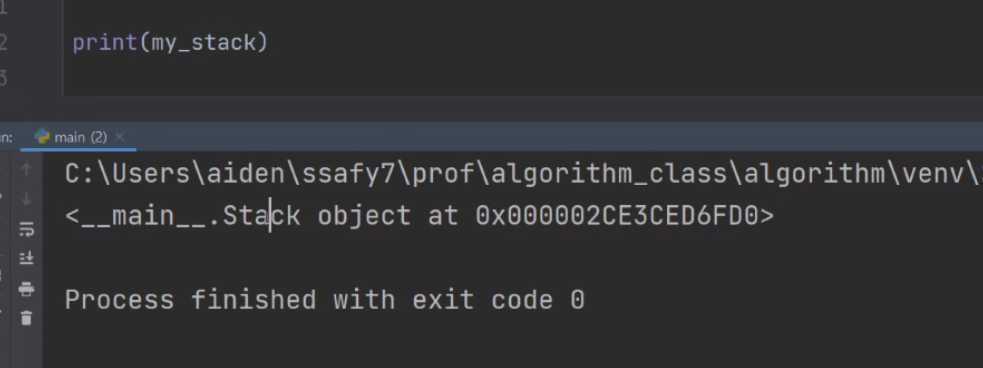

그런데 우리가 원하는건 저 형태가 아니고, 문자로 프린트할것

문자로 표현할 매직매서드 

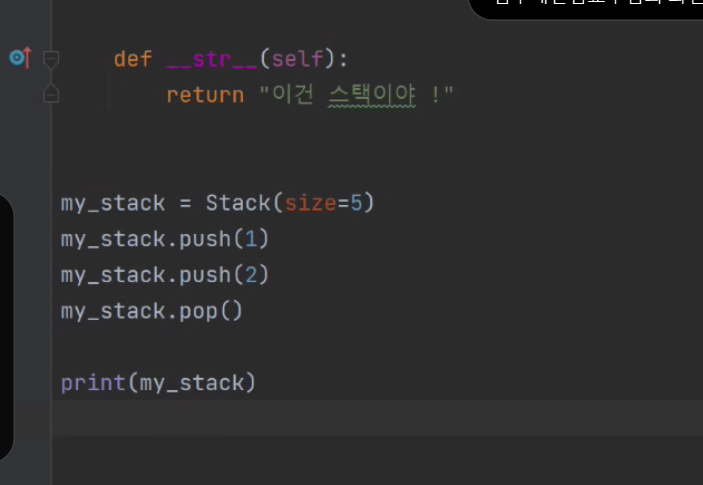

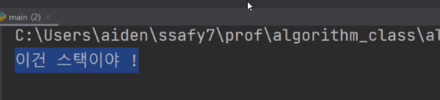

이렇게 나옴

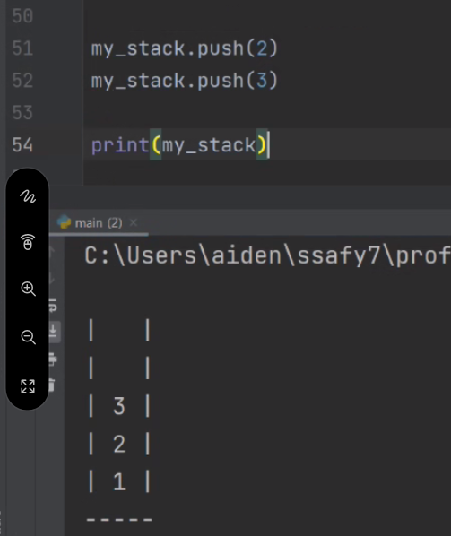

이건 교수님이 만든 코드로 나타낸 것 (이 그림은 알 필요 없음)

--> 파이썬 리스트의 매서드를 사용하면 간단하게 사용가능

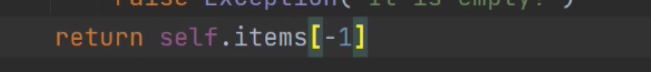

self.top이 아니라 -1을 사용해서 가지고 올 수 있음.

스택은 리스트와는 다른 자료구조이지만 파이썬은 리스트에 스택의 개념이 다 녹아있음.

## append()는 push연산

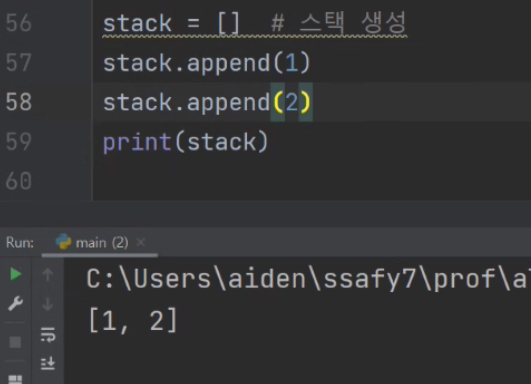

## pop()은 리스트를 알아서 줄여줌

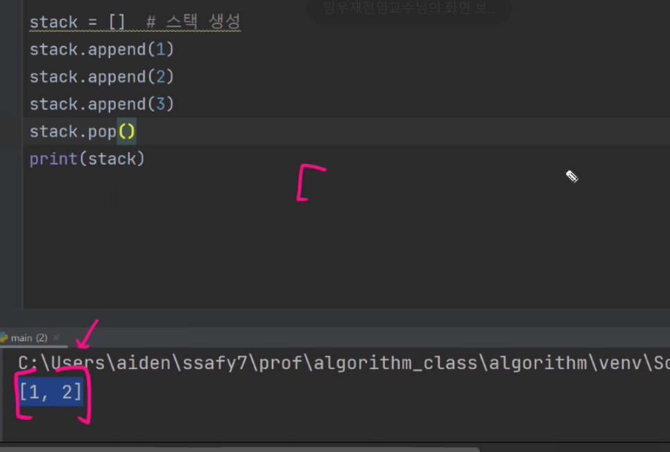

## stack[-1]은 peek (가장 마지막에 있는 것을 가져와)

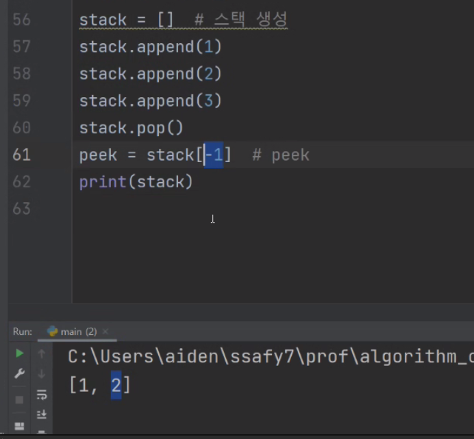

## len(stack) == 0 이라면 is_empty - 파이썬에서는 is_full의 의미가 없음(알아서 늘려주고 줄여주니깐)

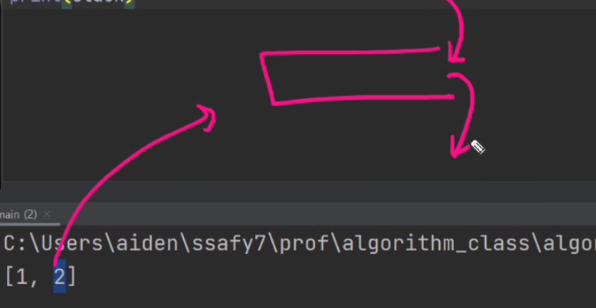

## index() 는 앞에도 넣을 수 있는데요 ? - 스택과 무관한 개념이다.

# 스택의 연산

* push : 아이템 삽입 
* pop : 아이템 삭제
* is_empty
* is_full
* peek : 맨 위에만 가져옴

## 파이썬에서는 list를 이용하면 스택을 사용할 수 있다.

## overflow : 디버깅 용도, 실제로는 상관없는것

* stack의 크기를 너무 작게 잡은것 or push가 너무 많이된 것

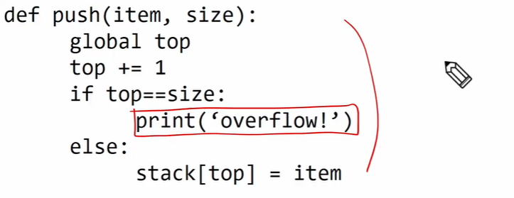

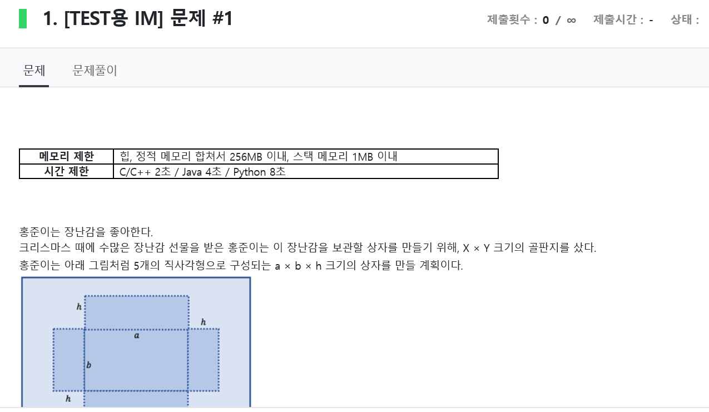

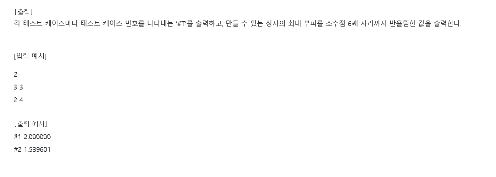

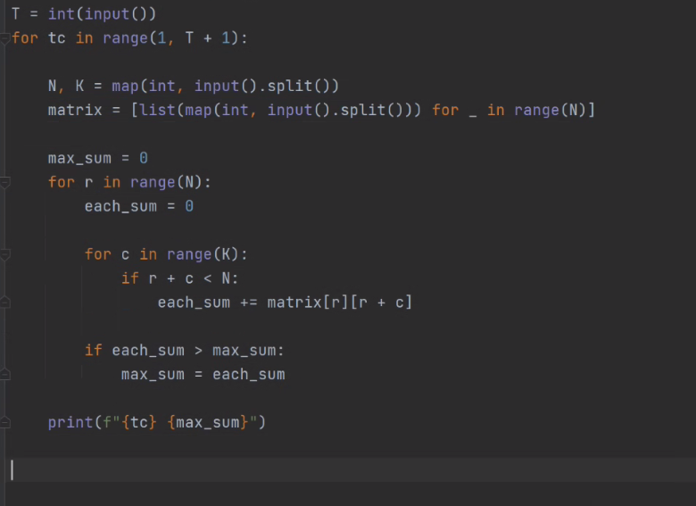

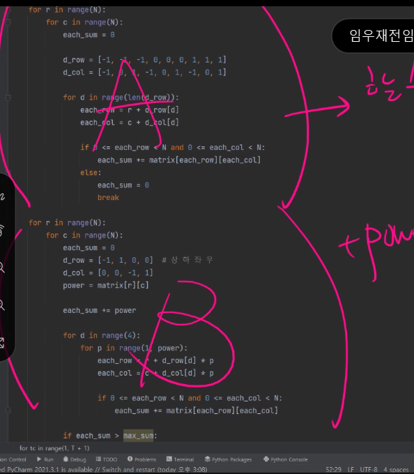

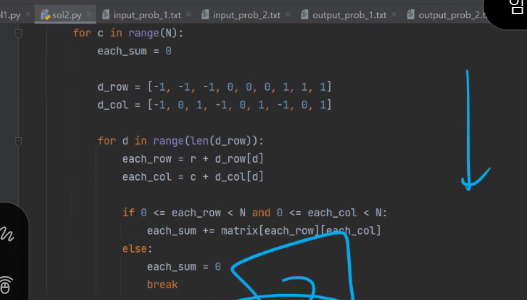

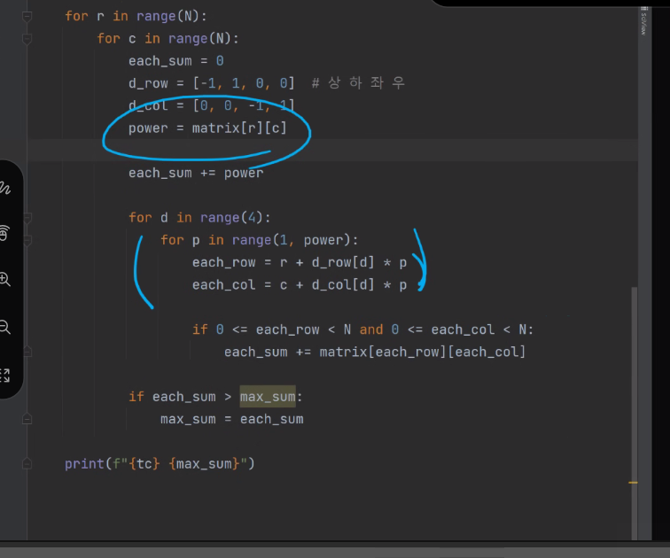