# 03 31 목 

* def bfs()

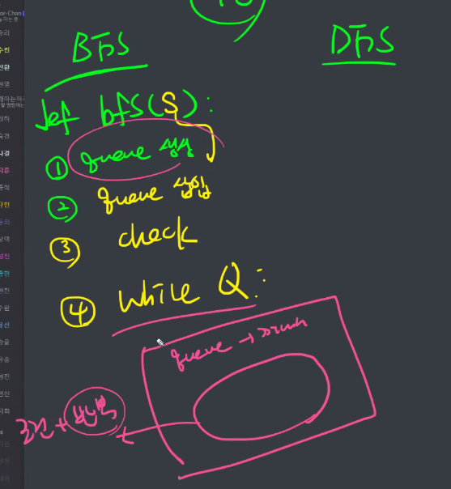

* def dfs() : 재귀
* elsd에서는 모든 경우를 다 넣어야함
* 

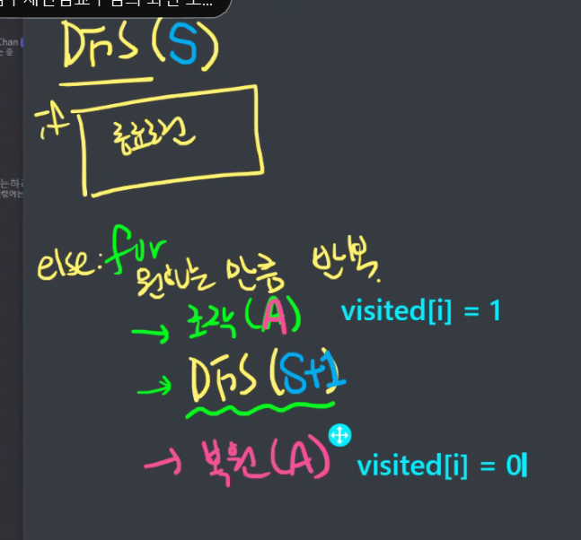

함수로 짜놓고...내가 이해하기 쉽게 바꾸기...

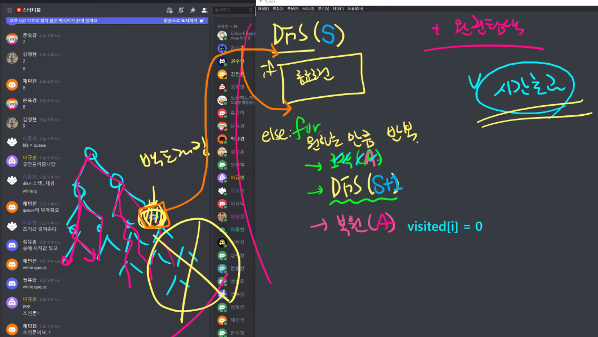

백 트래킹은 어떤 조건이면 아래 가지는 실행하지 말라는 것임 (시간초과 방지)

조건은 if앞이나 뒤에 아무데나..주로 앞에 넣기!

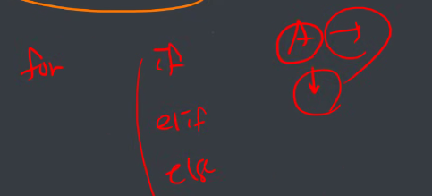

아래와 옆만 간다면 굳이 for를 쓰지않아도되겠구나


https://idea-sketch.tistory.com/29

N-queue?

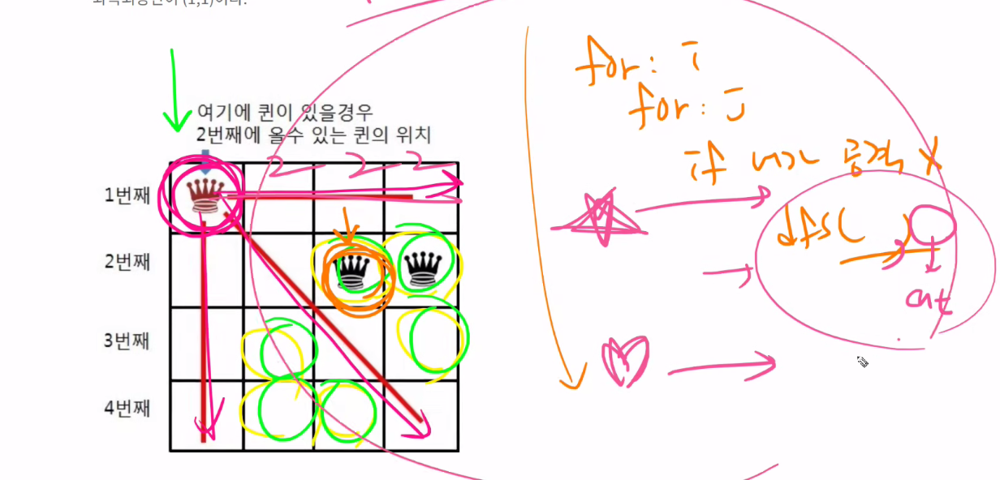

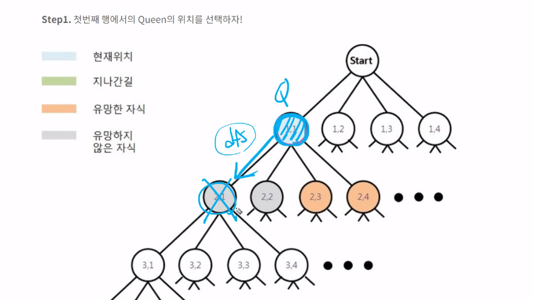


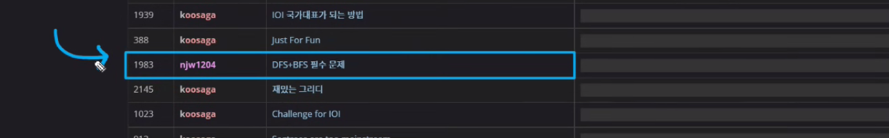

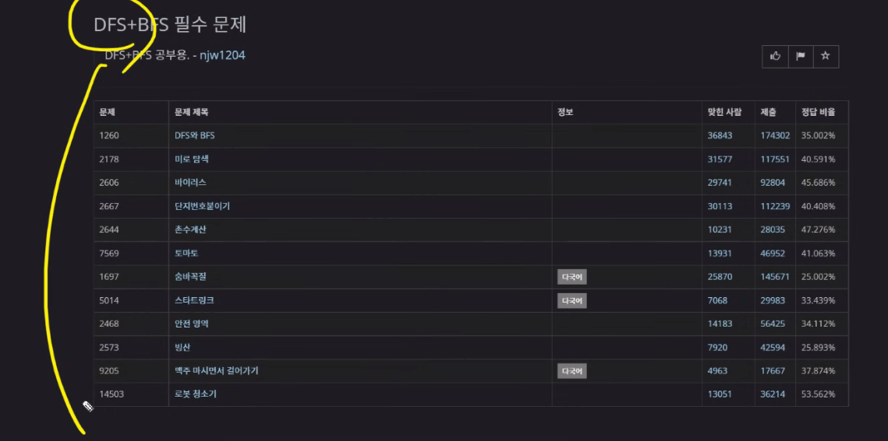


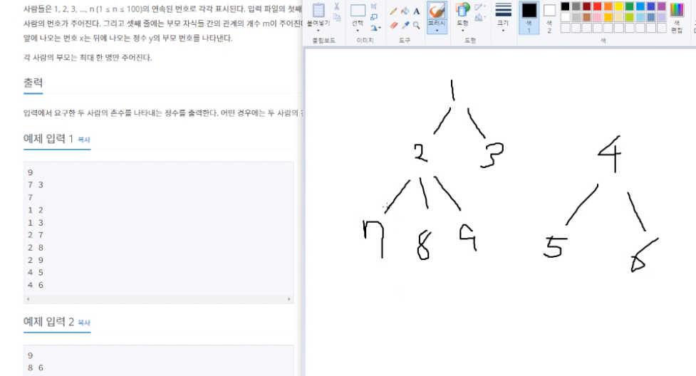

dfs는 최단거리 탐색 보장 , 재귀 , 백트래킹

bfs는 최단거리 탐색 보장 x / 내 노드에서 딴 노드에서 거리를 알고 싶을 때  (대부분의 경우) `거리`는 무조건 bfs

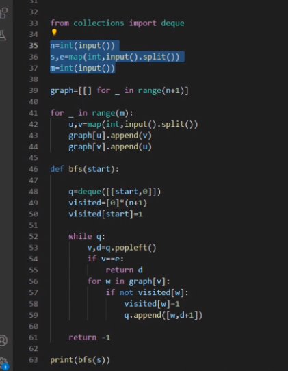


인접 행렬 = 2차원 행렬, 인접 리스트 = 

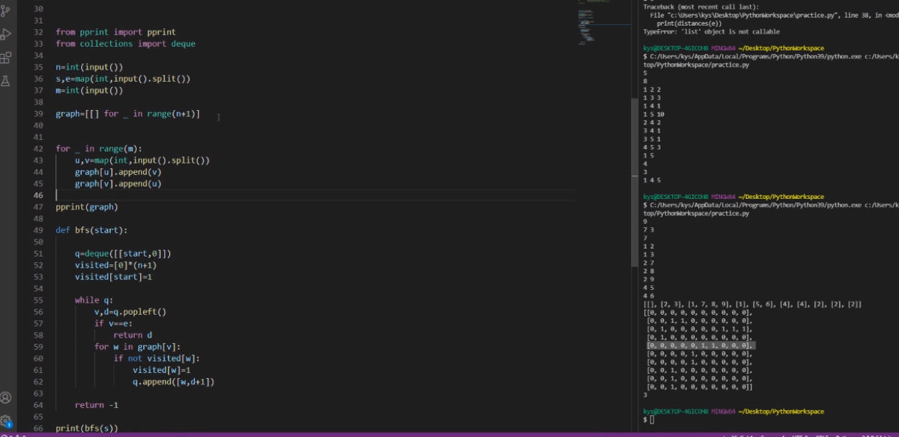

인접 행렬은 메모리 공간이 낭비 되어서 인접리스트가 더 효율이 좋다

``` python

```


dfs 7에서 3으로 가면 7 2 1 10 11 3 순

bfs 7에서 3으로 가면 

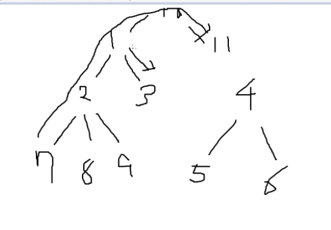

start, 0 --.> start는 시작하는 노드의 번호 / 0은 거리 

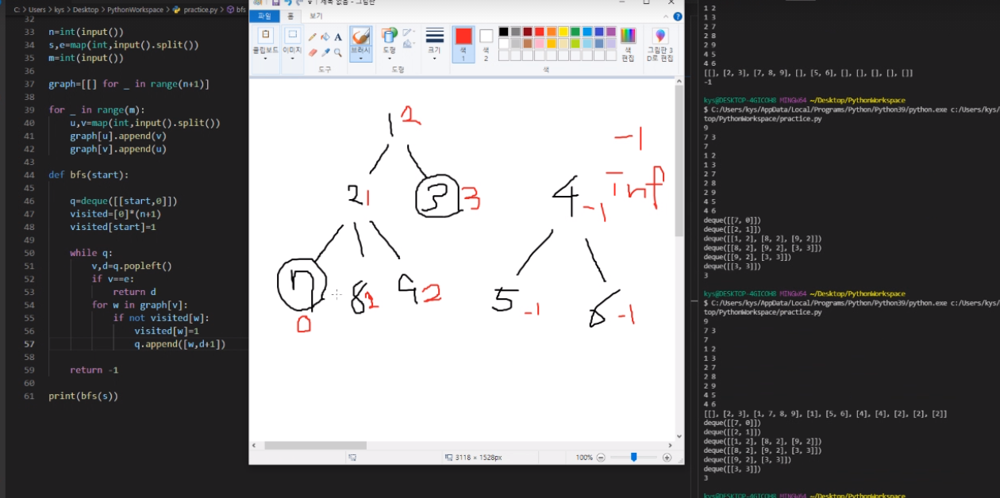


``` python
from collections import deque

n=int(input())
s,e=map(int,input().split())
m=int(input())

graph=[[] for _ in range(n+1)]  # 연결리스트

for _ in range(m):
    u,v=map(int,input().split())
    graph[u].append(v)
    graph[v].append(u)

def bfs(start):

    q=deque([[start,0]])
    visited=[0]*(n+1)
    visited[start]=1

    while q:
        v,d=q.popleft()
        if v==e:
            return d
        for w in graph[v]:
            if not visited[w]:
                visited[w]=1
                q.append([w,d+1])

    return -1

print(bfs(s))
```


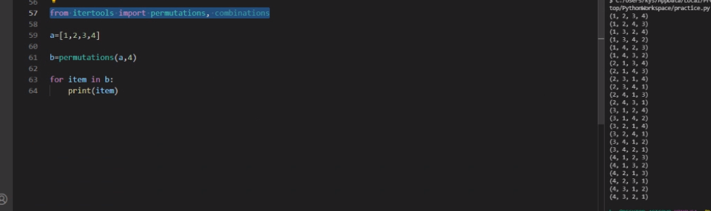

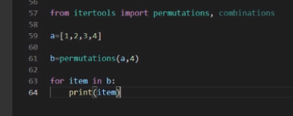

> 전자카트

``` python
from itertools import permutations

T=int(input())

for t in range(1,T+1):
    N=int(input())
    numbers=[]

    for _ in range(N):
        numbers.append(list(map(int,input().split())))

    a=[i for i in range(1,N)]
    order=permutations(a,N-1)

    ans=99999999999999999999999
    for o in order:
        tmp=0
        for i in range(N-2):
            tmp+=numbers[o[i]][o[i+1]]
        tmp+=numbers[0][o[0]]
        tmp+=numbers[o[-1]][0]

        if ans>tmp:
            ans=tmp

    print(f'#{t} {ans}')
```


> 5205_퀵정렬

```python

```


> 2번

```python
def powerset(k, sum_num):
    global cnt
    cnt += 1
    if sum_num > 10:  # 가지치기
        return
    if k == n:  # 목표도달
        if sum_num == 10:
            for i in range(n):
                if visited[i]:
                    print(arr[i], end=" ")
            print()
        return

    else:
        visited[k] = 1
        powerset(k + 1, sum_num + arr[k])
        visited[k] = 0
        powerset(k + 1, sum_num)


arr = [1, 2, 3, 4, 5, 6, 7, 8, 9, 10]
n = len(arr)
cnt = 0
visited = [0] * n
powerset(0, 0)
```


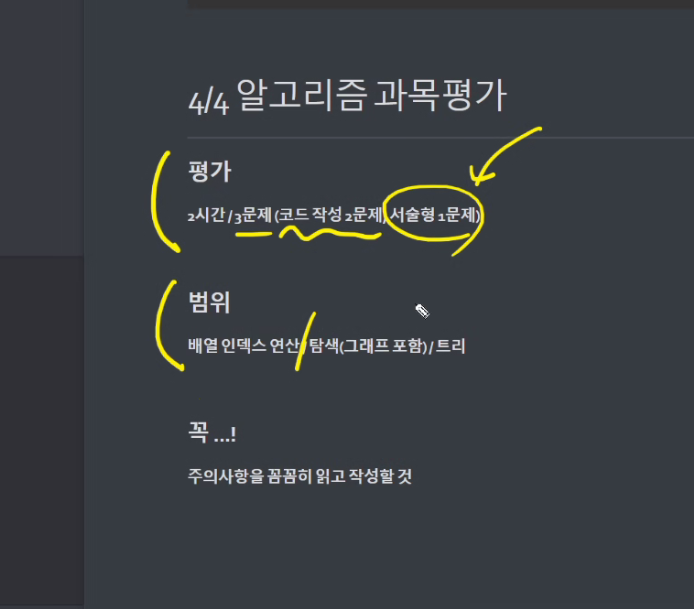