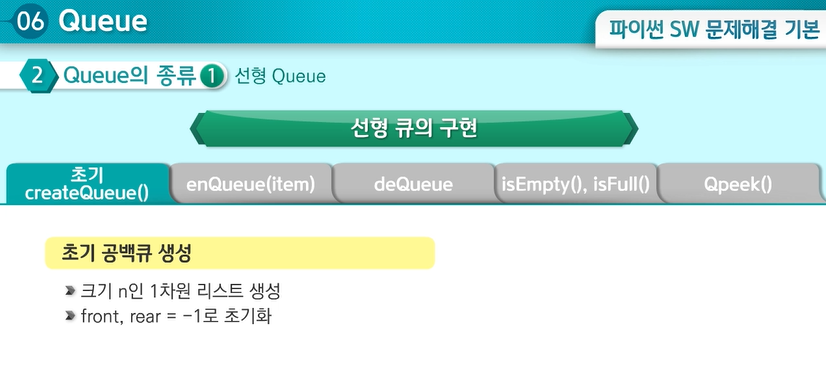

# Queue

| Title           | Directory         | 비고  |
| --------------- | ----------------- | ----- |
| 5097_회전       | `5097_회전`       | learn |
| 5102_노드의거리 | `5102_노드의거리` | learn |
| 5105_미로의거리 | `5105_미로의거리` | learn |
| 5099_피자굽기   | `5099_피자굽기`   | learn |
| 1226_미로1      | `1226_미로1`      | HW    |

## [Learn Course](https://swexpertacademy.com/main/learn/course/subjectDetail.do?courseId=AVuPDN86AAXw5UW6&subjectId=AWOVIoJqqfYDFAWg)

## [HomeWork - 1226 미로1](https://swexpertacademy.com/main/code/problem/problemDetail.do?contestProbId=AV14vXUqAGMCFAYD&categoryId=AV14vXUqAGMCFAYD&categoryType=CODE&problemTitle=%EB%AF%B8%EB%A1%9C&orderBy=FIRST_REG_DATETIME&selectCodeLang=ALL&select-1=&pageSize=10&pageIndex=1)

## Queue : 선입선출

* front = rear 라면 큐가 비어있다고 판단할 수 있음
* 큐의 기본 연산 과정

* 큐의 종류

### 선형 큐

* Qpeek() : 가장 앞에 있는 원소를 검색하여 반환
  * front+1에 있는 원소 반환
  * 주의할 점은 front의 값이 변경되지 않아야 한다.

* 선형 큐의 문제점
  * 리스트의 크기를 동적으로 바꾸지 않고 고정하면 사용할 큐의 크기만큼을 미리 확보해야 하는데 메모리의 낭비가 발생할 수 있음

### 원형큐

* 원형큐의 기본 연산 과정

* 구현
  * 크기 n인 1차원 리스트 생성 후 front, rear = 0으로 초기화
  * 

* 파이썬의 리스트 특성을 사용한 큐

### 연결 큐 = 연결 리스트

### BFS : 너비 우선 탐색

* 탐색 순서 : A B C D E F G H I

* visited 리스트, queue

5097. [파이썬 S/W 문제해결 기본] 6일차 - 회전

5105. [파이썬 S/W 문제해결 기본] 6일차 - 미로의 거리

## 꿀팁

A형 꿀팁 :모의라고 치면 비슷한거 많이 나옴

백준 

https://www.acmicpc.net/workbook/view/1152

큐