# CT

논리를 이산수학을 통해 배울 수 있다.

현실의 문제를 모델링하고 프로그램으로 옮기면, 더이상 연속이 아닌 이산적인 존재로 써야함

- 추상화 및 모델링

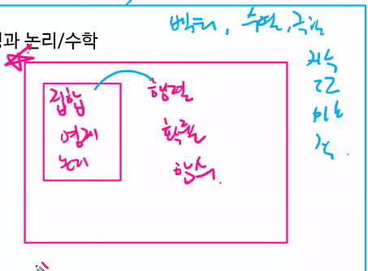

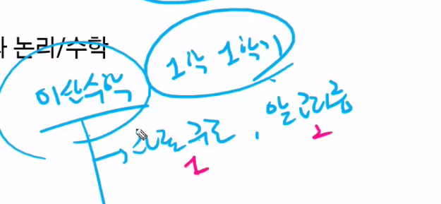

이산 수학을 배워야 자료구조, 알고리즘을 배울 수 있음

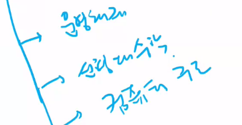

## 재귀와 동적 프로그래밍에 집중

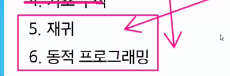

* 카드

D가 나오면 주장이 틀려서 확인해봐야해요

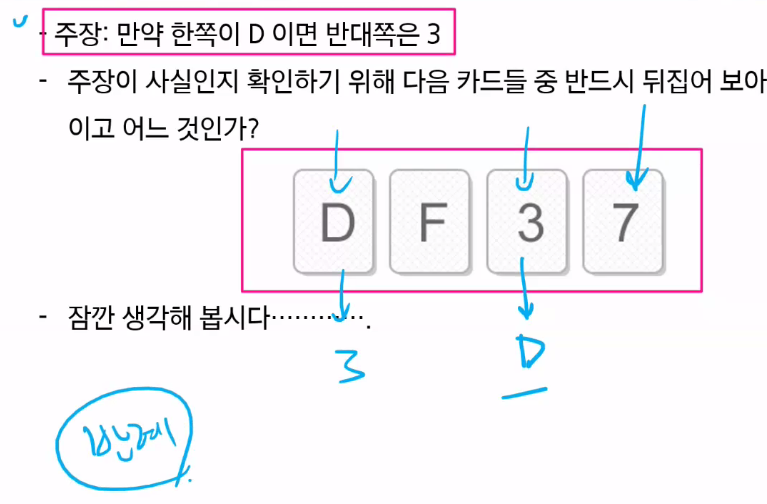

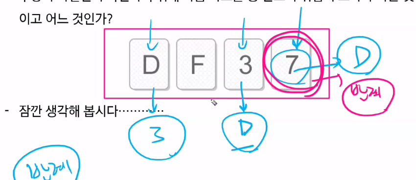

명제는 참 거짓을 판별할 수 있는 문장

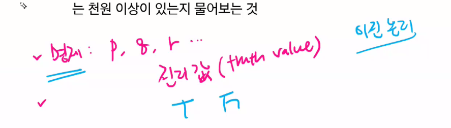

논리는 참과 거짓을 판별할 수 있는 법칙

### 이 세개는 꼭 알기

* 부정
  * 낫같이 생긴 not
* 논리합
* 논리곱

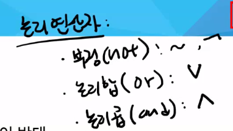

논리합 : V 

논리곱 : and

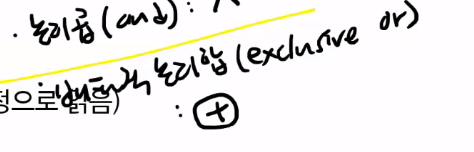

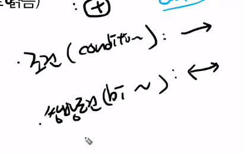

nand, nor도 있음

#### 진리표

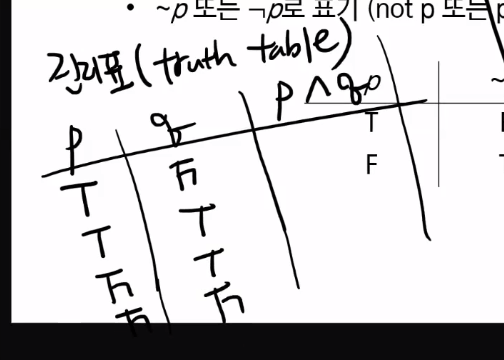

#### 배타적 논리합 (익스클루시브 오아)

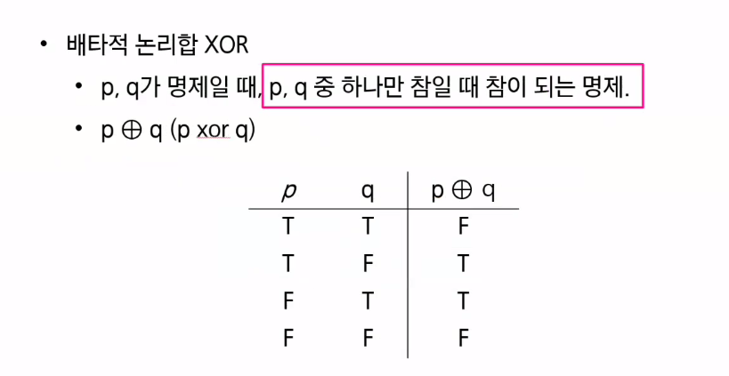

#### 거짓을 가정하고 시작하면, 결론은 항상 참

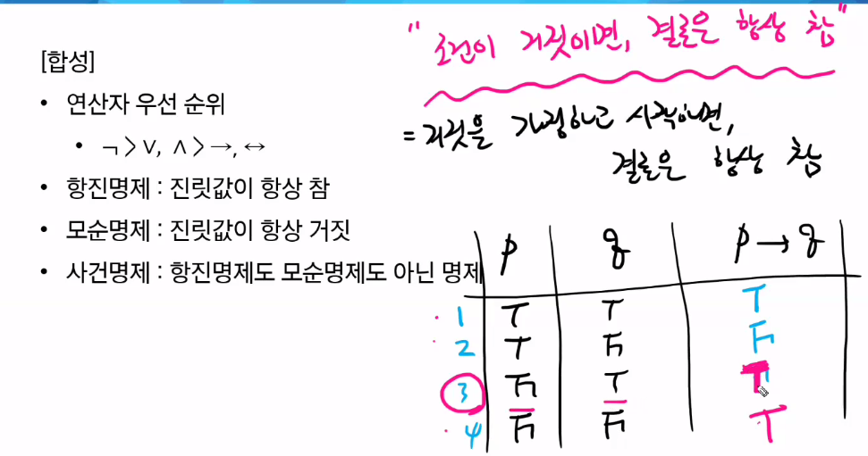

서울4반이 아니면 서울4반이다. (넌센스..모순)

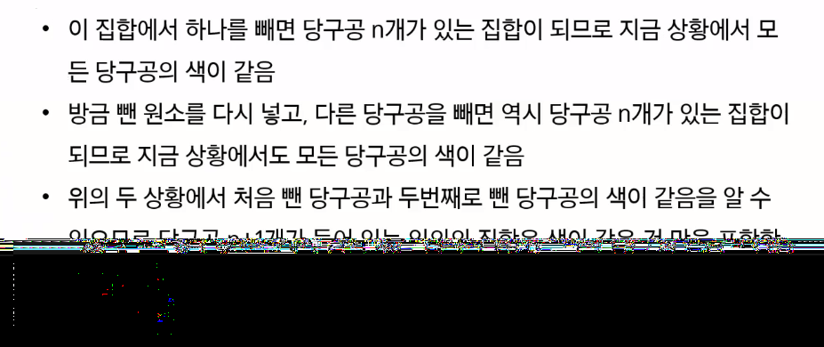

여기서 n=1이면 처음뺀당구공과 두번째로뺀 당구공의 색이 같음이 보장 안돼서 틀립니당

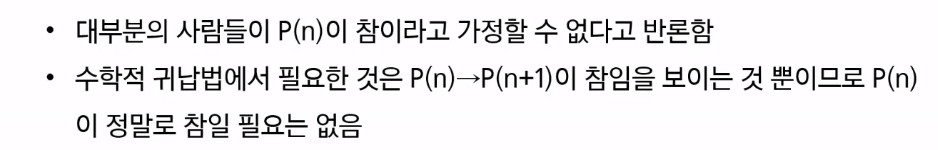

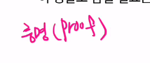

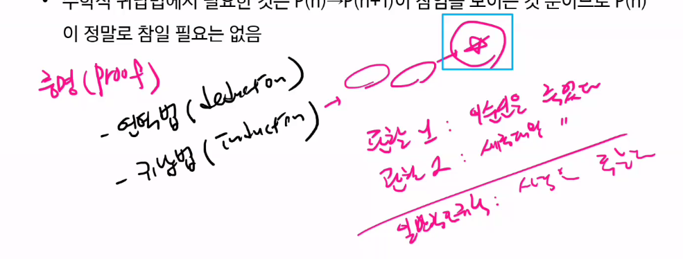

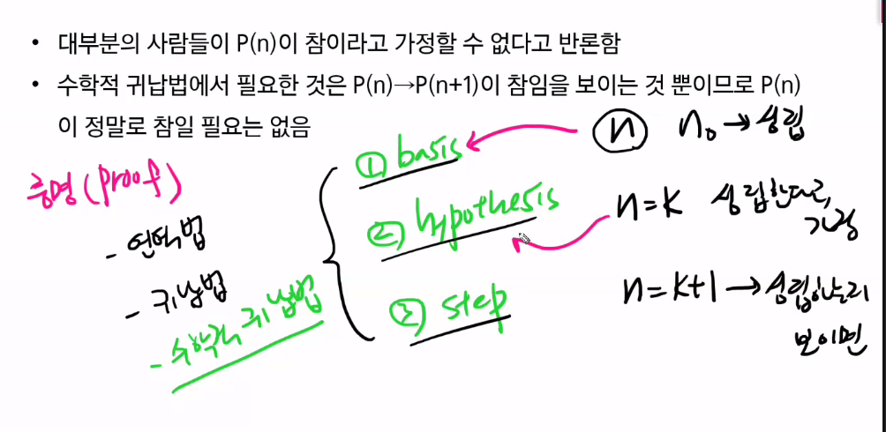

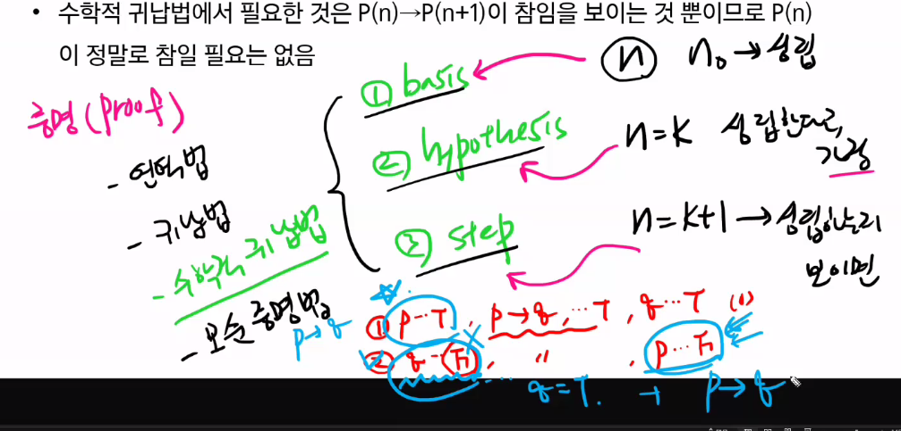

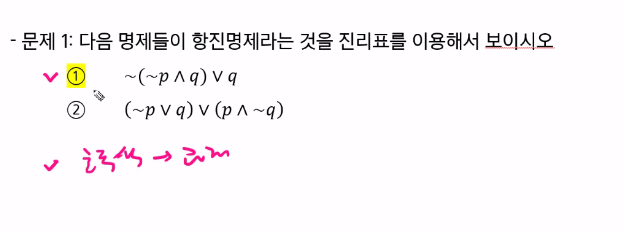노란색 다알기

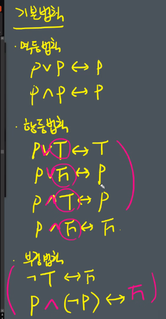

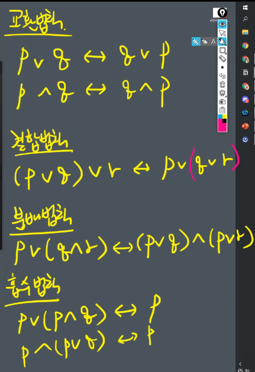

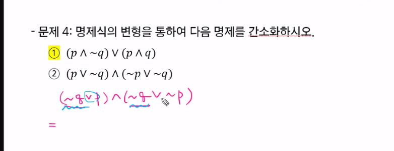

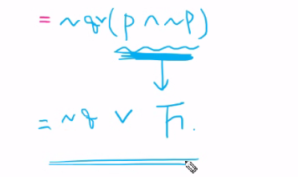

2번은 항상 ~q가 됨

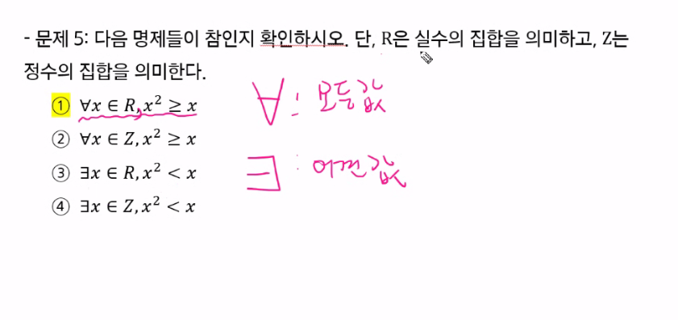

모든 실수R에 대해 콤마 뒤를 만족하느냐?

반례를 찾는게 더 빠름 (증명 보다) 

1번 참 2번 참 

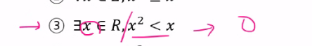

3번(어떤 실수 x가 저걸 만족해?) 참  (예:0.5?

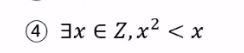

4번 (어떤 정수에 대해서 자기보다 작아지는 애가 존재해?) 거짓

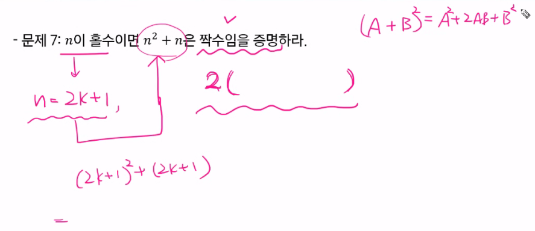

마지막 거를 싹 다 풀어서

이거를 2(               ) 형태를 만들어라가 증명

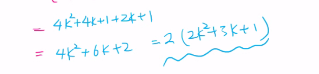

그래서 n이 홀수이면 2(      ) 형태가 되니짝수

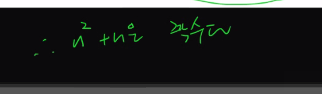

이걸 써야함

---

홈워크

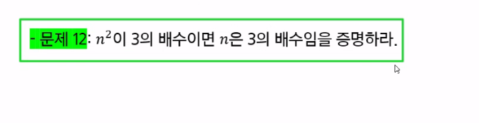