# 0418 월요일

## [목차]

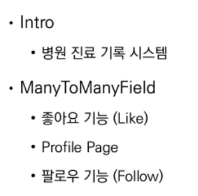


## 1. Intro 병원 진료 기록 시스템 (모델링이 중요하다.)

* 환자와 의사가 사용하는 병원 진료 기록 시스템 구축할 것임
* 병원 시스템에서 

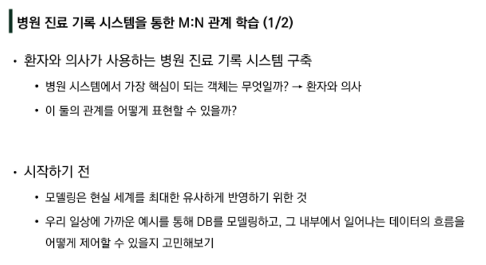

* ppt상의 url로 다운받기 

* 의사와 환자가 1:N관계를 가짐 

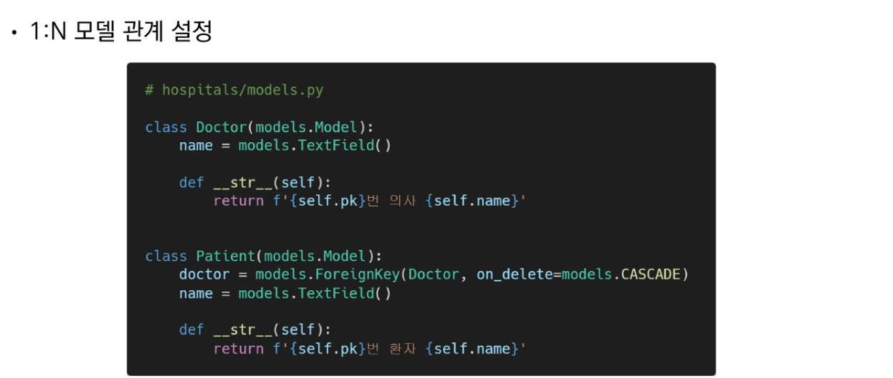

---

## 2. 병원 진료 기록 시스템 프로젝트 진행 - 1:N관계

* 가상환경 설정

``` bash
star3@starmoon MINGW64 ~/OneDrive/바탕 화면/TIL/Django/99_mtm_practice (master)
$  python -m venv venv

star3@starmoon MINGW64 ~/OneDrive/바탕 화면/TIL/Django/99_mtm_practice (master)
$ source venv/Scripts/activate
(venv) 
```

* 패키지 설치

``` bash
star3@starmoon MINGW64 ~/OneDrive/바탕 화면/TIL/Django/99_mtm_practice (master)
$ pip install -r requirements.txt
```

* migrations, migrate, shell 실행

``` bash
$ python manage.py makemigrations
$ python manage.py migrate
$ python manage.py shell_plus
```

* 의사 2명과 환자 2명 생성

``` shell
Python 3.9.9 (tags/v3.9.9:ccb0e6a, Nov 15 2021, 18:08:50) [MSC v.1929 64 bit (AMD64)]
Type 'copyright', 'credits' or 'license' for more information
IPython 7.27.0 -- An enhanced Interactive Python. Type '?' for help.

In [1]: doctor1 = Doctor.objects.create(name='justin')

In [2]: doctor2 = Doctor.objects.create(name='eric')

In [3]: patient1 = Patient.objects.create(name='tony', doctor=doctor1)

In [4]: patient2 = Patient.objects.create(name='harry', doctor=doctor2)

In [5]: doctor1
Out[5]: <Doctor: 1번 의사 justin>

In [6]: doctor2
Out[6]: <Doctor: 2번 의사 eric>

In [7]: patient1
Out[7]: <Patient: 1번 환자 tony>

In [8]: patient2
Out[8]: <Patient: 2번 환자 harry>
```

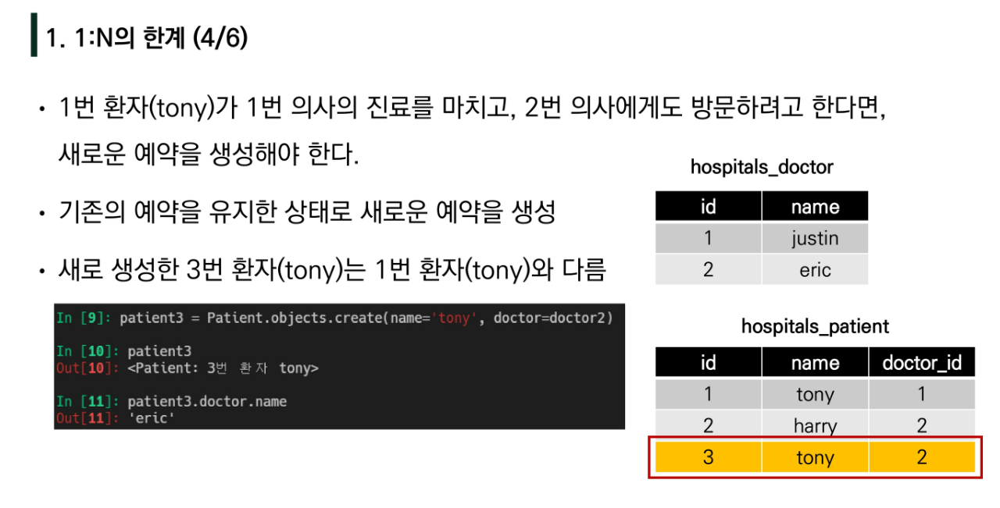

``` shell
# 한 환자가 두명의 의사에게 진료를 받을 때는, 새로운 인스턴스를 생성해서 진료를 받을 수 밖에 없고
In [9]: patient3 = Patient.objects.create(name='tony', doctor=doctor2)

In [10]: patient3
Out[10]: <Patient: 3번 환자 tony>

# 한 환자가 두명의 의사한테 받겠다고 한다면 에러가 날 수 밖에 없음 (1:N 관계의 한계)
In [11]: patient4 = Patient.objects.create(name='harry', doctor=doctor1, doctor2)
  File "<ipython-input-11-6edaf3ffb4e6>", line 1
    patient4 = Patient.objects.create(name='harry', doctor=doctor1, doctor2)
                                                                           ^
SyntaxError: positional argument follows keyword argument
```

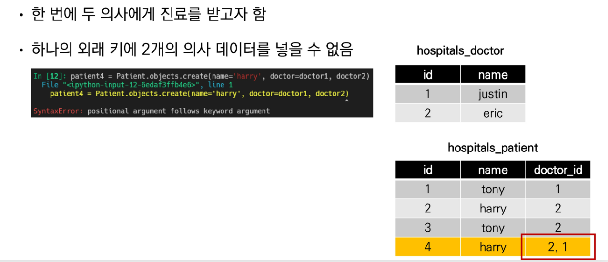


---

## 3. 병원 진료 기록 시스템 프로젝트 진행 - 중개 모델

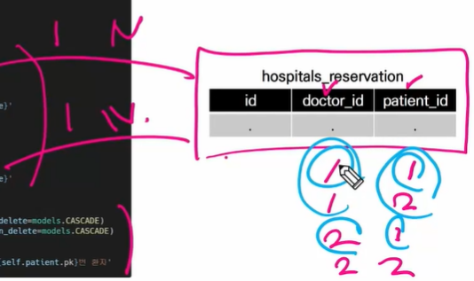


* 데이터 베이스 초기화

1. 설계도 지우기 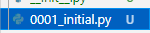
2. 데이터 베이스 지우기  (shell 나가서 지우기)

3. models.py 갈아끼우기

``` python
# sample_code ex_2.py
from django.db import models


class Doctor(models.Model):
    name = models.TextField()

    def __str__(self):
        return f'{self.pk}번 의사 {self.name}'


# 외래키 삭제
class Patient(models.Model):
    name = models.TextField()

    def __str__(self):
        return f'{self.pk}번 환자 {self.name}'

# 중개모델 작성
class Reservation(models.Model):
    doctor = models.ForeignKey(Doctor, on_delete=models.CASCADE)
    patient = models.ForeignKey(Patient, on_delete=models.CASCADE)

    def __str__(self):
        return f'{self.doctor_id}번 의사의 {self.patient_id}번 환자'
```

4. migrations, migrate, shell 실행

``` bash
$ python manage.py makemigrations
Migrations for 'hospitals':
  hospitals\migrations\0001_initial.py
    - Create model Doctor
    - Create model Patient
    - Create model Reservation
(venv) 

$ python manage.py migrate
$ python manage.py shell_plus
```

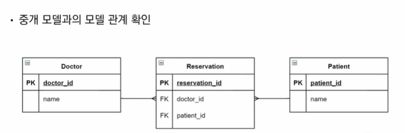

``` shell
In [1]: doctor1 = Doctor.objects.create(name='justin')

In [2]: patient1 = Patient.objects.create(name='tony')

In [3]: Reservation.objects.create(doctor=doctor1, patient=patient1)
Out[3]: <Reservation: 1번 의사의 1번 환자>

# 역참조
In [4]: doctor1.reservation_set.all()
Out[4]: <QuerySet [<Reservation: 1번 의사의 1번 환자>]>

# 역참조
In [5]: patient1.reservation_set.all()
Out[5]: <QuerySet [<Reservation: 1번 의사의 1번 환자>]>

In [6]: patient2 = Patient.objects.create(name='harry')

In [7]: Reservation.objects.create(doctor=doctor1, patient=patient2)
Out[7]: <Reservation: 1번 의사의 2번 환자>

# 두 명이 됨
In [8]: doctor1.reservation_set.all()
Out[8]: <QuerySet [<Reservation: 1번 의사의 1번 환자>, <Reservation: 1번 의사의 2번 환자>]>

# 쿼리셋의 데이터를 반복문을 통해 출력할 수 있음
In [9]: for reservation in doctor1.reservation_set.all():
   ...:     print(reservation.patient.name)
   ...:
tony
harry
```

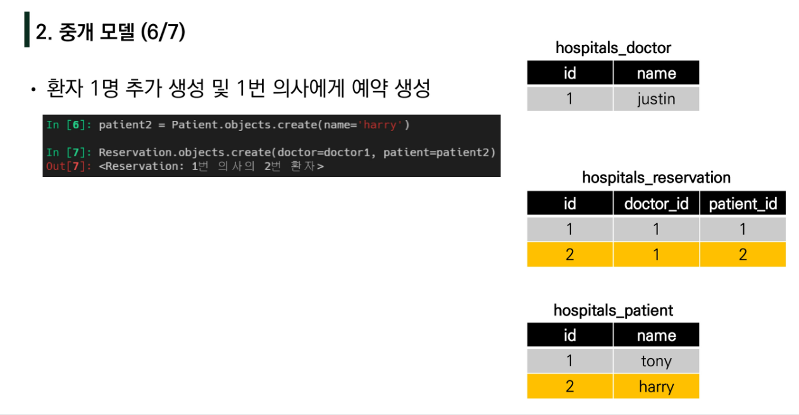

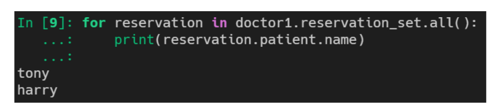


## 3. ManyToManyField를 작성 (ex_3.py)

* ManyToManyField를 작성하면 중개 모델이 필요가 없어진다

* 데이터 베이스 초기화

1. 설계도 지우기 
2. 데이터 베이스 지우기  (shell 나가서 지우기)

3. models.py 갈아끼우기

``` python
# ex_3.py
from django.db import models


class Doctor(models.Model):
    name = models.TextField()

    def __str__(self):
        return f'{self.pk}번 의사 {self.name}'


class Patient(models.Model):
    # ManyToManyField 작성
    doctors = models.ManyToManyField(Doctor)
    name = models.TextField()

    def __str__(self):
        return f'{self.pk}번 환자 {self.name}'
```

4. shell 키기 

``` bash
star3@starmoon MINGW64 ~/OneDrive/바탕 화면/TIL/Django/99_mtm_practice (master)
$ python manage.py shell_plus
```

5.db 이름 바뀐 거 확인

	* 1:N관계에서 외래키를 작성하면, 테이블에 물리적인 외래키가 생겼었음

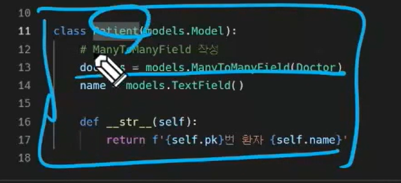

 * M:N을 맺는 둘은 아무런 변화가 없지만, 테이블이 새로 생긴다.
 * 2번과 동일한데, 클래스 작성을 하나 빼고 ManyToManyField가 대신 해줌


* 생각해볼 것
  * Patient클래스의 doctors변수를 Doctor클래스에 써도 될까? 상관없음
  * 그러나 테이블 명이나, 필드명은 순서가 바뀔 수 있음

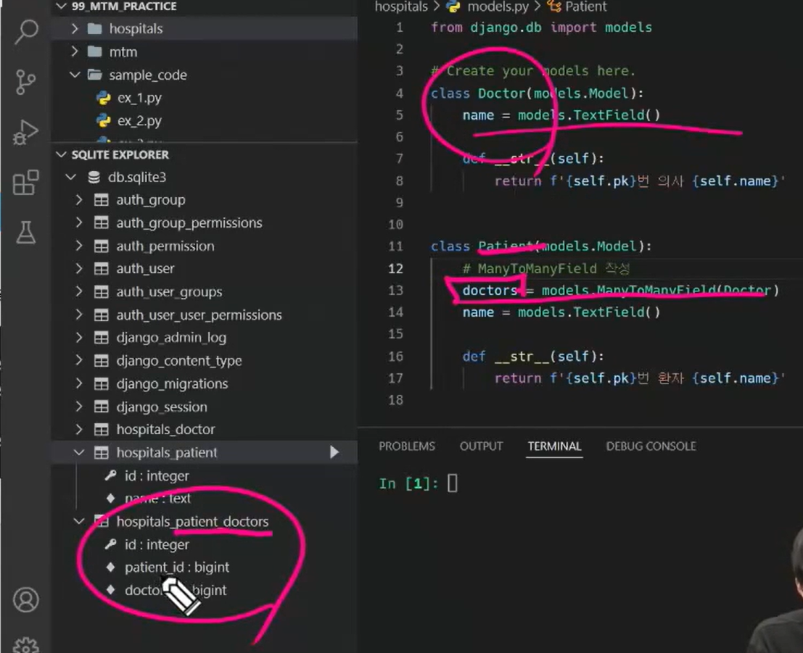

		* 그러나 달라지는 점은 아까와 달리, 역참조 관계가 생긴다는 것, but 결과는 같음

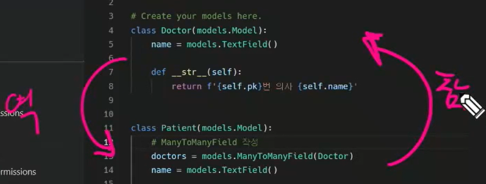

* ​	

``` shell
In [1]: doctor1 = Doctor.objects.create(name='justin')

In [2]: patient1 = Patient.objects.create(name='tony')

In [3]: patient2 = Patient.objects.create(name='harry')

# 다대다 관계에서 사용하는 add메소드
In [4]: patient1.doctors.add(doctor1)

In [5]: patient1.doctors.all()
Out[5]: <QuerySet [<Doctor: 1번 의사 justin>]>

In [6]: doctor1.patient_set.all()
Out[6]: <QuerySet [<Patient: 1번 환자 tony>]>

# 의사입장에서 추가
In [7]: doctor1.patient_set.add(patient2)

In [8]: doctor1.patient_set.all()
Out[8]: <QuerySet [<Patient: 1번 환자 tony>, <Patient: 2번 환자 harry>]>

In [9]: patient2.doctors.all()
Out[9]: <QuerySet [<Doctor: 1번 의사 justin>]>

In [10]: patient1.doctors.all()
Out[10]: <QuerySet [<Doctor: 1번 의사 justin>]>

# 의사입장에서 지우기
In [11]: doctor1.patient_set.remove(patient1)

In [12]: doctor1.patient_set.all()
Out[12]: <QuerySet [<Patient: 2번 환자 harry>]>

In [13]: patient1.doctors.all()
Out[13]: <QuerySet []>
```

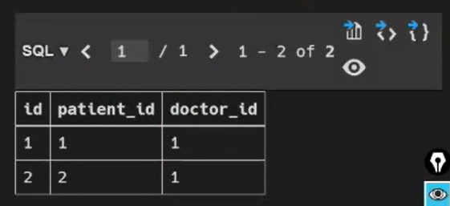

``` shell
In [16]: patient2.doctors.remove(doctor1)

In [17]: patient2.doctors.all()
Out[17]: <QuerySet []>

In [18]: doctor1.patient_set.all()
Out[18]: <QuerySet []>
```

* 다대다에서는 복수형으로 변수를 써서 구별해준다.

* 그리고 이 부분은 ManyToManyField가 Doctor클래스에 있을 경우

  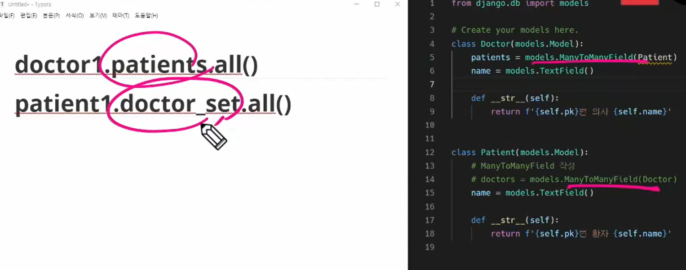


## 역참조시에 사용하는 manager이름 설정 (related_name)

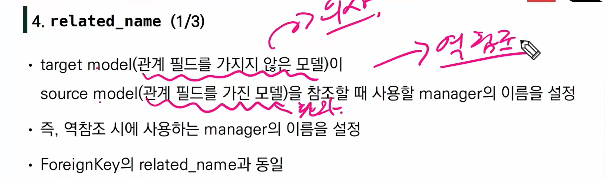

---

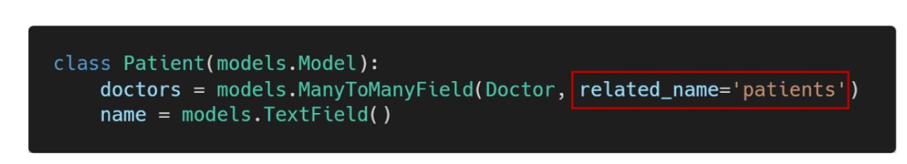

``` python
from django.db import models


class Doctor(models.Model):
    name = models.TextField()

    def __str__(self):
        return f'{self.pk}번 의사 {self.name}'


class Patient(models.Model):
    # ManyToManyField 작성
    doctors = models.ManyToManyField(Doctor, related_name='patients')
    name = models.TextField()

    def __str__(self):
        return f'{self.pk}번 환자 {self.name}'
```

* 이후에 다시 makgemigrations, migrate, shell_plus를 하고 

``` shell
In [2]: doctor1 = Doctor.objects.get(pk=1)

In [3]: doctor1
Out[3]: <Doctor: 1번 의사 justin>

#이제는 _set 사용못함
In [4]: doctor1.patient_set.all()
---------------------------------------------------------------------------
AttributeError                            Traceback (most recent call last)
<ipython-input-4-e81b89c43a95> in <module>
----> 1 doctor1.patient_set.all()

AttributeError: 'Doctor' object has no attribute 'patient_set'

# 내가 새롭게 설정한 것으로 참조
In [5]: doctor1.patients.all()
Out[5]: <QuerySet []>
```

* 다대다 관계에서는 이렇게 바뀜

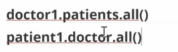

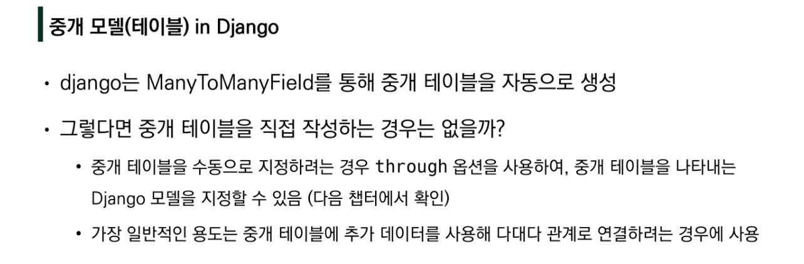

* 다대다필드의 단점
  * pk, 외래키1, 외래키2만 사용가능함
  * 예약자체는 가능한데, 몇시나 무슨증상이나 하는 것은 추가 불가능 (따로 해줘야함)


# ManyToManyField's

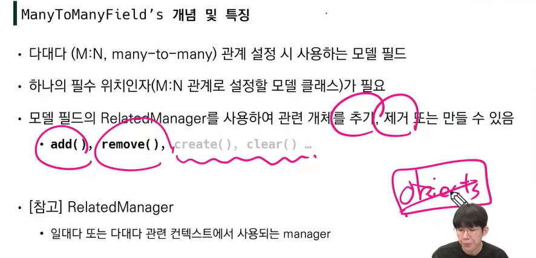

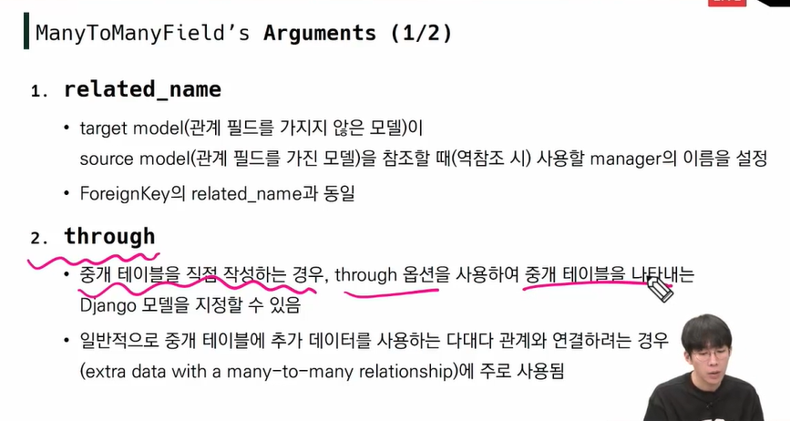

 through : 다대다관계에서 추가 데이터 사용하는 경우

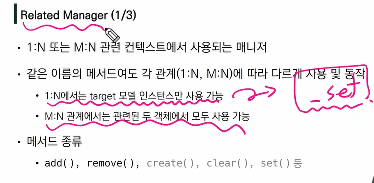

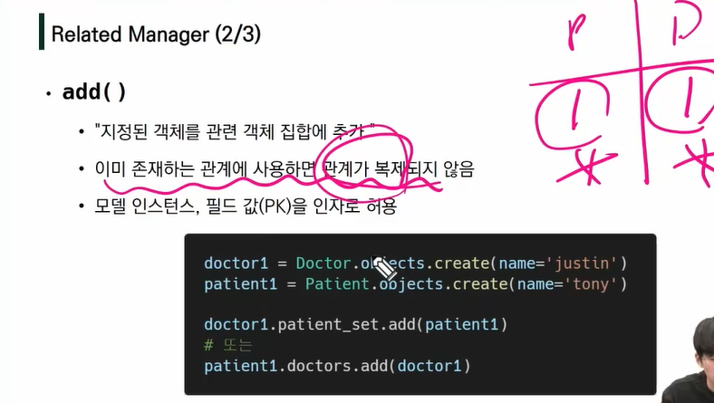

관계가 복제되지 않는다는 뜻이, 이미 존재하면 추가로 똑같은 관계가 만들어지지 않는다는 뜻


https://fontawesome.com/


대댓글 만들기


