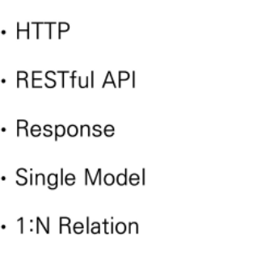

# 0420 수요일 REST API PPT 정리

## [목차]

## HTTP

* HyperText Transfer Protocol
* 웹 상에서 컨텐츠를 전송하기 위한 약속
* HTML 문서와 같은 리소스들을 가져올 수 있도록 하는 프로토콜(규칙, 약속)
* 웹에서 이루어지는 모든 데이터 교환의 기초
  * 요청(request) : 클라이언트에 의해 전송되는 메세지
  * 응답(response) : 서버에서 응답으로 전송되는 메세지
* 기본 특성
  * 

