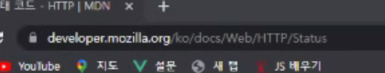
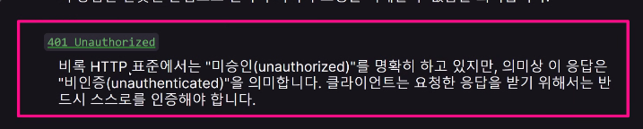
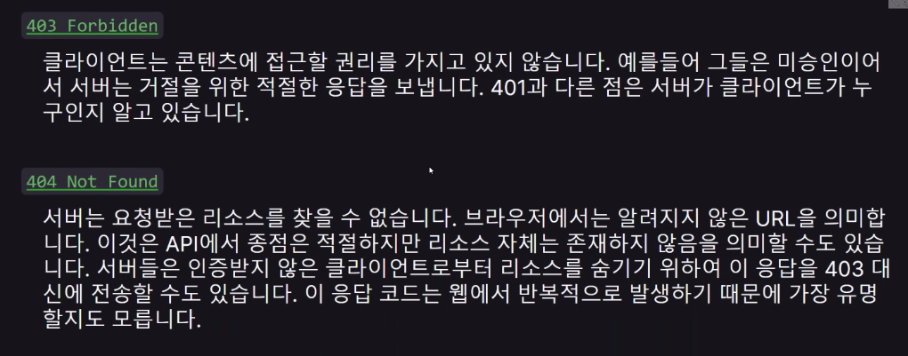
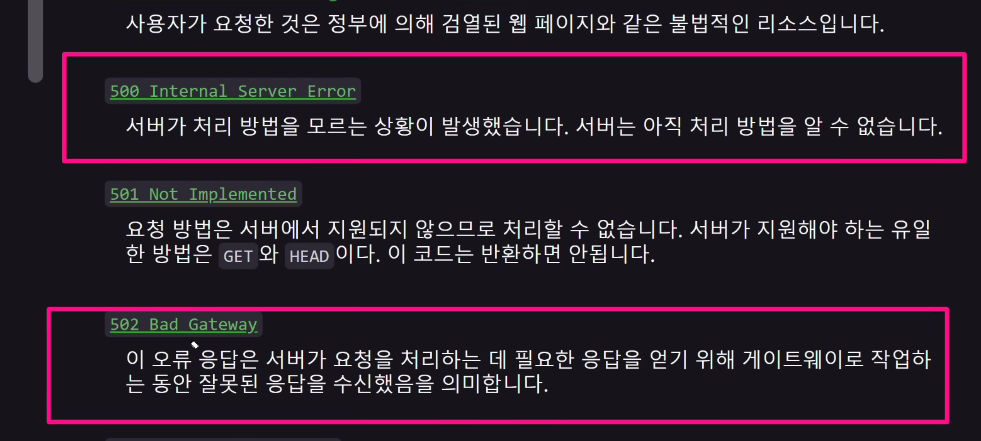
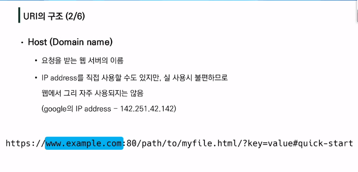
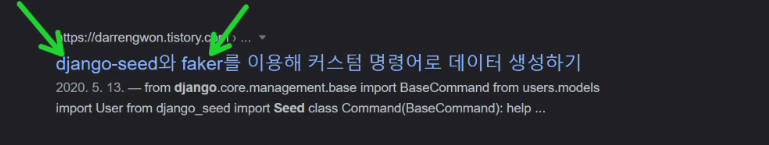
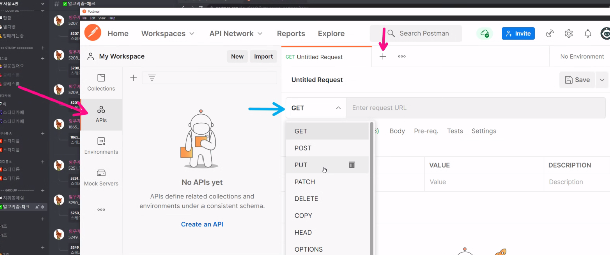
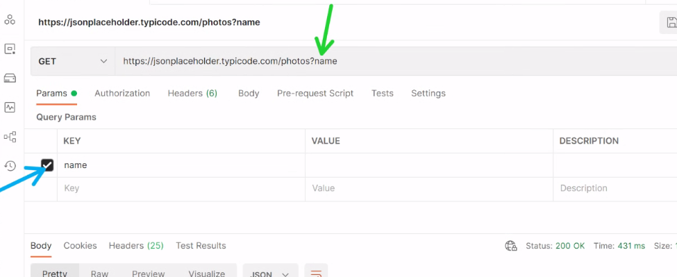
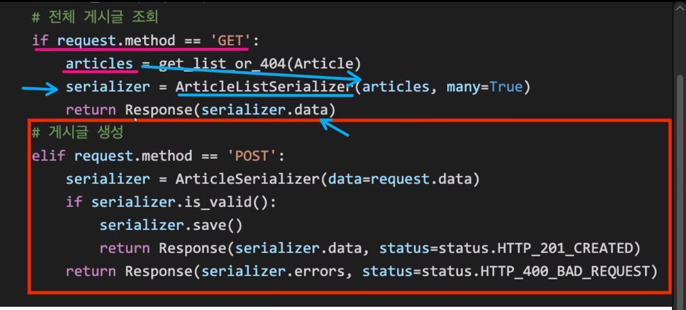

# 0420 수요일

put요청 : 수정

---

그러나, 회사에서는 약속해서 200번대로 통일하기도 함

여기서 부터는 문제가 나올수있다

seed -> 내가 가지고 있는 데이터파일을 장고 모델에 맞춰서 장고 db에 넣어주는 것

faker 랜덤하게 데이터만들때 씀

키값넣을수있음

어떤형식으로 오는지 찍어보는 것 = serializer.data

