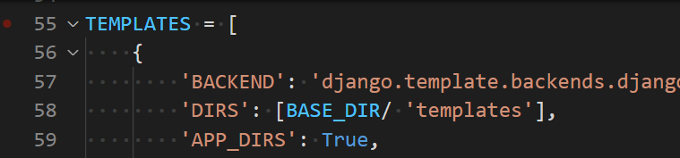

## Article CR (CREATE & READ) 진행 과정

## 1. 가상환경 구축 & project, app 생성 & settings.py 잡기

1. 가상환경 구축하기

```bash
$ python -m venv venv
```


2. 가상환경 실행시키기

```bash
$ source venv/Scripts/activate 
```


3. pip list로 목록 확인하기

```bash
$ pip list
```


4. 버전에 맞는 `django` 설치

```bash
$ pip install django==3.2.10
```

4-1. `requirements.txt` 설치

* 재귀(리컬시브) 사용

``` bash
$ pip install -r requirements.txt
```


5. 프로젝트 시작하기 (프로젝트 이름은 crud)

```bash
$ django-admin startproject crud .
```


6. 앱 생성 (앱 이름은 articles)

```bash
$ python manage.py startapp articles
```


7. 프로젝트의 settings.py 의 `INSTALLED_APPS`에 앱 추가 (순서 주의)


8. 프로젝트의 settings.py 시간, 언어 설정


---

### 2. models.py와 migration

1. 앱의 models.py

%20%EC%A7%84%ED%96%89%20%EA%B3%BC%EC%A0%95.assets/image-20220309200152818.png)


* models.py를 건들이면 꼭 migrate를 해야하는데, git 처럼 변경사항이 생기고, 그걸 보고하는 시스템임
* 그리고 아무것도 건들지 않아도 model을 사용하기 위해서는 django에 내장된 기본 model을 최초 한 번은 migrate를 해야 사용할 수 있게 된다.

2. migration생성

``` bash
$ python manage.py makemigrations
```

%20%EC%A7%84%ED%96%89%20%EA%B3%BC%EC%A0%95.assets/image-20220309195401306.png)


3. migrate

``` bash
$ python manage.py migrate
```

%20%EC%A7%84%ED%96%89%20%EA%B3%BC%EC%A0%95.assets/image-20220309195420382.png)


`[migratie 관련 명령어]`

* orm이 sql로 변환한 것이 나옴

```bash
$ python manage.py sqlmigrate articles 0001
```

%20%EC%A7%84%ED%96%89%20%EA%B3%BC%EC%A0%95.assets/image-20220308103625634.png)


  *	 migration을 보여달라!

``` bash
$ python manage.py showmigrations
```

노란색 - 앱

초록색 - 마이그래이션

분홍색(X) - 적용된 것

%20%EC%A7%84%ED%96%89%20%EA%B3%BC%EC%A0%95.assets/image-20220308104015090.png)

---

### * shell

1. shell접속

```bash
$ python manage.py shell
```

2. model불러오기

```shell
>>> from articles.models import Article
>>> Article.objects.all()
```

%20%EC%A7%84%ED%96%89%20%EA%B3%BC%EC%A0%95.assets/image-20220309214302248.png)


3. 첫번째 객체 -> 꼭 저장해야함.

```bash
>>> article = Article()
>>> article.title = "타이틀"
>>> article.content="내용"
>>> article.save()  
```

%20%EC%A7%84%ED%96%89%20%EA%B3%BC%EC%A0%95.assets/image-20220309214732389.png)


%20%EC%A7%84%ED%96%89%20%EA%B3%BC%EC%A0%95.assets/image-20220309220222148.png)

%20%EC%A7%84%ED%96%89%20%EA%B3%BC%EC%A0%95.assets/image-20220309220210676.png)


### 3. urls.py

1. 프로젝트의 urls.py

%20%EC%A7%84%ED%96%89%20%EA%B3%BC%EC%A0%95.assets/image-20220309201921911.png)


(원래)18번 줄을 넣어줘야 내가 만든 앱 pages의 views를 쓸 수 있음

```python
from articles import views
```


(앱에 urls.py를 또 만들 때) 17번째 줄에 include를 넣어줌

urlpatterns 21번째 줄 


#### cf) Variable Routing

ex) Variable Routing의 개념을 활용한다. 저녁메뉴는 string, 인원수는 integer이다.

```python
urlpatterns = [
    path('admin/', admin.site.urls),
    path('dinner/<str:menu>/<int:people>', views.dinner),
]
```


2. 앱의 urls.py

%20%EC%A7%84%ED%96%89%20%EA%B3%BC%EC%A0%95.assets/image-20220309210139716.png)

* html에서는 이런 식으로 연결

%20%EC%A7%84%ED%96%89%20%EA%B3%BC%EC%A0%95.assets/image-20220309210503946.png)


cf) dinner

****

request와 함께 Variable Routing을 통해 전달 받은 인자를 html 파일에서 사용할 수 있도록 렌더링 할 때 넘겨준다.

```python
def dinner(request, menu, people):
    context = {
        'menu':menu,
        'people':people
    }
    return render(request, 'dinner.html', context )
```


### 4. veiws.py

참고)

%20%EC%A7%84%ED%96%89%20%EA%B3%BC%EC%A0%95.assets/image-20220309211010907.png)


### templates

1. 프로젝트의 `BASE_DIR` 설정




2. BASE_DIR은 프로젝트와 동일선상에 `templates`폴더를 만들면 됨

%20%EC%A7%84%ED%96%89%20%EA%B3%BC%EC%A0%95.assets/image-20220309203238855.png)

3. 프로젝트 외부 templates 폴더 하위에 base.html을 생성하고 부트스트랩 cdn을 불러옴

* 11, 12번째 줄 

%20%EC%A7%84%ED%96%89%20%EA%B3%BC%EC%A0%95.assets/image-20220309203319702.png)


4. `앱/templates/앱` 하위에 base.html을 상속받을 템플릿 파일들을 만듦

(여기서는 read.html, create.html 두개 필요)

* read.html

```html



<h1> INDEX </h1>
<a href="">NEW </a>
<hr>

  <p> 글 제목 : {{article.title}} </p>
  <p> 글 내용 : {{article.content}} </p>

<a href="">DETAIL </a>

```


* create.html

%20%EC%A7%84%ED%96%89%20%EA%B3%BC%EC%A0%95.assets/image-20220309204304714.png)


```html



<h1> NEW </h1>

<form action="" method="POST">
  <!--method="POST", csrf_token은 짝꿍-->
  
  <label for="title"> TITLE :</label>
  <input type="text" name="title" id="title"><br>
  <label for="content"> CONTENT : </label><br>
  <textarea name="content" cols="30" rows="5" id="content"> </textarea>
  <br>
  <input type="submit" value="작성">

</form>
<a href="">BACK </a>

```


