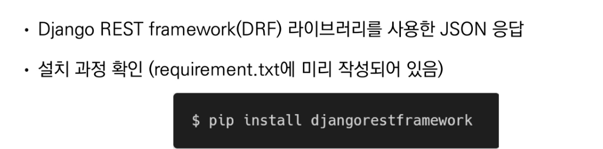
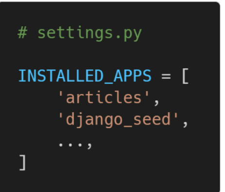
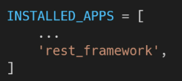
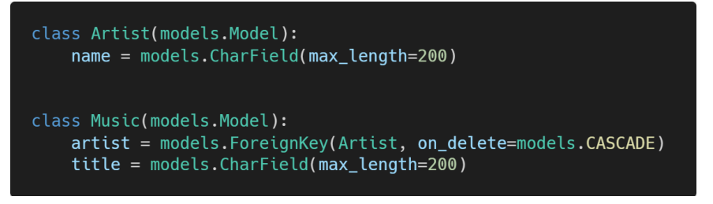
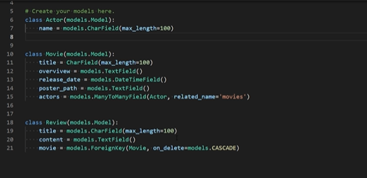
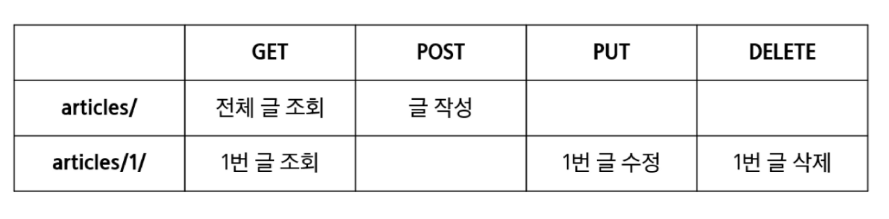

# Django REST Framework 실습 코드

## 가상환경 및 세팅

1. 가상환경 구축하기

```bash
$ python -m venv venv
```


2. 가상환경 실행시키기

```bash
$ source venv/Scripts/activate 
```


3. interpreter 변경하기

ctrl+shift+p 로 

가상환경 


4. `.gitignore` 파일 생성 후 

   gitignore.io 사이트에서 python, window, django, visual studio code 등을 넣어서 생성 후

   파일에 넣고 저장


5. pip list로 목록 확인하기

```bash
$ pip list
```


6. 버전에 맞는 `django` 설치

```bash
$ pip install django==3.2.10
```

6-1. `requirements.txt` 설치

* 재귀(리컬시브) 사용

``` bash
$ pip install -r requirements.txt
```

* DRF 라이브러리 사용시 (INSTALLED_APPS에 rest_framework를 적어줘야함)

``` bash
$ pip install djangorestframework
```





7. 패키지 설치했다면


``` bash
$ pip freeze > requirements.txt
```


## 프로젝트 시작

1. 프로젝트 시작하기 (프로젝트 이름은 crud)

```bash
$ django-admin startproject crud .
```


2. 앱 생성 (앱 이름은 articles)

```bash
$ python manage.py startapp articles
```


3. 프로젝트의 settings.py 의 `INSTALLED_APPS`에 앱 추가 (순서 주의)
   * 코드 컨벤션 
     * 장고가 기본적으로 만든 것 위에 app을 넣어줌
     * 장고는 위에서 부터 먼저 찾는다.





4. 프로젝트의 settings.py 시간, 언어 설정
   * 타임존 바꾸기 (기본으로 이정도만)


## init project

* my_api/urls.py


``` python
from django.contrib import admin
from django.urls import path, include

urlpatterns = [
    path('admin/', admin.site.urls),
    path('api/v1/', include('articles.urls')),
]
```


## apps/models.py

* music/models.py 작성



``` python
from django.db import models

# Create your models here.
class Artist(models.Model):
    name = models.CharField(max_length=200)

class Music(models.Model):
    artist = models.ForeignKey(Artist, on_delete=models.CASCADE)
    title = models.CharField(max_length=200)
```


* makemigrations, migrate 진행

``` bash
$ python manage.py makemigrations
$ python manage.py migrate
```


* django-seed 라이브러리를 사용해 모델 구조에 맞는 데이터 생성

``` bash
$ python manage.py seed music --number=20
```



$ python manage.py loaddata movies/fixtures/actors.json

## apps/serializer.py

* 모델에 맞춰 자동으로 필드를 생성해 serialize해주는 ModelSerializer확인

``` python
from rest_framework import serializers
from .models import Artist, Music
# 1. 모든 가수의 정보를 반환하기 위한 Serializer
class ArtistListSerializer(serializers.ModelSerializer):
    class Meta:
        model = Artist
        fields = ('id', 'name',)

# 3. 모든 음악의 정보를 반환하기 위한 Serializer
class MusicListSerializer(serializers.ModelSerializer):
    class Meta:
        model = Music
        #fields = '__all__'
        fields = ('id', 'title',)


# 2. (이거 잘 모르겠음)상세 가수의 정보를 생성 및 반환하기 위한 Serializer
# id, name, music_set, music_count 필드 출력 (music_count 필드는 music_set을 count한 결과이다.)
class ArtistSerializer(serializers.ModelSerializer):
    music_set = MusicListSerializer(many=True, read_only = True)
    # 이 부분 다시 잘 보기~! (필드 재정의)
    # (첫번째인자 : 어디서뽑아오는지 but 주의: 속성값은 문자열 / 두번째인자 : 읽기전용)
    music_count = serializers.IntegerField(source='music_set.count', read_only = True)

    class Meta:
        model = Artist
        #read_only_fields = ('articles',)
        fields = ('id', 'title',)


# 4. 상세 음악의 정보를 생성 및 반환하기 위한 Serializer
class MusicSerializer(serializers.ModelSerializer):
    # read_only 하나만 줄때는 comment_set = serializers.PrimaryKeyRelatedField(many=True, read_only = True)
    
    class Meta:
        model = Music
        #fields = '__all__'
        fields = ('id', 'title',)
        read_only_fields = ('artist',)
```


## apps Built RESTful API




## apps/ urls.py

``` python
from django.urls import path
from . import views

urlpatterns = [
    path('artists/', views.artists), #[GET]전체글 조회, [POST]작성
    path('artists/<int:artist_pk>/', views.artists_detail), #[GET]1번글 조회, [PUT] 1번글 수정, [DELETE] 1번글 삭제
    path('music/', views.music), 
    path('music/<int:music_pk>/', views.music_detial), 
]
```


## apps/views.py

``` python
from rest_framework.response import Response
from rest_framework.decorators import api_view
from rest_framework import status

from django.shortcuts import render, get_list_or_404

from .models import Artist, Music
from .serializers import ArtistListSerializer, ArtistSerializer, MusicListSerializer
from music import serializer
# Create your views here.

@api_view(['GET', 'POST'])
def artist_list(request):
    if request.method == 'GET':
        artists = Artist.objects.all()
        serializer = ArtistListSerializer(artists, many=True)
        return Response(serializer.data)
    elif request.method == 'POST':
        serializer = ArtistSerializer(data=request.data)
        if serializer.is_valid(raise_exception=True):
            serializer.save()
            return Response({"result":"success"}, status=status.HTTP_201_CREATED)
    
@api_view(['GET', 'DELETE', 'PUT'])
def artist_detail(request, artist_pk):
    artist = Artist.objects.get(pk=artist_pk)
    if request.method == 'GET':
        serializer = ArtistSerializer(artist)
        # 특정 가수의 노래 정보와 노래의 개수 정보를 함께 응답한다?
        return Response(serializer.data)
    elif request.method == 'DELETE':
        artist.delete()
        return Response({"result":"deleted"}, status=status.HTTP_204_NO_CONTENT)
    
    elif request.method == 'PUT':
        serializer = ArtistSerializer(artist, data=request.data, partial=True)
        if serializer.is_valid(raise_exception=True):
            serializer.save()
        return Response(serializer.data)

@api_view(['GET'])
def music_list(request):
    if request.method == 'GET':
        music = Music.objects.all()
        serializer = MusicListSerializer(music, many=True)
        return Response(serializer.data)
    elif request.method == 'POST':
        serializer = MusicListSerializer(data=request.data)
        if serializer.is_valid(raise_exception=True):
            serializer.save()
            return Response(serializer.data, status=status.HTTP_201_CREATED)

@api_view(['GET'])
def music_detail(request, music_pk):
    if request.method == 'GET':
        music = Music.objects.get(pk=music_pk)
        serializer = MusicListSerializer(music)
        return Response(serializer.data)
```

