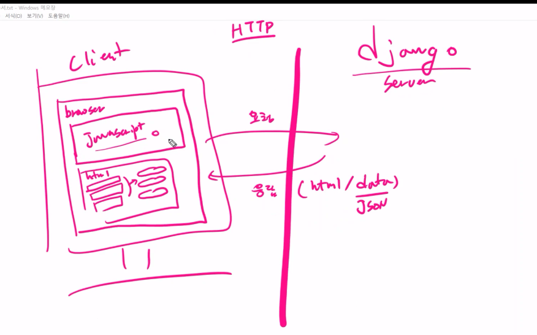
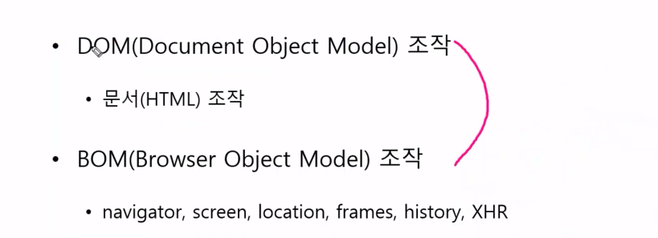
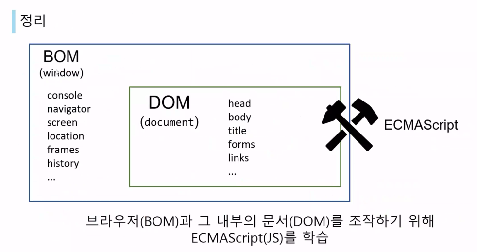
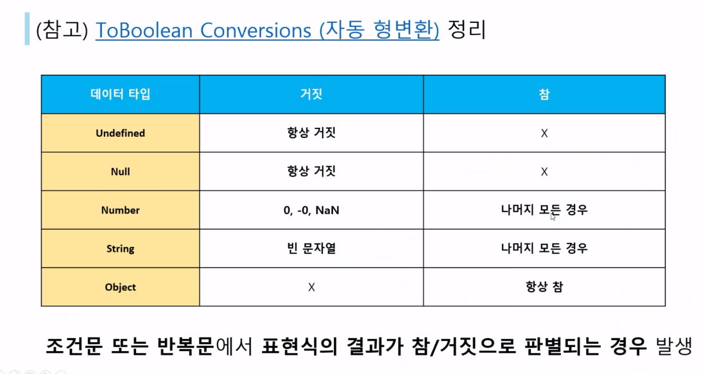

* 브라우저는 자바스크립트 엔진이다.
* 원래 브라우저는 http 요청, 응답의 주체임

* 자바스크립트를 이용해서 html 요소 조작

* 브라우저의 html는 바뀌지 않고, 자바스크립트안에서 요청과 응답이 일어남
* 자바스크립트의 주목적 (DOM 조작, BOM 조작)
  * BOM(widows) : 브라우저의 계층 모델 > DOM (document)

이거 시험 나올듯

switch문은 if문과 달리 break 나 default 안나오면 계속 조건에 맞을 때 실행이 된다