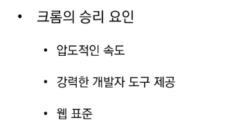
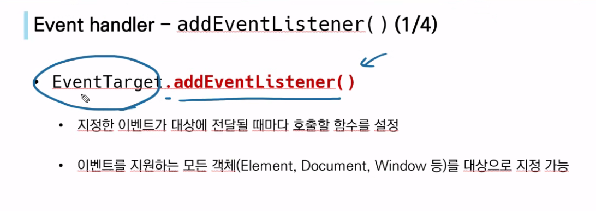
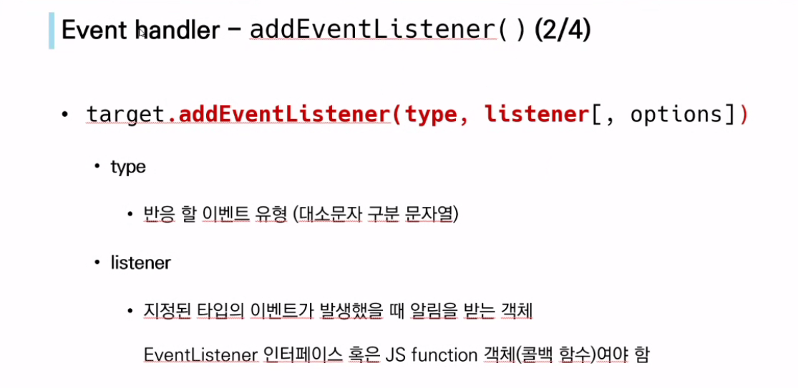

이거 안씀

## Event

* 사용자와 상호작용을 하는 것
* 

listener에 들어가는 함수 : 콜백함수 : 인자로 들어가는 함수를 말함

최대한 alert창을 안쓰는 게 좋지만 학습할 때는 잘 보이라고 쓰는 것임

일단 완전탐색 (DFS) + 백트래킹(가지치기)을 조금 더 연습하시면 좋을 것 같습니다! 짧은 시간에 하기에는 이만한게 없어요

