## dom & event 복습

* 브라우저 
* 돔 : 웹페이지에 나타난 html 문서 전체를 각각에 대해 객체로 나타낸 것

``` 
# 윈도우 객체 찍어보기
console.log(window) 

# 윈도우 창 너비 보기
console.log(window.innerWidth)

# 새 윈도우 창 열기
window.open() 

# 윈도우 창 닫기
window.close() 
```

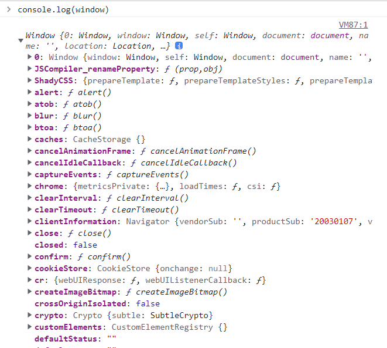


원래 window.console.log()~ 인데 최상의 consloe.log()


## dom트리 구조에서는 각각의 객체를 각각의 노드라고도 표현한다.

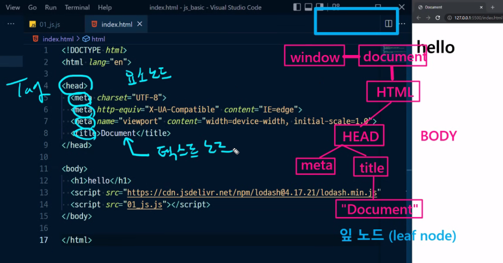


* 일반적으로 텍스트노드는 요소노드의 자식노드가 된다 (T)
* 12가지가 있지만 tag를 표현하는 요소노드, 텍스트를 표현하는 텍스트노드정도만 알면 됨

* window는 자바스크립트 어디서든 접근할 수 있는 전역 객체(global object) 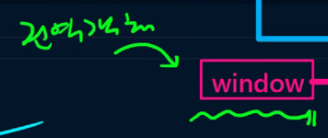


---

### 0428.html

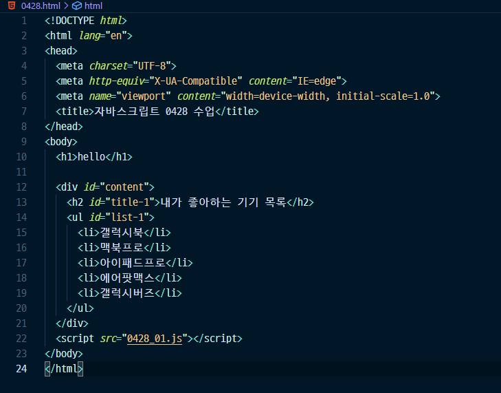

* div#content 탭 : 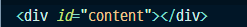
* sc 치고 script *src* 있는 걸 탭
* *alt + shift + 위아래 방향키로 코드 복사*
* li * 5 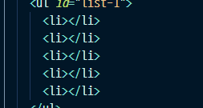

---

### 0428_01.js

요즘은 *document**.**querySelector*() 혹은 *document**.**querySelectorAll*()만 씀

*document**.**querySelector*()  쓸 때 css 선택자 넣는 것 주의

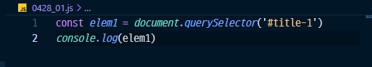

하면 

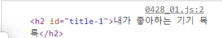

콘솔에 뜸

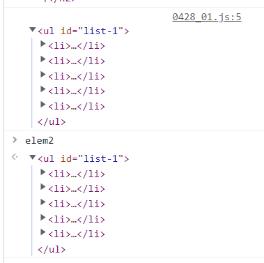

위에는 js파일에서 *console**.**log*(elem2) 사용한 것 / 아래는 콘솔에서 elem2를 쓴 것

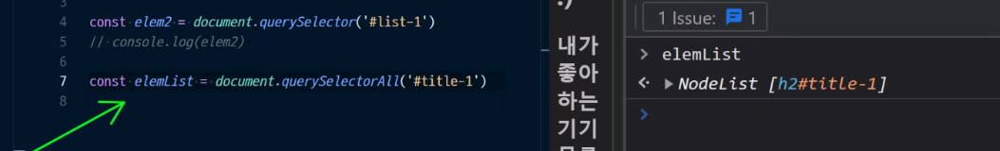

*querySelectorAll*로 접근하면 반드시 유사배열로 접근한다.


## innerHTML

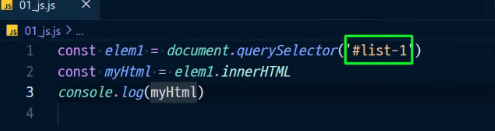

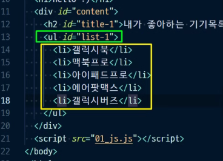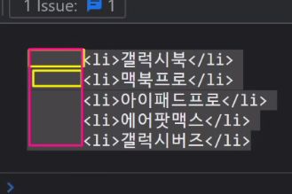

해당 태그의 안쪽 html요소를 다 가져옴 , 들여쓰기까지 다 가져옴


* 요소추가하기

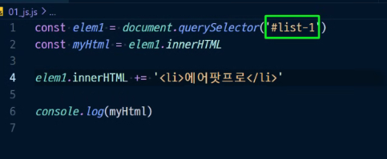

``` 
innerHTML : 나를 포함하지 않고 내 안쪽에 있는 HTML만 
outerHTML : 나를 포함해서 HTML에 접근
```


### elem2.innerHTML += '<li>에어팟프로</li>' 

* 자칫하면 다 지워질 수 도 있어서 잘 안씀


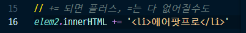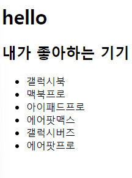

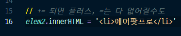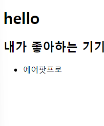

---

### firstElementChild / children

* firstElementChild : 첫번째의 마지막
* children : 유사배열로 접근 (길이도 알려줌)
* *lastElementChild* : 마지막 자식

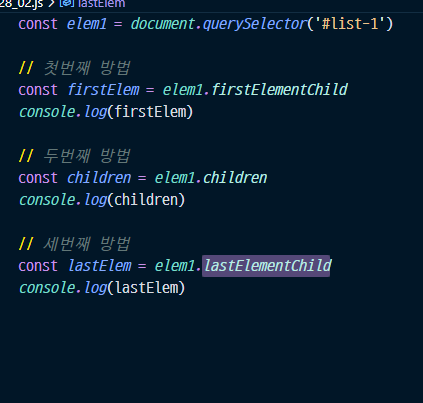


---

### 부모노드 선택 (parentElement)

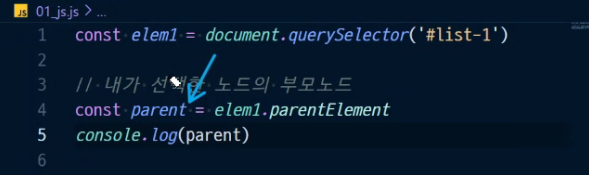


## 내가 선택한 노드의 앞쪽 형제노드

* *previousElementSibling* : *내가 선택한 노드의 앞쪽 형제노드 선택*
* *nextElementSibling* : *내가 선택한 노드의 뒤쪽 형제노드 선택*

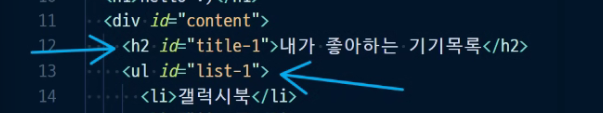

내가 선택한게 list-1이라면 title-1을 선택하는 것

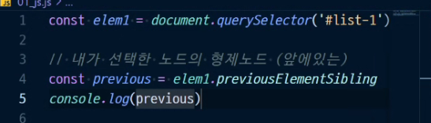

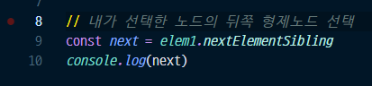

---

### 안에 내용 보기

innerHTML : HTML까지 다 가져옴

textContent : text요소만 가져옴


* title-1일때는 차이가 없어보이지만 (태그 한개, 한줄짜리)


 list-1를 선택할 때는 안의 내용이 달라짐


---

### outerHTML은 주의해야함

* outerHTML를 변경하고 나서는, 새로 찾아주고 해야함
* 완전히 새로운 요소가 됨

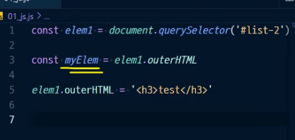

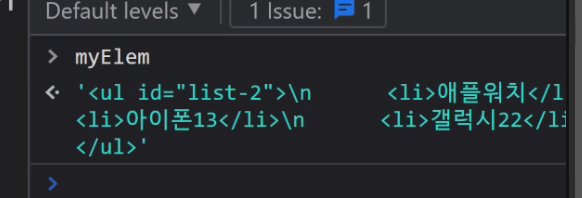


## 지우기 .remove()

elem.remove()


---

### 이동하기

* append
* prepend
* before
* after


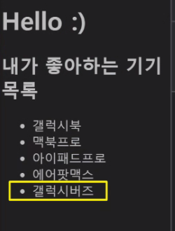여기서 갤럭시 버즈 이동시키기

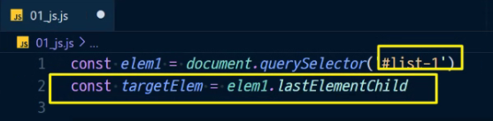

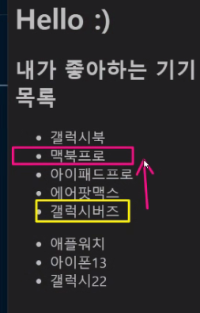맥북프로 자리에 넣어주기


---


### 원하는 태그 만들어서 원하는 곳으로 이동시키기

* 갤럭시22 밑으로 전기모기채 넣기

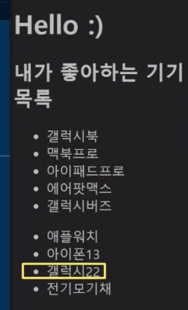

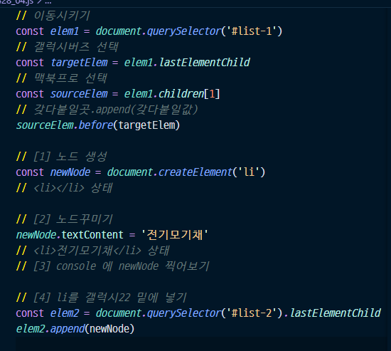


## setAtrribute (속성명 대소문자 구분 x)

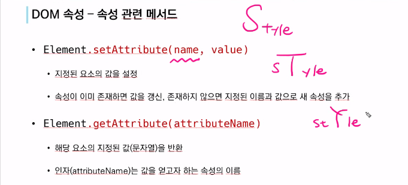


### style

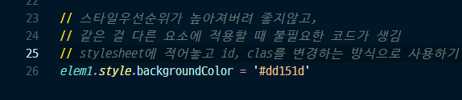

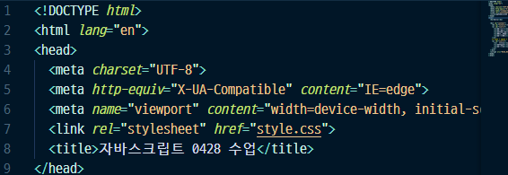

link 로 넣어주기

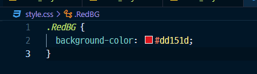

css 파일설정 (RedBG라는 이름의 클래스 설정)

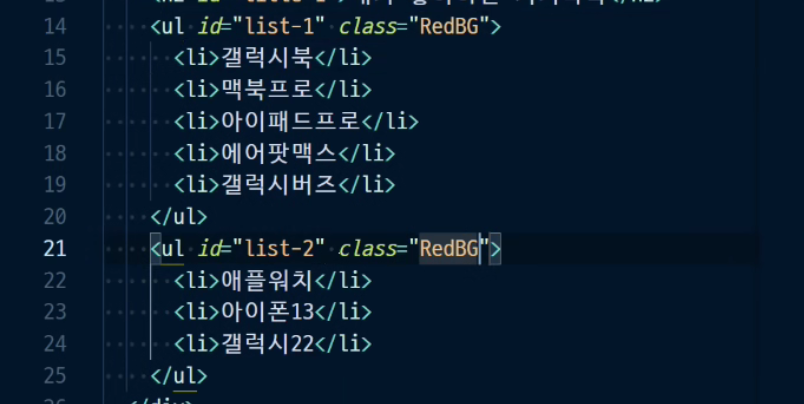


### className = 클래스 바꾸기

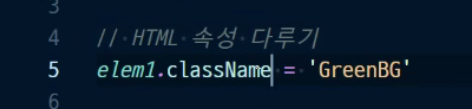


클래스를 바꿀때는 className으로 접근해야한다.

---

## event


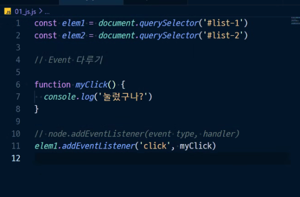


익명함수로 핸들러에 넣어버리면 삭제를 할 수 없다.

반드시 선언형으로 등록하고 해야함

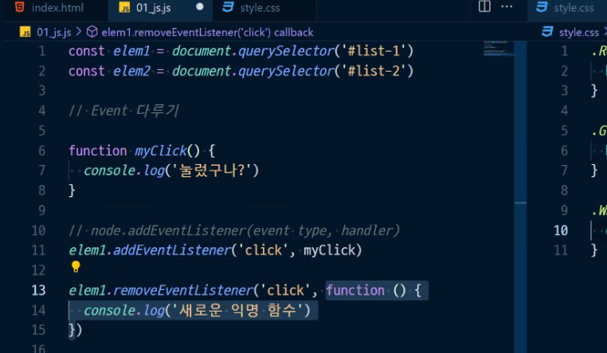

13번째줄은 ㄴㄴ해야함


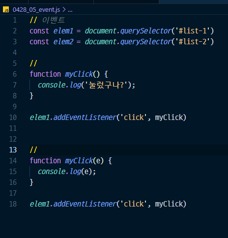

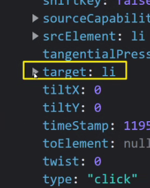

target이 가장많이쓰이는 것중 하나: 어떤거를 클릭했는지


---

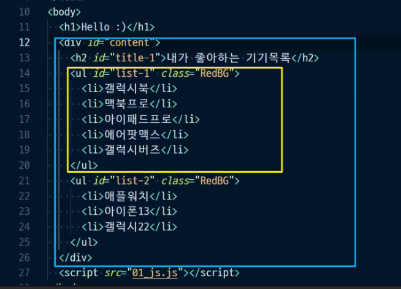

---

### event 버블링 : document를 만날때까지 일어남


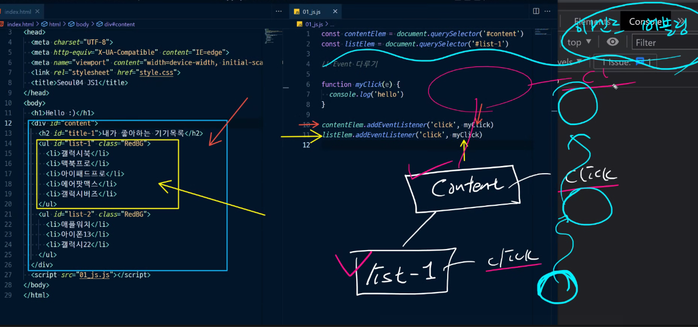

파란박스 content를 클릭하면 한번만 클릭되지만

노란박스 li를 클릭하면 content, li까지 두번 클릭됨

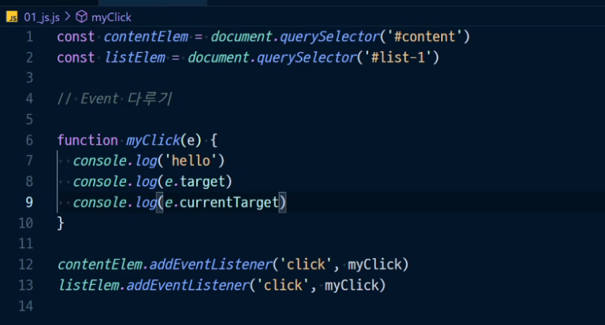

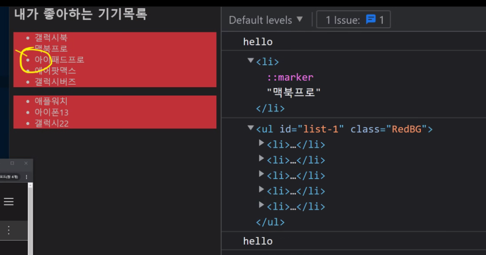

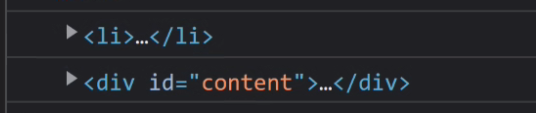

---

## 버블링 멈추게하는것 stopPropagation()

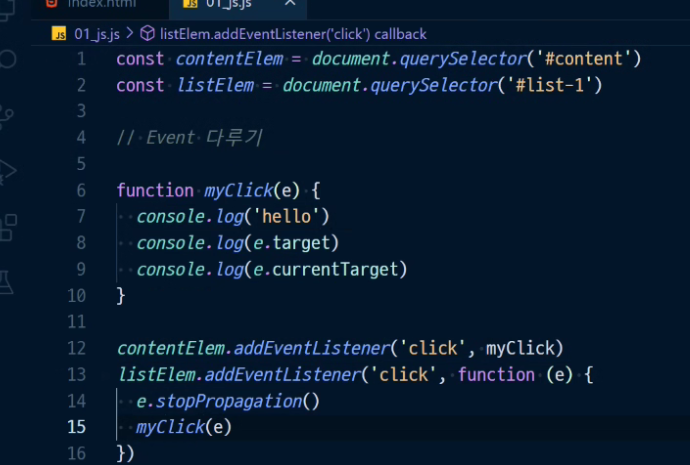


----

### 실습 : 버튼 눌러서 숫자 올리고 내리기 

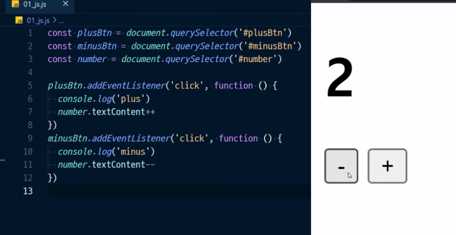

형변환 필요없지만 에어비앤비 스타일이 아님 ++ -- 이런것들이

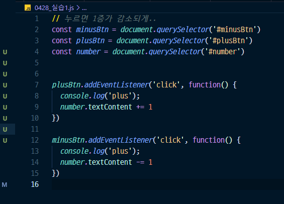