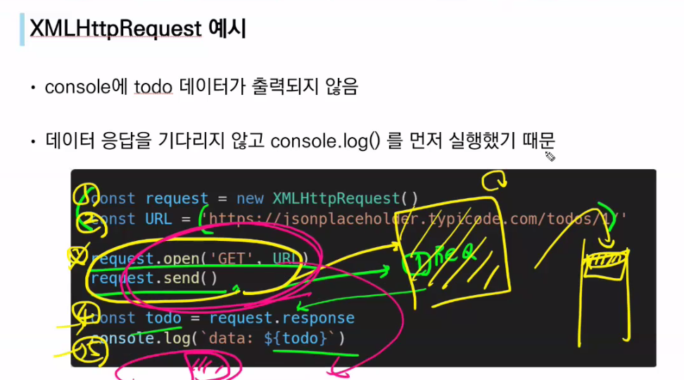
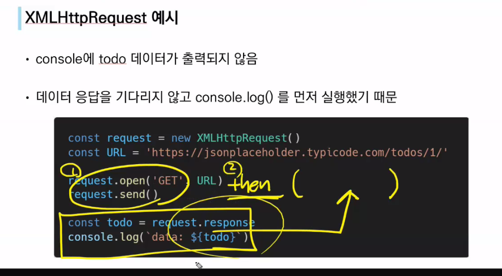
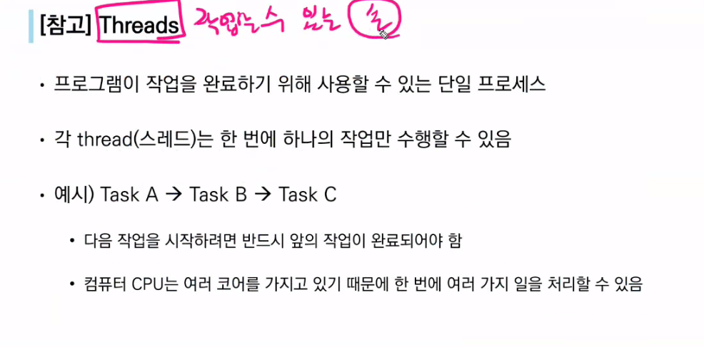
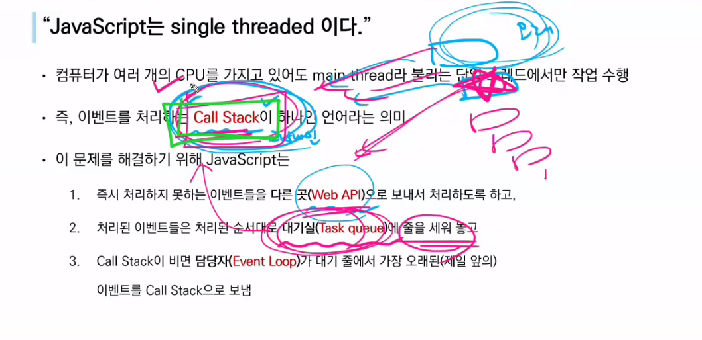
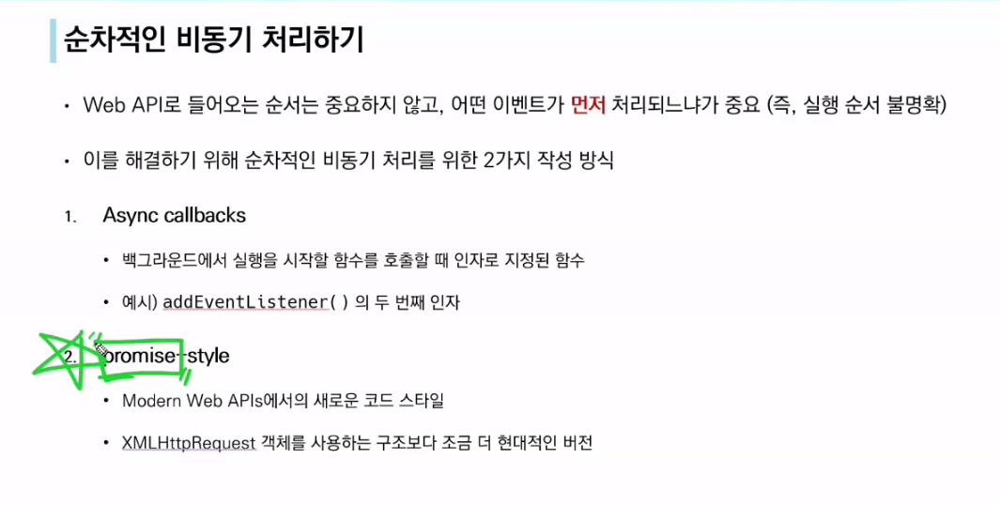
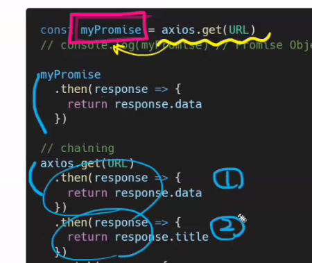
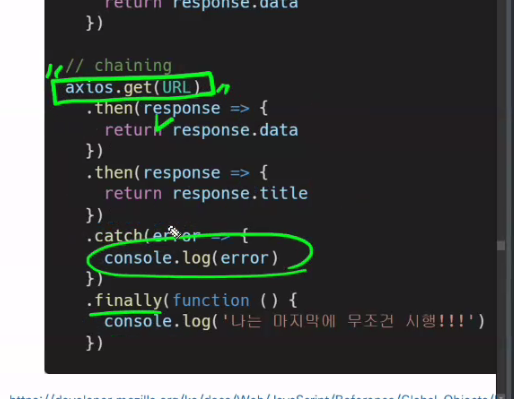
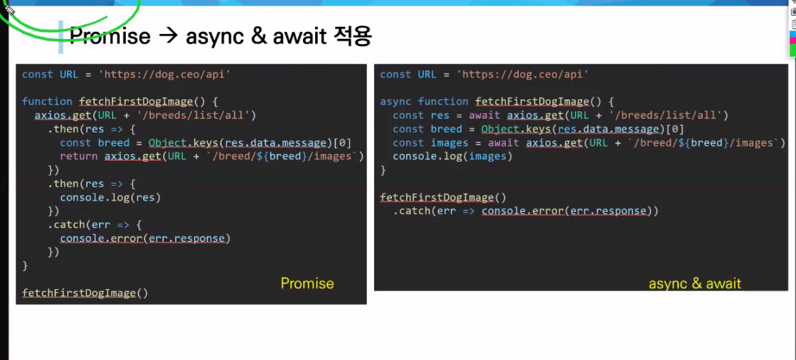

# ㄴ0502 월요일

* Ajax : 비동기통신하는 방법이구나!

1번 끝나면 2번해줘!

비동기는 멀티가 아니다.

사용자경험을 위해서 비동기식을 중요하게 생각함

## threads

core : 4사람

thread : 손

* 자바스크립트는 싱글쓰레드,
* 

이벤트루프(담당자)

setTimeout보자마자 webapi로 넘겨버림

같은 코드이다.

catch-> 실패하면

finally -> 실패하든 성공하든 무조건

then 말고 await 사용

2. 

