ajax : 자바스크립트가 서버랑 비동기적으로 통신하는 것


여기서 맨밑코드를 실행하려면 todo에 1초 기다려같은 코드를 넣어야해서 비효율적이다.


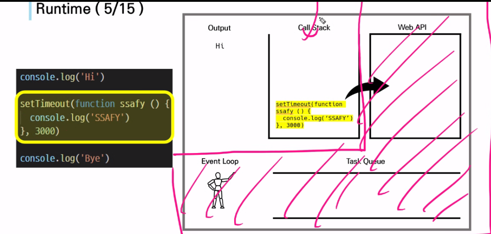


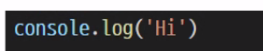

setTimeout을 만나자마자 뒤도 돌아보지않고 Web API에 넘김, setTimeout은 브라우저에서 처리하는 것

```
Hi
Bye
SSAFY
```

순으로 출력됨


자바스크립트는 싱글쓰레드, 프로미스 객체를 가지고 비동기처리를 한다.

---

## callback function : 다른 함수에 인자로 전달된 함수

callback hell 들여쓰기를 하지않고 하고싶어서 callback함수가 나옴


## promise object 

비동기 객체

미래에 어떤 상황에 대한 약속

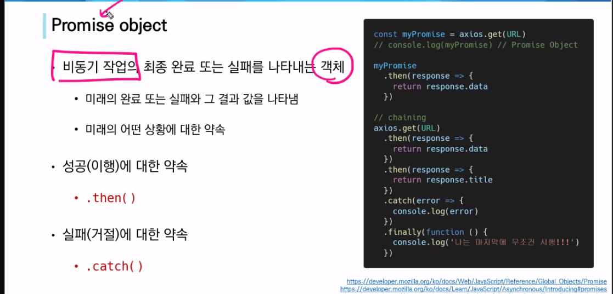


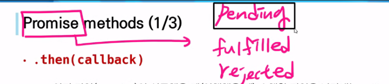

Promise 는 pending, fulfilled, rejected 상태 세가지 상태를 가지고 프로미스객체가 동작한다.

모든 promise객체는 맨 처음엔 pending상태로 시작하고,

성공하면 fulfilled상태가 되고 or 실패하면 rejected가 됨

fulfilled상태가 되면 then에 있는 콜백실행

비동기작업의 작업 성공 결과가 첫번째 파라미터로 넘어옴


rejected상태가 되면 catch에 있는 콜백실행 


## axios 실습 (axios도 결국 promise객체를 리턴, 그렇기때문에 .then을 붙일수있음)

json placeholder를 검색

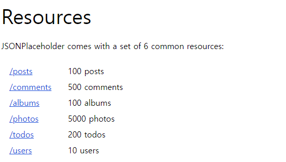

우리는 users에 get요청을 보냄

https://jsonplaceholder.typicode.com/users

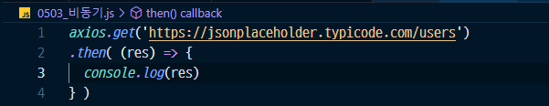

적고 브라우저를 확인하면 이런 에러가 뜨게 된다.

axios 는 자바스크립트에서 비동기를 쉽게 처리해주는 `패키지`

(설치가 필요함)

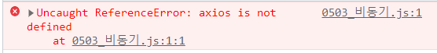


axios cdn을 불러온다. 

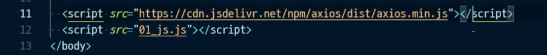

이 위치도 중요하다. (자바스크립트 코드 위로)


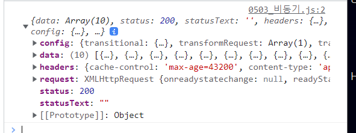

정상적으로 뜸 (axios 내부에서 자동으로 객체형태로변환까지 해줌)


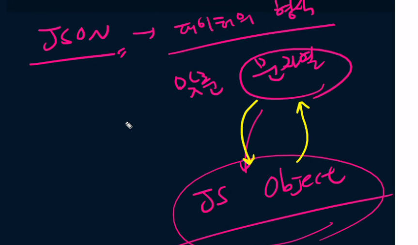


이 두개의 코드가 같다. http request는 머리와 몸통으로나눠져 있다.

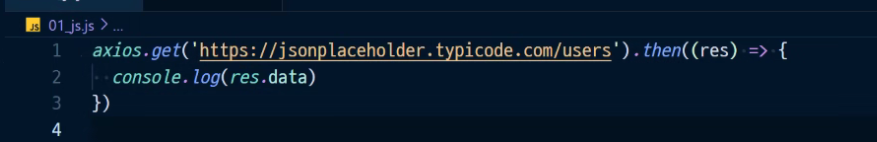

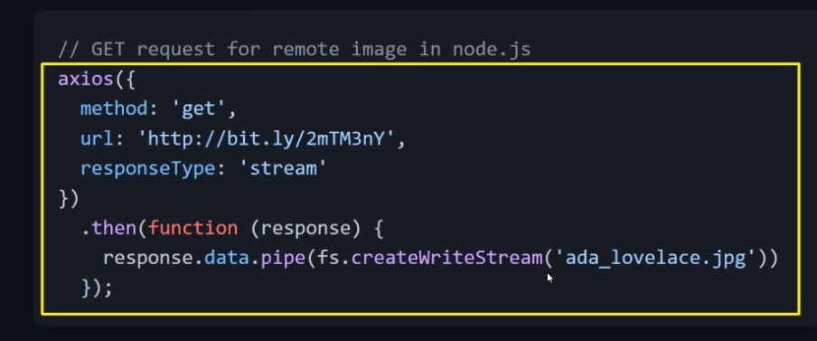


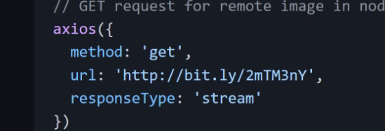헤드부분

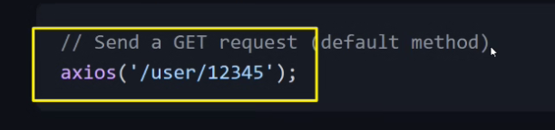기본적으로 get요청


#### 작업의 실패 결과 (없는  url을 보냄) 도 콜백에 

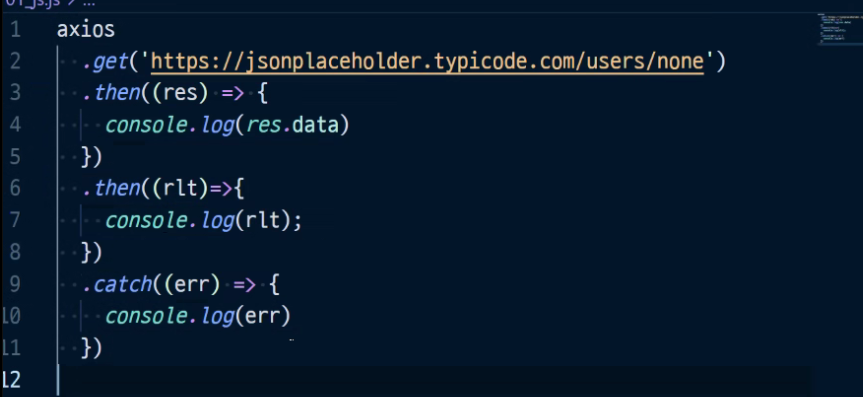

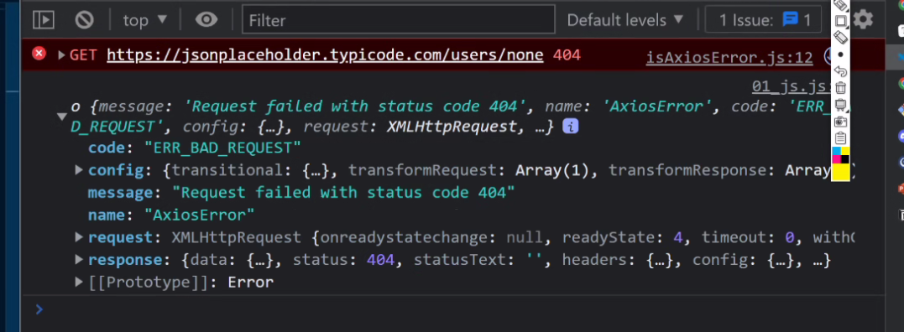


#### then두번? 첫번째는 promise 객체를 리턴함, 

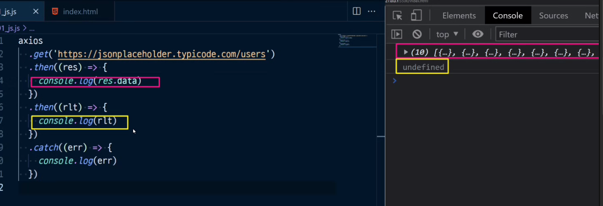

밑에는 undefined가 뜸

첫번째 네모박스가 promise 객체를 리턴하나? 안하고 있음.. `return`이 없음

그래서 rlt에 undefined가 들어와서 저렇게 찍힌 것임


첫번째 then 메서드의 return값을 그다음 then메서드의 콜백함수 인자로 받음


* then 메서드는 항상 프로미스 객체를 리턴한다.
* but, then

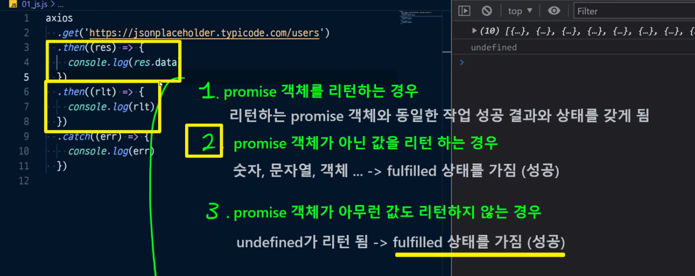

콜백함수에 리턴에 따라서 then메서드가 가지고 있는 상태값이 바뀐다.


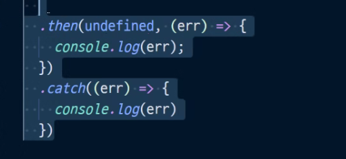

두개 같은 것

then메서드의 첫번째 파라미터에는 성공했을 때 들어갈 콜백함수가 들어감.

두번째 파라미터에는 실패했을때 들어갈 콜백함수

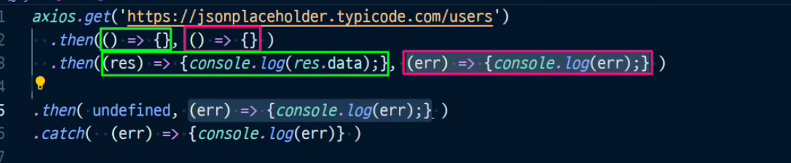


----

최신 뉴스피드를 가지고 오고싶은데 그게 안되면 이렇게 예외처리를 중간중간 catch를 넣어서도 많이 씀

모든 tehn, catch는 프로미스객체를 모두 리턴한다.

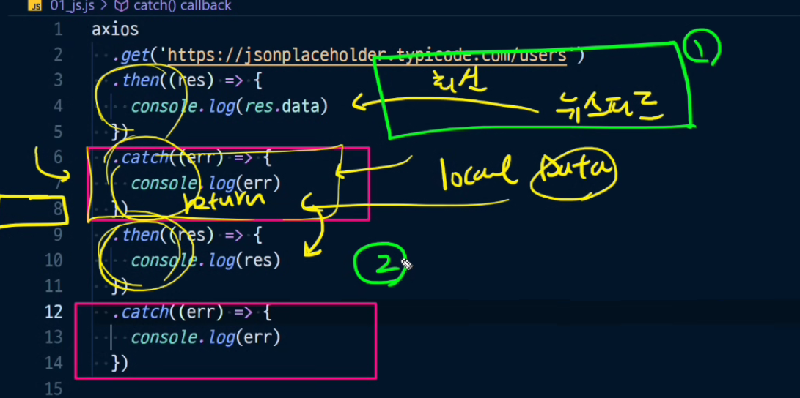

로컬 데이터를 리턴하기 때문에 fulfiled상태가 됨, 그래서 then을 이어갈 수 있음

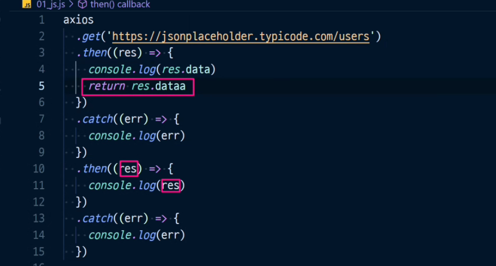


---

### 변천사

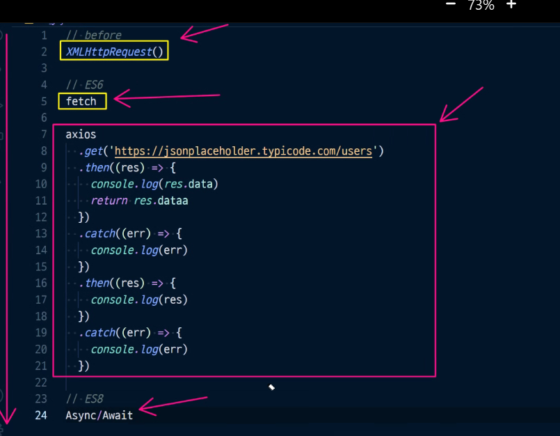


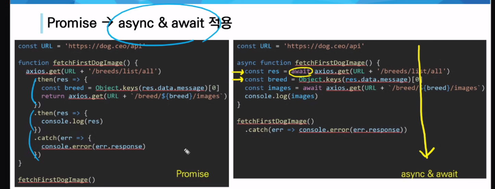


async & await는 ES8에서 나온거고 코딩스타일이 탑다운임

아직 promise를 쓰는 곳이 많아서 알긴해야함

