# js 01

* 브라우저가 어떤역할을 하는지

* dom이 어떤건지 dom tree가 어떤건지 (중요하진 않음, 공부하는 김에 보기)
* 파싱, ECMA 용어 등등 ~~~~스타일가이드까지시험 X

* 변수부터 시작! (let, const, var : 각각 어떤 차이가 있는지 , 어떤게 안되는지)

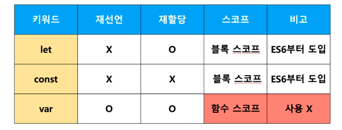

* 데이터 타입 (원시 타입, )

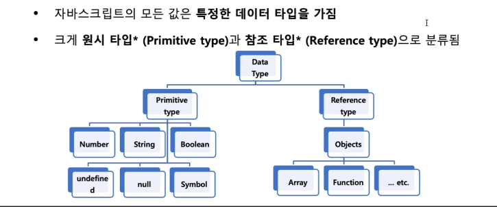

원시 타입 : 넘버, 스트링, 불린 타입 기억해야함

참조타입 : 객체 : array, function 기억

* 찍어보면 다른게 있음??

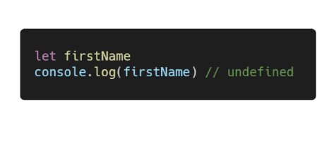

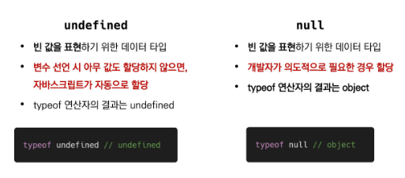

* 연산자는 ===만 알면됨 타입과 값을 모두 비교함, 

==, === 은어떤차이가 있는지

* 반복문 (당연히 나옴) for, for in for of가 어떻게 다른지 알아야함 

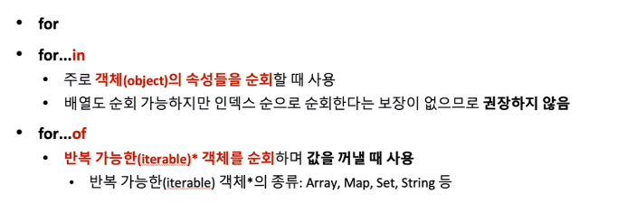

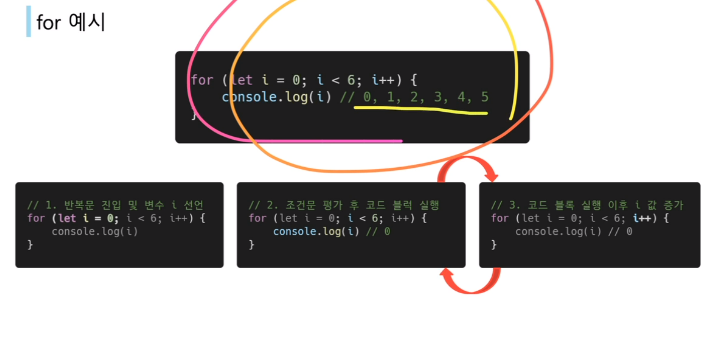

이런 걸 보면서 0 1 2 3 4 5 가 나오겠구나 하고 알아야함

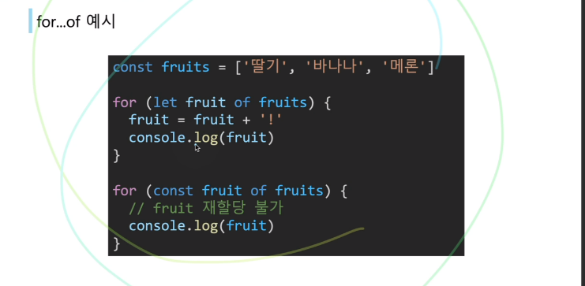

* 코드가 나왔을 때 console.log로 찍었을때 출력 결과가 어떤건지 알아야함

코드는 직접 코드 보고 해석할 수 있어야함

* 함수 : 일급객체가 중요함

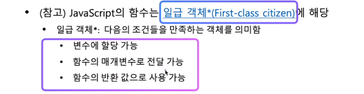

* 호이스팅은 자세히는 안나오니 너무 열심히 공부 x

* 어떤 경우에 뭘 생략할 수 있는지 알아야함

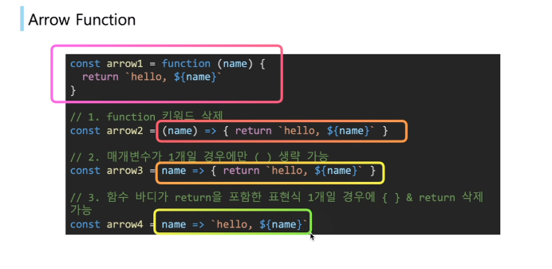

* 문자열 메서드 다외울필요 x (한번씩은 봐라)
* 배열은 파이썬과 비슷, 그러나 앞에 추가하고 빼기, 뒤에 추가하고 빼기정도는 알아야함 (메서드)

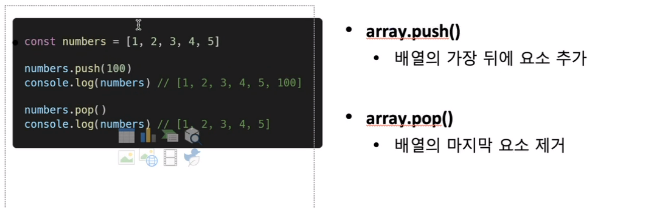

* foreach (비슷한 함수 3개 알아야함)
  * array는 많이 안씀 , element, index 에 대해 콜백함수를 실행하는 메서드

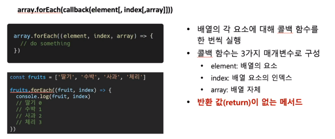

* 키는 문자열만 가능, 벨류는 모든값, 자바스크립트는 json

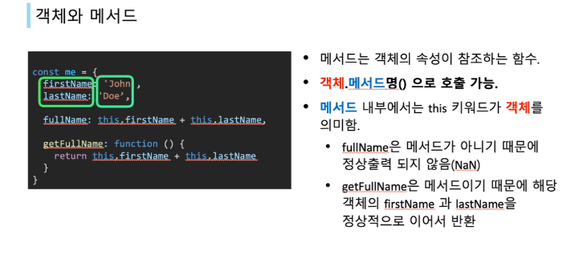

* 구조분해할당 알아야함 (이런식으로 쓰는 구나 정도 직접 타이핑하면서 알아두기)

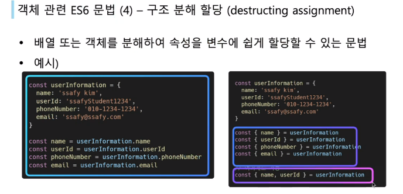

* 교수님한테 안들은 설명 나와도 생전 처음 본거를 찍을 필요가없음
* 배운거에서 틀린게나오니 함정 조심

----

# js 02

* 이 사람 알아두기 

* 역사는 넘어가기

* 쿼리셀렉터, 쿼리셀렉터올을 쓴다 정도~

셀렉터 안쪽에 뭐가 들어가는지, 아이디 선택자 , 클랙스 선택자, 태그들이들어간다.

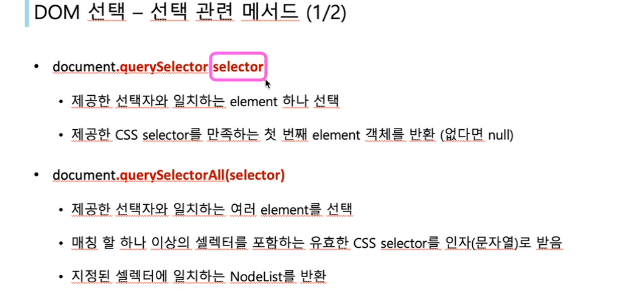

* append하면 뒤에 붙일수있구나 정도만 알면됨

* innerText innerHTML 이거 두개는 차이알아야함 (헷갈리는것임)
* 보기에 delete()로 나오면 틀림

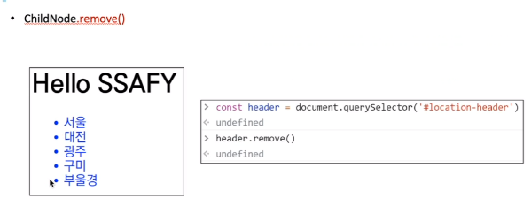

* setattribute() 
* 이벤터는 addeventlistener()랑 onclick등

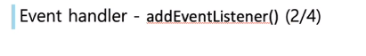

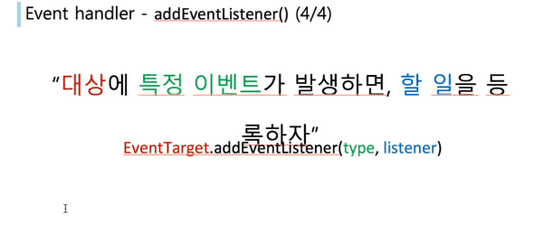

타입엔 뭐가 들어가는지?>

리스너인자에 콜백함수가 들어감

* 이거 알기 

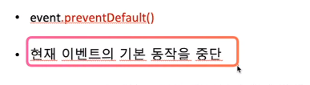

* 