# 쟈스 시험

변수 

let : 재선언 X 재할당O 블록스코프

const : 재선언 X 재할당 O 블록스코프

var : 다 된다, 함수 스코프

---

---

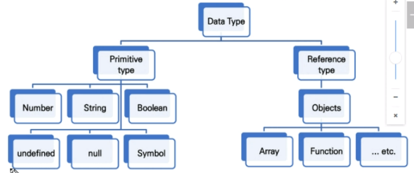

원시 타입 : 넘버, 스트링, 불린, 언디파인드, 널, 심벌

참조 타입 : 객체 : array, function

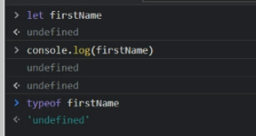

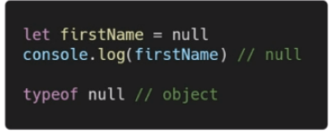

키벨류...

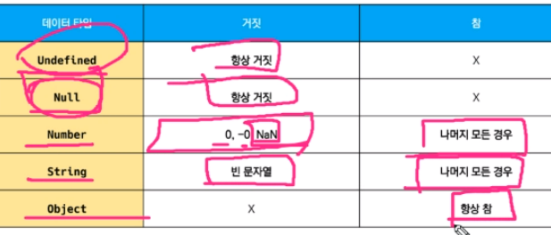

## 연산자

== (암묵적 타입변환)

=== 이랑 차이점은??? 엄격한 비교 (타입과 값이 모두 같은지)

==는 암묵적 타입변환을 하기 때문에, 문자열 123이랑 숫자 123이랑 아무거나로 바뀜...!!

true로 바뀜 ()

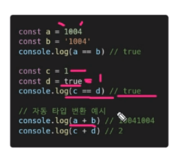

---

---

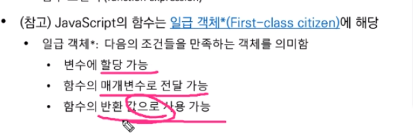

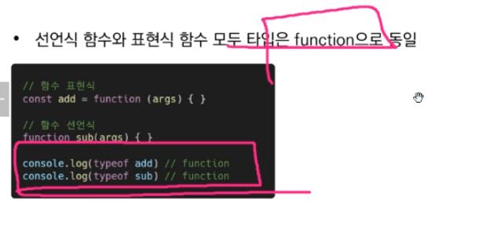

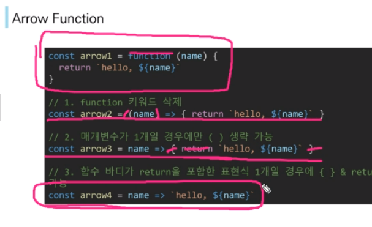

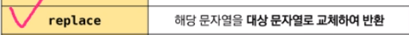

replace 첫번째 한놈만

replace 모두 다 바꿔줌

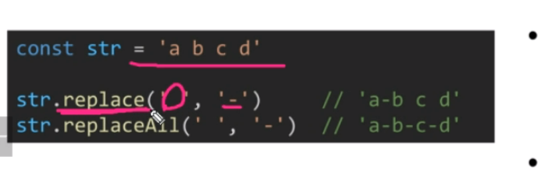

---

str.includes() 띄어쓰기

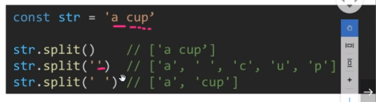

---> 언쉬프트

<--- 쉬프트

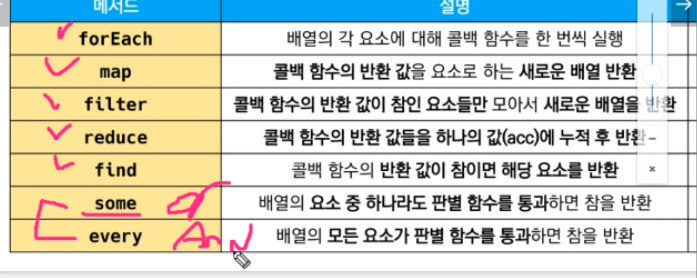

콜백함수 : 3가지 매개변수로 구성

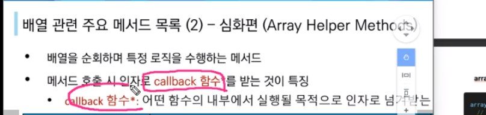

forEach (enumerate랑 비슷)

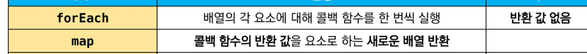

map

함수의 반환값을 새로운 배열로 만듦

새로운 배열을 만들어줌

---

reduce

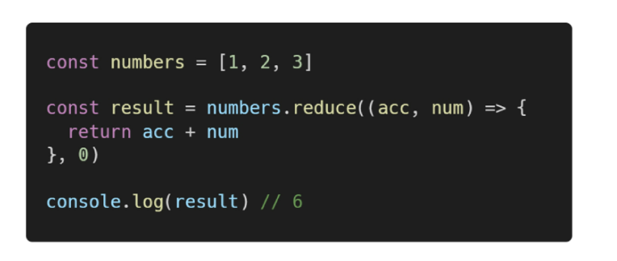

acc => reduce해줄 초기값이 , 0 이부분~!

---

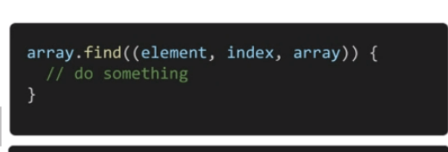

---

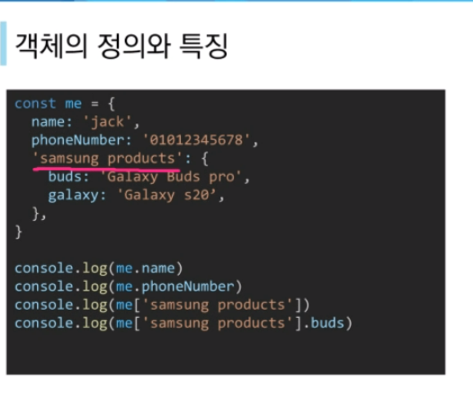

띄어쓰기 있는 사람들은 ['ㅇㅇㅇ']이렇게 해야함

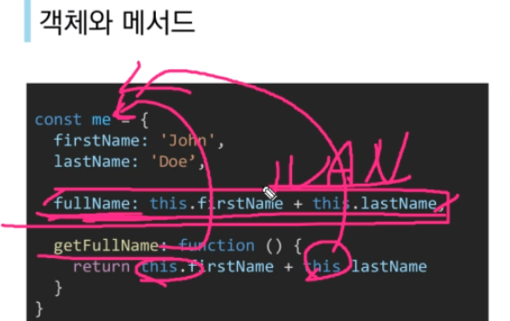

메서드 안에서의 this는 이 객체me를 보는건데, 

메서드가 아닌 놈에서의 this는 window를 봄 -- >NaN

구조 분해 할당

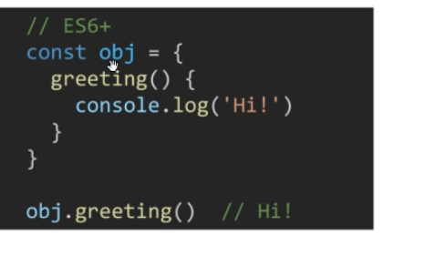

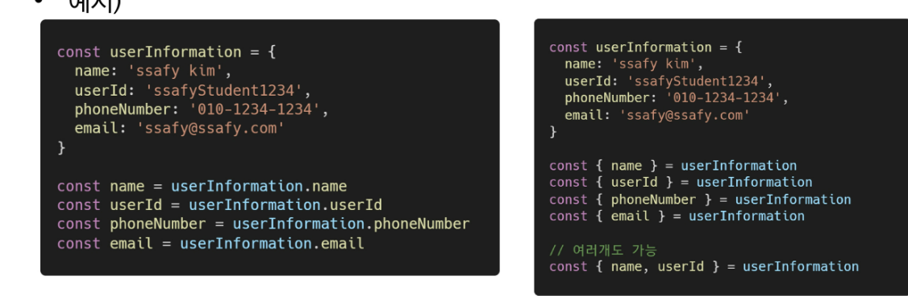

# js02

아버지 : 브랜던 아이크, 

자바스크립트 설계자, 모질라재단 설립자, 코드네임 피닉스 프로젝트 진행, 파이어폭스 전신

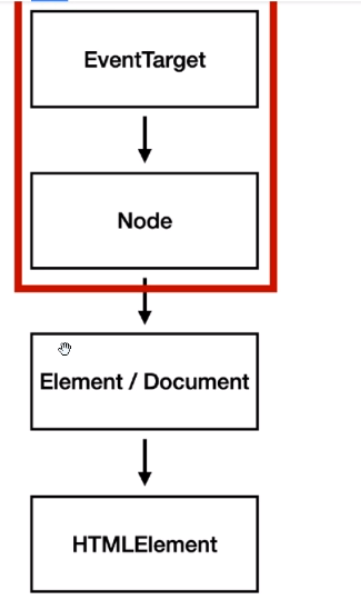

createElement

append

querySelector

querySelectorAll

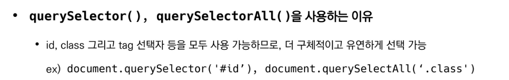

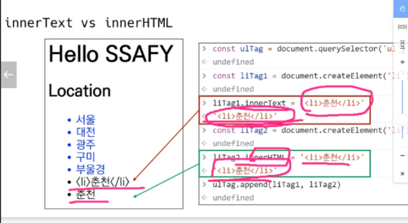

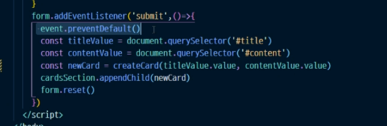

event, docudemt같은거 

----

setAttribute

getAttribute

remove

addEventListener(타입, 리스너=콜백함수)  <--> removeEventListener

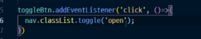

event.preventDefault() - 이벤트 기본 동작을 중지시킴

(예: a태그일 때 클릭 막아줌)

---

preventDefault 스펠링 조심!!

