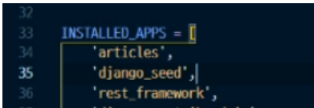
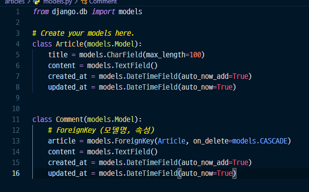
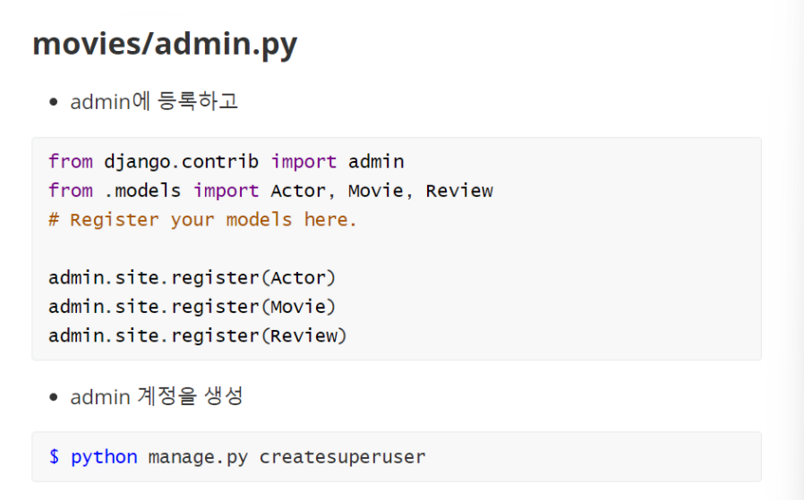
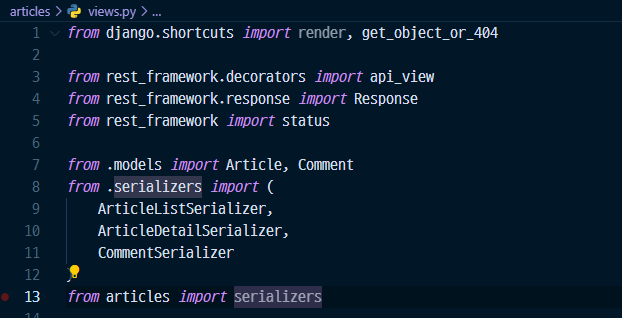
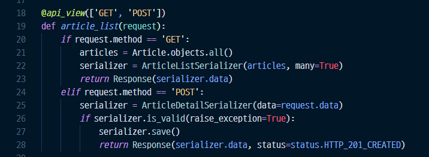
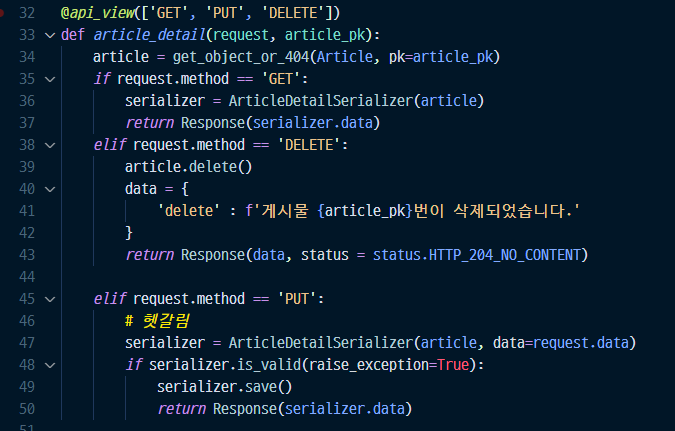
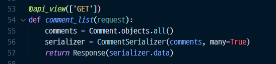
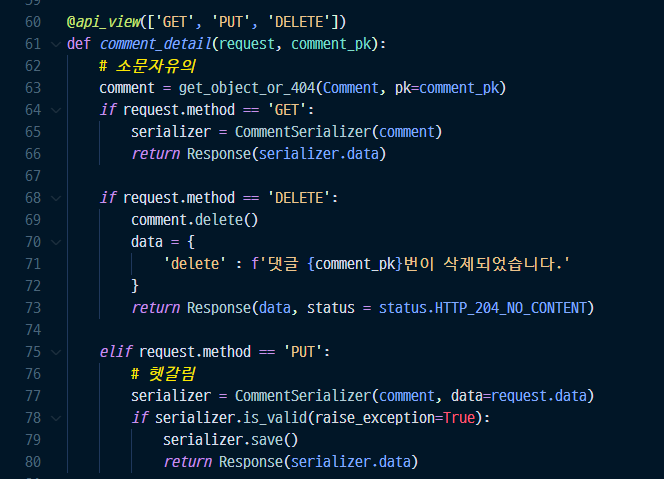
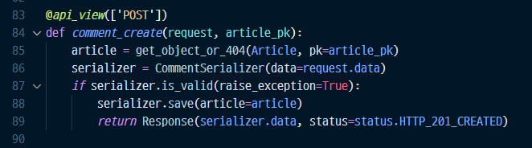

# 시험 내용 정리

### 가상환경 및 세팅

```bash
$ python -m venv venv
$ source venv/Scripts/activate

`ctrl+shift+p`로 interpreter 변경하기 -> venv로 변경

`.gitignore` 파일 생성 후 gitignore.io 사이트에서 
python, window, django, visual studio code 등을 넣어서 생성 후 파일에 넣고 저장

$ pip install -r requirements.txt
```

---

## settings.py

1. apps 등록




2. urls.py작성

프로젝트

``` python
from django.contrib import admin
from django.urls import path, include

urlpatterns = [
    path('admin/', admin.site.urls),
    path('api/v1/', include('movies.urls')),
]
```

앱

``` python
from django.urls import path
from . import views
#app_name = 'articles'

urlpatterns = [
    path('articles/', views.article_list),
    path('articles/<int:article_pk>/', views.article_detail),
    path('comments/', views.comment_list),
    path('comments/<int:comment_pk>/', views.comment_detail),
    path('articles/<int:article_pk>/comments/', views.comment_create),
]
```


3. models.py 작성



``` python
from django.db import models

# Create your models here.
class Article(models.Model):
    title = models.CharField(max_length=100)
    content = models.TextField()
    created_at = models.DateTimeField(auto_now_add=True)
    updated_at = models.DateTimeField(auto_now=True)


class Comment(models.Model):
    # ForeignKey (모델명, 속성)
    article = models.ForeignKey(Article, on_delete=models.CASCADE)
    content = models.TextField()
    created_at = models.DateTimeField(auto_now_add=True)
    updated_at = models.DateTimeField(auto_now=True)
```


4. migration, migrate

``` bash
$ python manage.py makemigrations
$ python manage.py migrate
```


5. 데이터만들기

``` bash
seed : $ python manage.py seed articles --number=20
load : $ python manage.py loaddata movies/fixtures/actors.json
```


6. 시리얼라이저


7. (혹시) admin




8. views.py (대소문자 주의)

* import 6개



``` pyhon
from django.shortcuts import render, get_object_or_404

from rest_framework.decorators import api_view
from rest_framework.response import Response
from rest_framework import status

from .models import Article, Comment
from .serializers import (
    ArticleListSerializer, 
    ArticleDetailSerializer,
    CommentSerializer
)
from articles import serializers
```


* article 리스트 




* article 디테일 




* comment 리스트




* comment 디테일




* comment 만들기

