```
```


1. model 작성 - article


2. 마이그래이션, 마이그래이트

3. seed : $ python manage.py seed articles --number=20

3-1. load   : python manage.py loaddata movies/fixtures/actors.json


4. admin

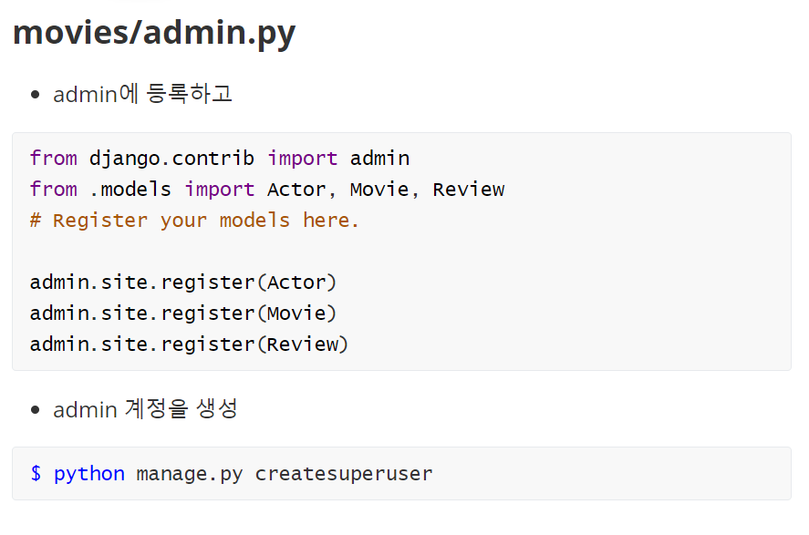


5. 시리얼라이즈


1개만 수정할때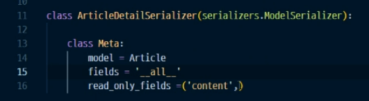


6. url


``` python
from django.contrib import admin
from django.urls import path, include

urlpatterns = [
    path('admin/', admin.site.urls),
    path('movies/', include('movies.urls')),
]
```


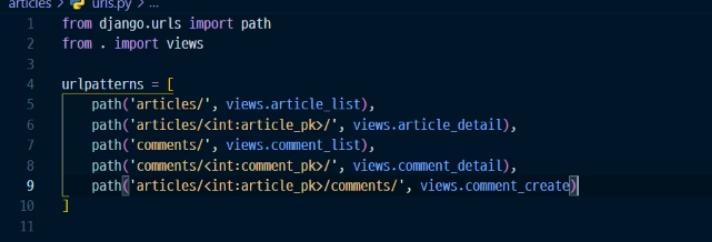


5. views


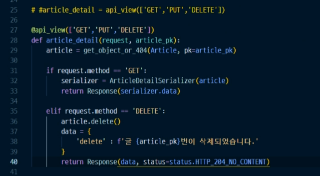

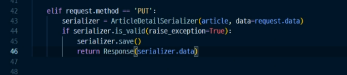


6. models에 comment넣기

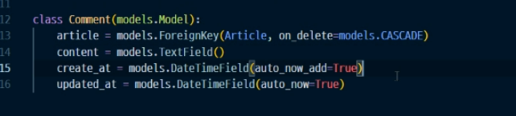

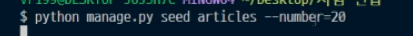


7. 시리얼라이즈 

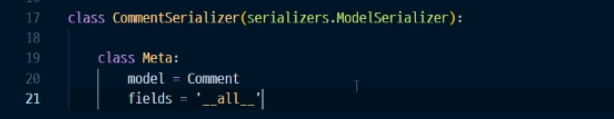


8. 뷰, comment (GET) / commentcreate(POST)

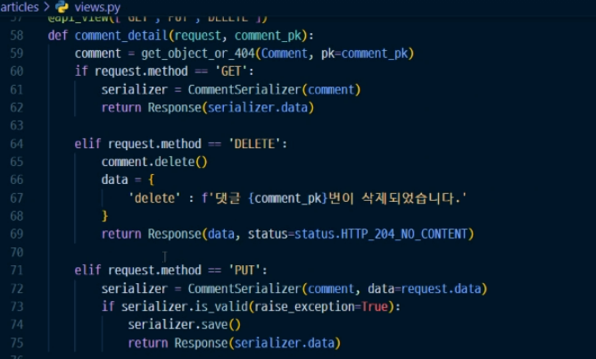


9. 시리얼라이즈


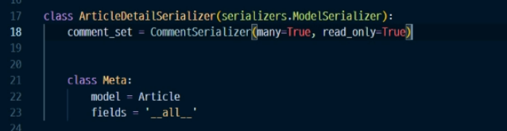


11. create

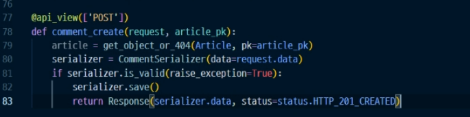


12. not null

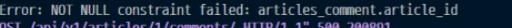


13. comments

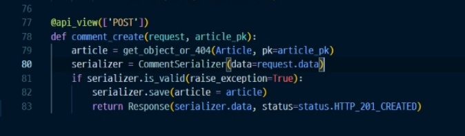


14. postman

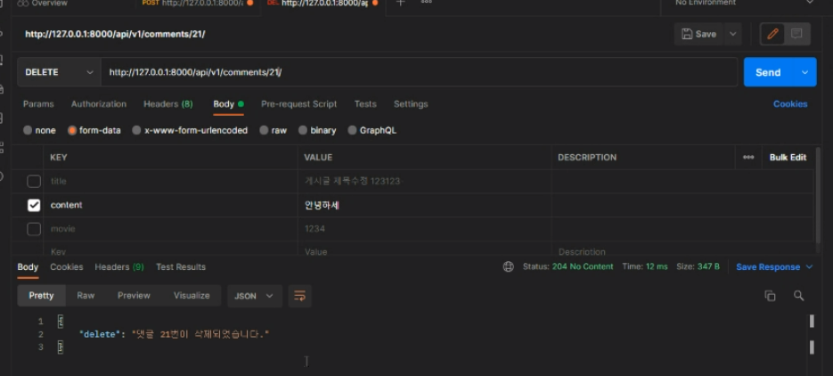

