# 0504 수요일

* Vue : 어떤 웹페이지를 동적으로 그리기 위한 프로그램
* SPA 

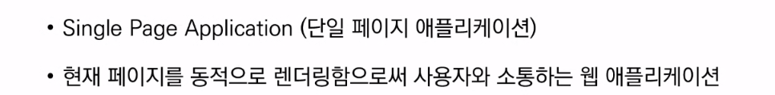

* Rendering : 내가 적은 코드를 웹페이지로 만드는 것


> 🔴 SSR, CSR의 차이점만 알면됨
>
> 🔴 SSR, CSR은 서로 상보적 관계
>
> 🔴 요즘날엔 SSR + CSR 혼용


* SSR (Server Side Rendering) : 

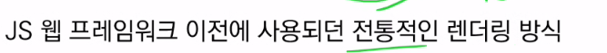

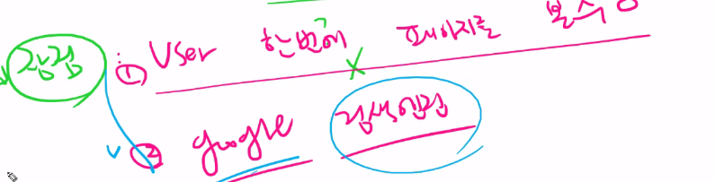

서버에서 모두 다 가져다 주니 유저가 한번에 페이지를 볼 수 있다. google 검색엔진에 잘 걸림 - 스타트업의 생존은 마케팅에 달려있음 (그래서 2번이 꽤 중요)

단점 : 사용자가 

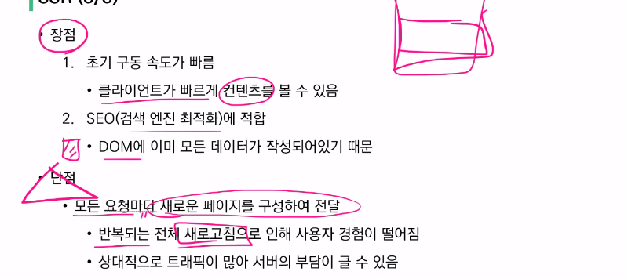


그래서 먼저 사용자에게 보여야 할 컨텐츠나, 구글 검색엔진에 걸려야할 데이터는 서버에 박아서 보내줌


* CSR (Client Side Rendering) : 브라우저가 해줌 (브라우저 전쟁해서 크롬이 이겨서 일단 모두가 크롬에 맞춤)

----

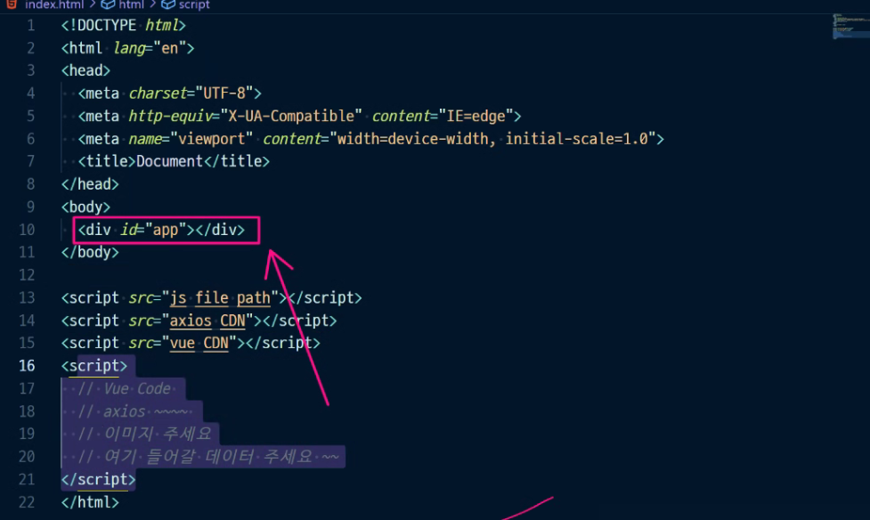

* 뼈대는 빨리 받았는데, src가 들어간 외부 소스 때문에 계속 랜더링하게 됨 --> 계속 요청해서 실시간으로 받아야하니 느리다.

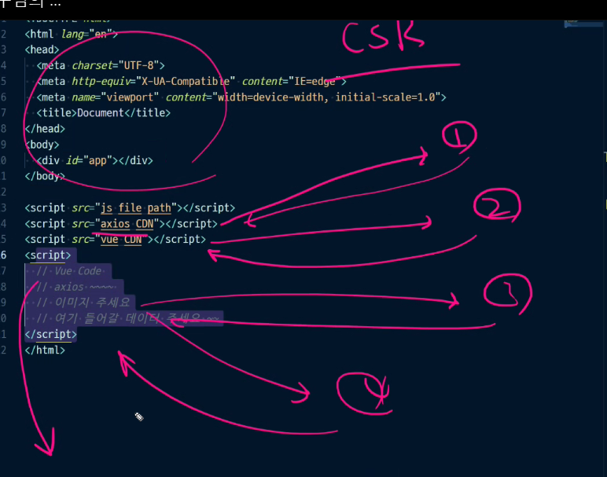

---

* SEO (검색엔진최적화)

🔴 장고는 MTV임, Vue.js는 MVVM (model - view - viewmodel)

🔴 Vue가 템플릿 역할, 장고는 MV역할 (장고는 [Django REST framework](https://www.django-rest-framework.org/))

유저가 클라이언트를 통해서 request를 날리면, 템플릿을 클라이언트에게 주고, 그걸 유저에게 보여줌

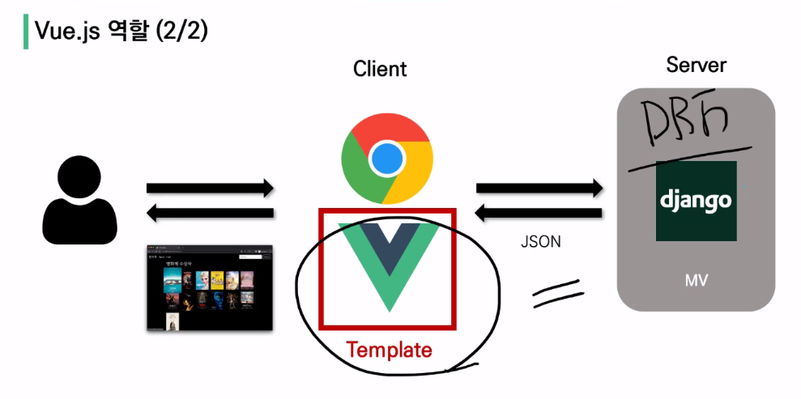


---

1. 프로젝트 완성, 2. 기능 잘되고 3. 비지니스모델(시장성이 있는 프로토 타입인가)

---

요즘 뜨는 언어 : React, Vue, 스벨트

---

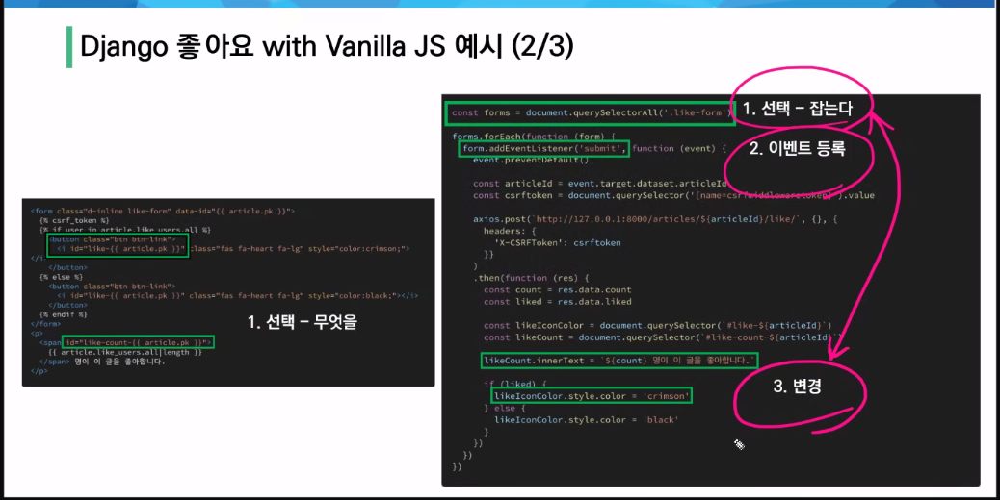

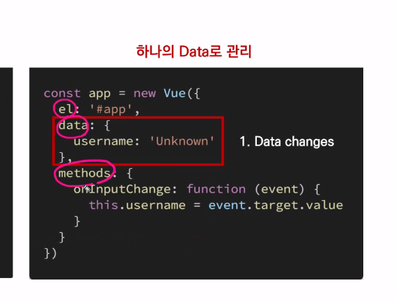

🔴 methods 🔴 : 이거 맨날 시험에 나오는데도 틀린다고~

---

## MVVM  Pattern (프론트앤드에 특화된 디자인패턴)

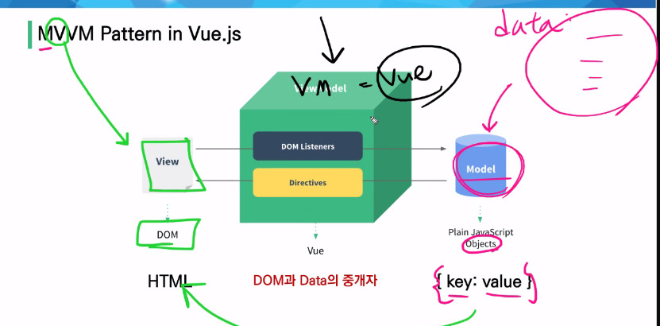

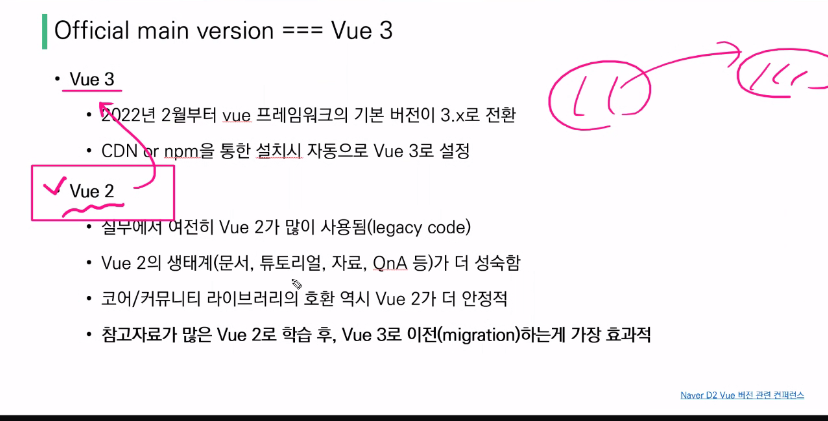

일단 Vue 2를 먼저 배우고, 필요하면 Vue 3로 이전하기

---

https://vuejs.org/

ctrl+k :  검색

https://kr.vuejs.org/v2/guide/installation.html

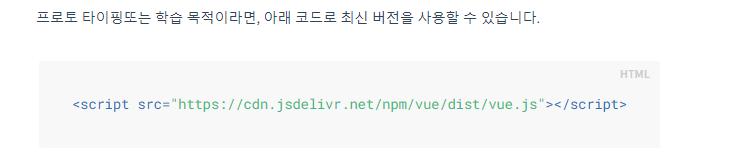

``` 
<script src="https://cdn.jsdelivr.net/npm/vue/dist/vue.js"></script>
```


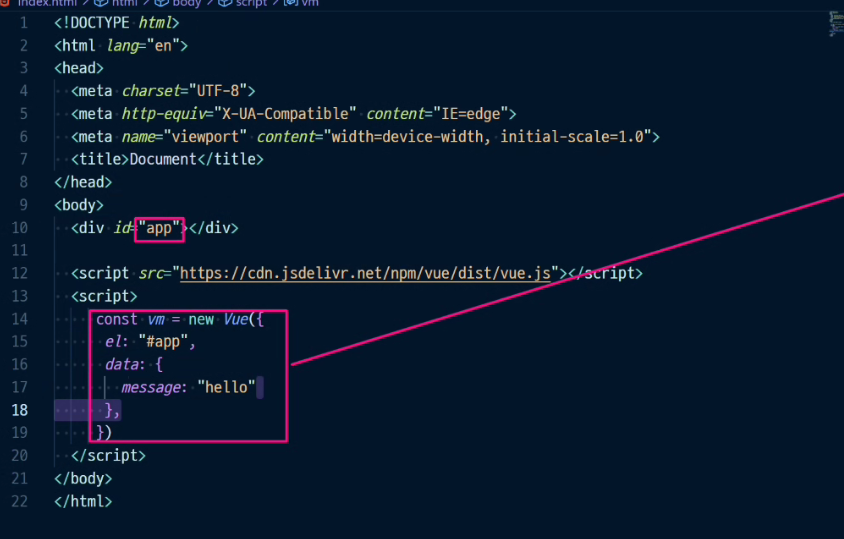


`v-*` vue야 이거해줘

v-on-click : 클릭이벤트 처리 = @click


methods안에 key, value방식

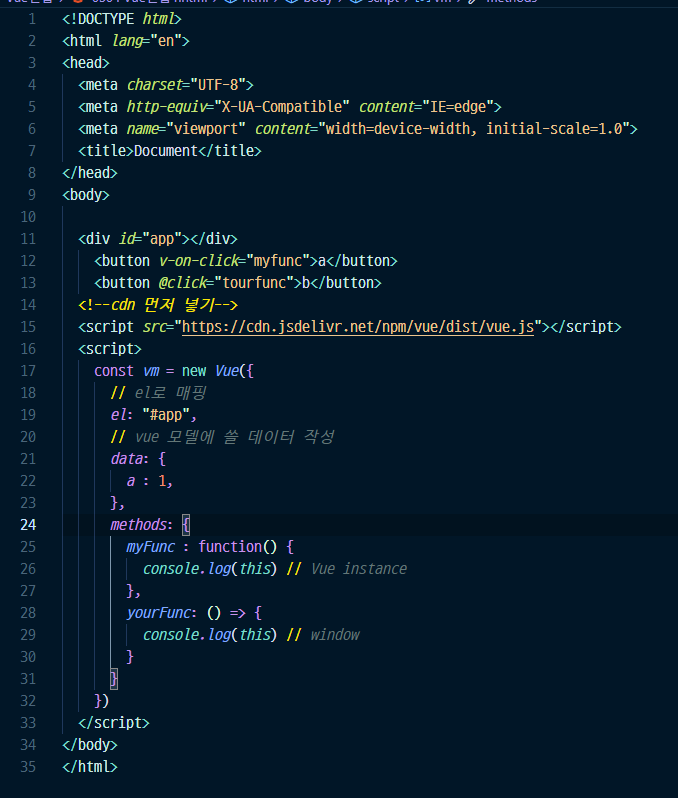

data안에 한번 감싸고, 

methods안에 한번감싸서 this가 vue가 아닐줄알았는데 그게 아니었음 vue바로 아래 정의됨


vue에 함수를 정의할 때는 화살표 함수를 쓰면안된다.!

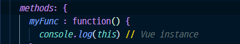

이 형태로 써야함

귀찮으니

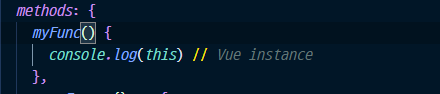

이형태로 축약해서쓰기

---

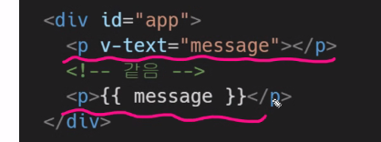

둘다 같음 이거 씀

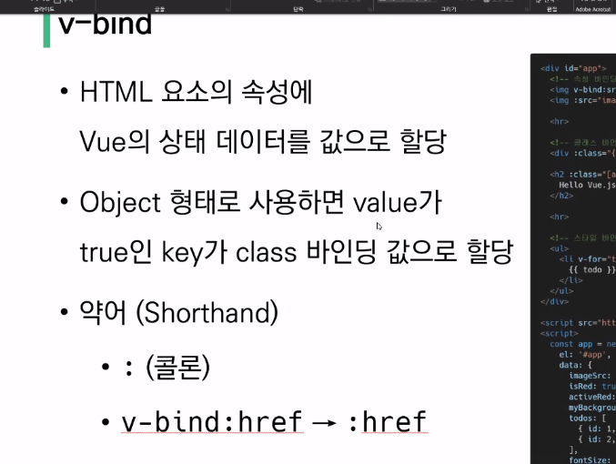