# 투두앱

``` bash
$ vue create todo-app
```


``` bash
$ vue run serve
```


* 파일은 두단어, 파스칼케이스로


## app.vue에 div, components에 작성해보자

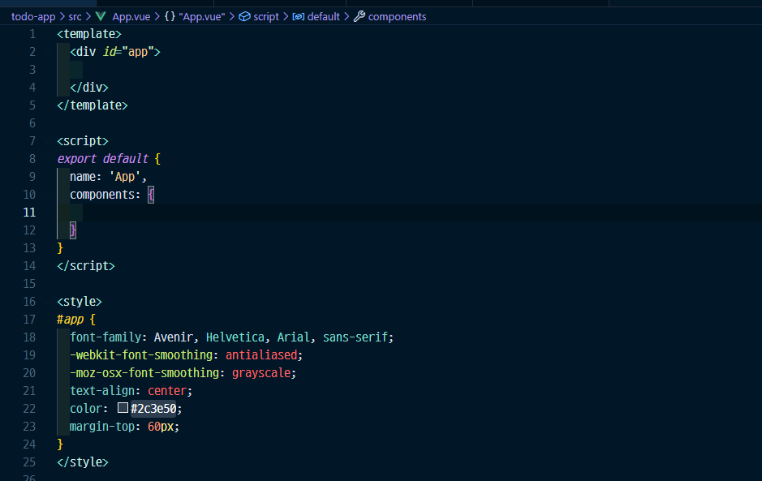

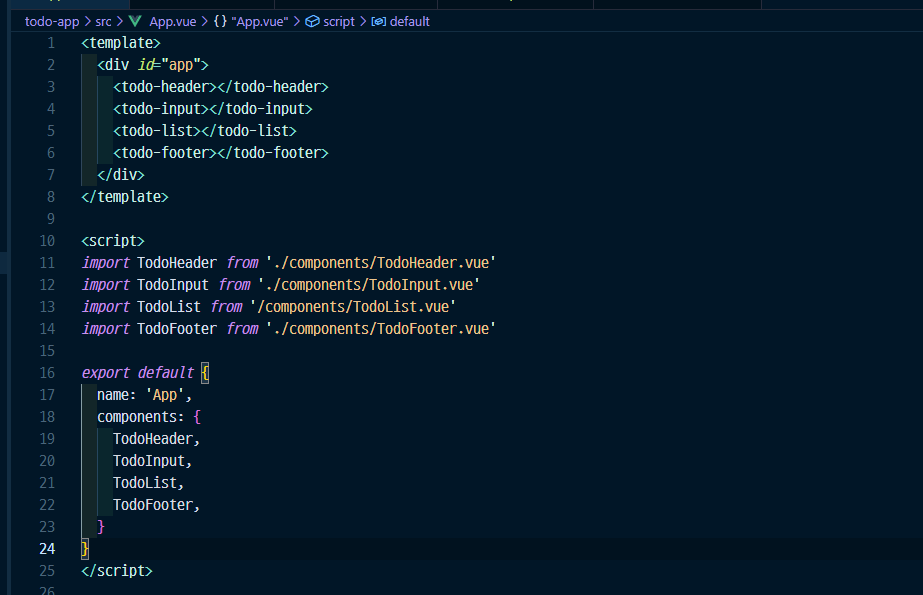


## 처음에 위치 잡기 

* 헤더


* 인풋


* 리스트

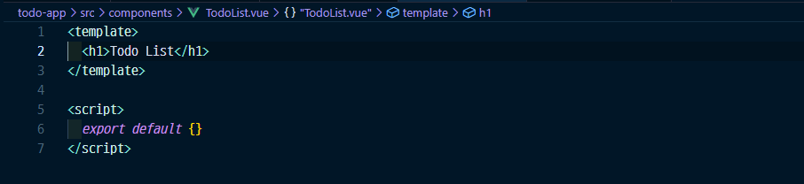

* 푸터


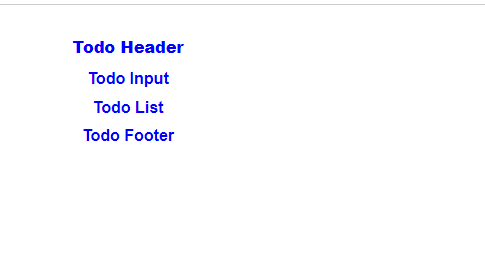

----

## 헤더

인풋이랑 데이터랑 편하게 엮어주는 것 v-model


## fontawesome을 이용해보자

public > index.html에 9번줄 사용

``` 
<script src="https://kit.fontawesome.com/4cd8e988bf.js" crossorigin="anonymous"></script>
```

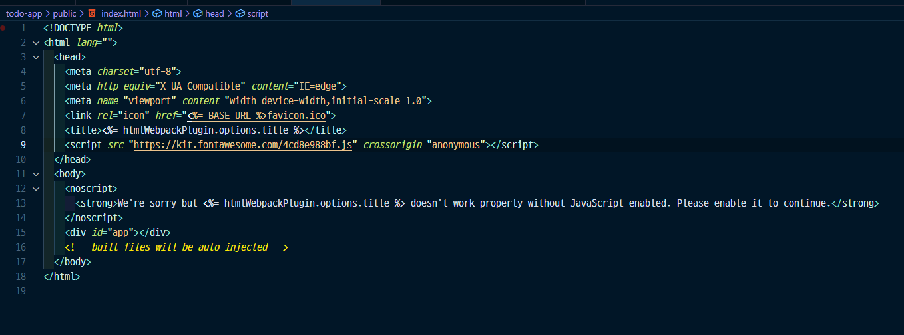


## 인풋박스 


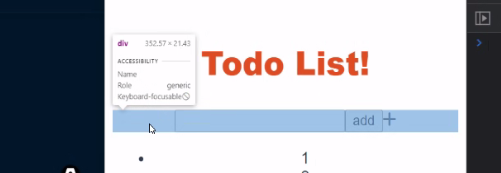


## 로컬스토리지

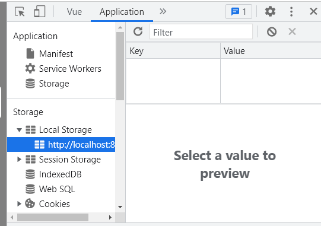

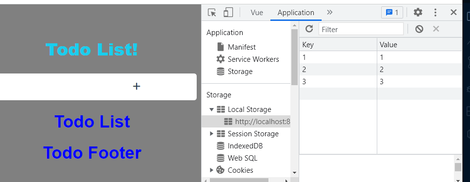

문제는 빈문자도 그냥 추가됨

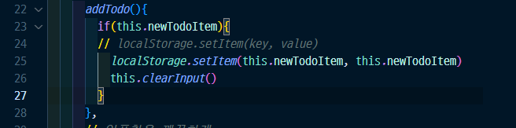


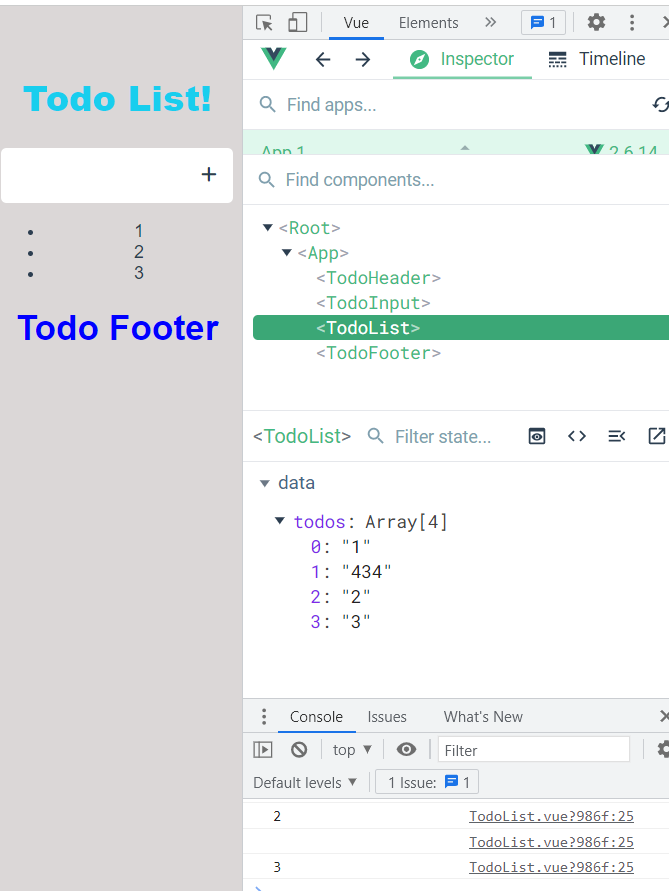


변경사항을 추적해서 dom을 알아서 그려줄 todos리스트 (array 요소 삭제)하기

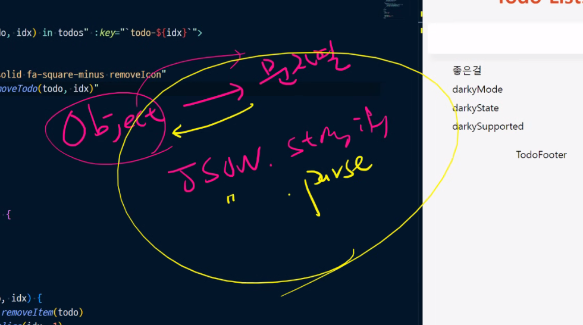

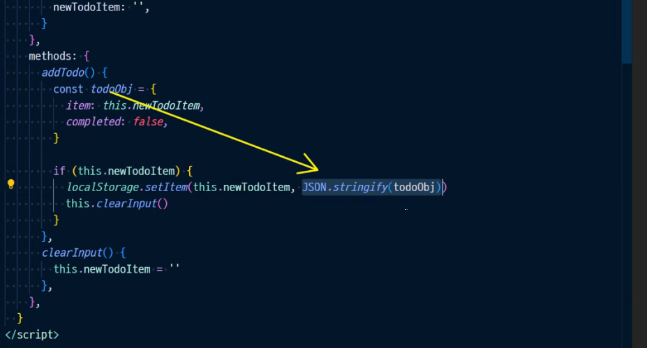


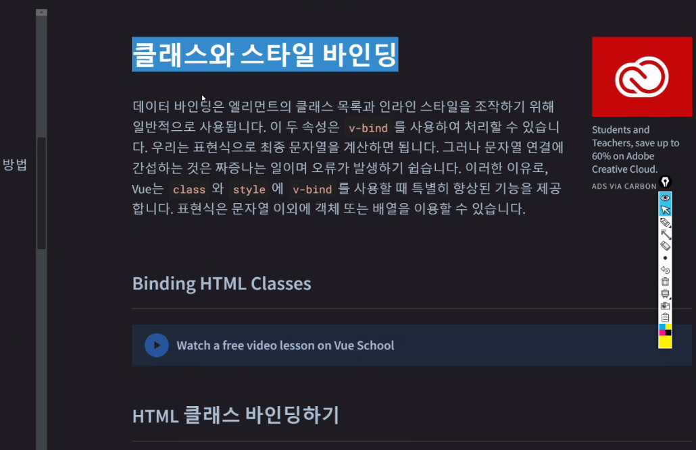


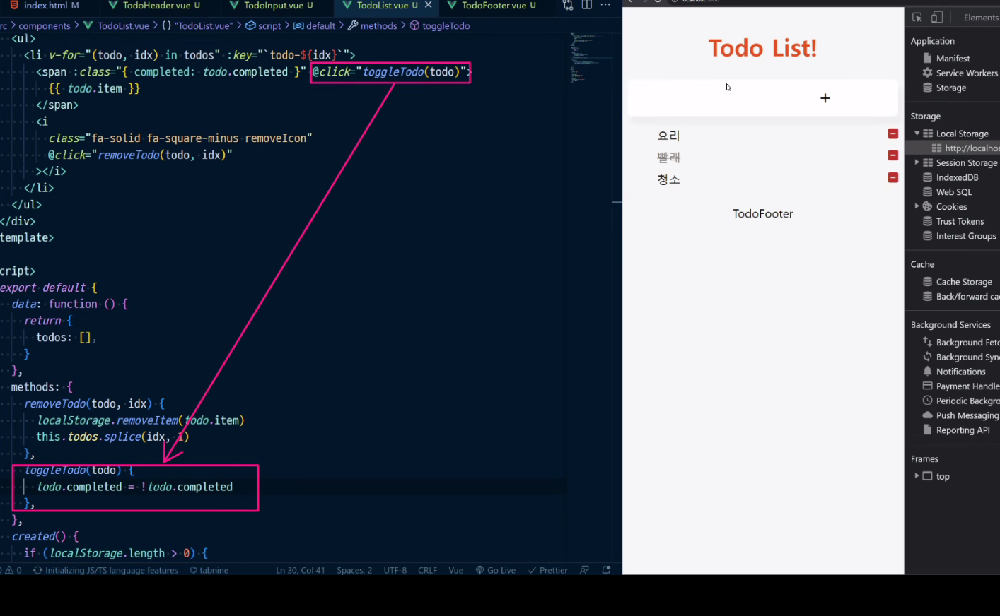

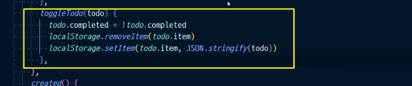


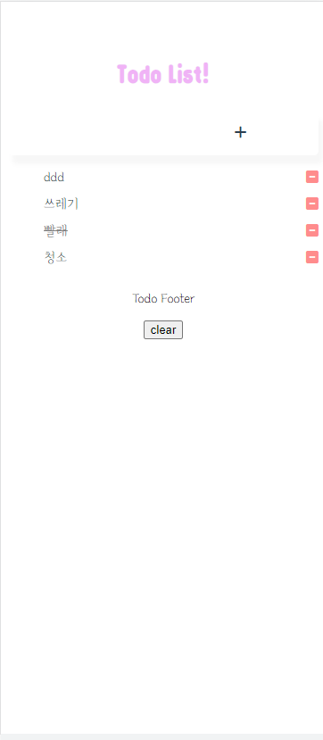