### 서버

* 존재 이유 : Database

* 서버 :  응답을 해주는 존재

* 우리가 `django만 사용했다면 html` 응답을 했다면,

  `drf를 사용했을 땐 json`으로 응답을 해줌


### 클라이언트

* 서버에게 서비스를 요청하고 필요한 인자를 서버가 요구하는 방식에 맞게 제공
* url을 알아들을 수 있게, 형식에 맞는 요청을 보내기

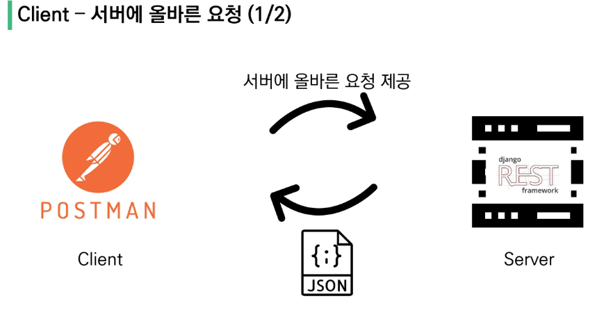

---

### 프로젝트

``` bash
$ python -m venv venv

$ source venv/Scripts/activate

$ pip install django==3.2.12 djangorestframework django_extensions

$ pip freeze > requirements.txt

$ django-admin startproject django_back .

$ touch .gitignore
```

* gitignoreio사이트 접속 `https://www.toptal.com/developers/gitignore` 파일 저장

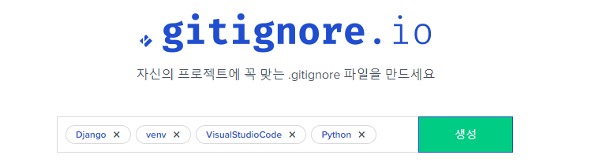

https://www.toptal.com/developers/gitignore/api/django,venv,visualstudiocode,python

---

``` bash
$ python manage.py startapp accounts

$ python manage.py startapp articles	
```


#### 세팅해주기

* `settings.py` 

[1] INSTALLED_APPS


[2] 내장 유저말고 커스텀 유저로 만들 것 `AUTH_USER_MODEL = 'accounts.user'`

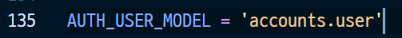

accounts app 안에 user 모델이 전체 프로젝트의 user이다.


#### models.py

* `accounts > models.py`

[1] 바로 user를 지정해준다.

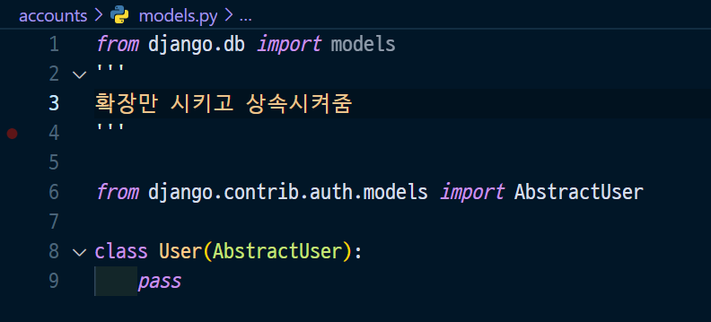


* `article > models.py` 도 써준다.

[1] Article, Comment 모델 정의

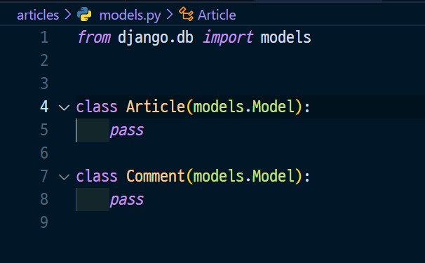

---

[2] 각 model끼리 각각 1 대 N 관계를 가짐

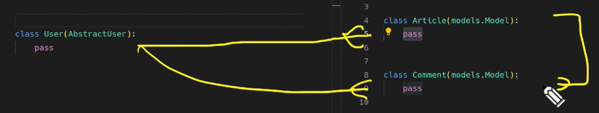

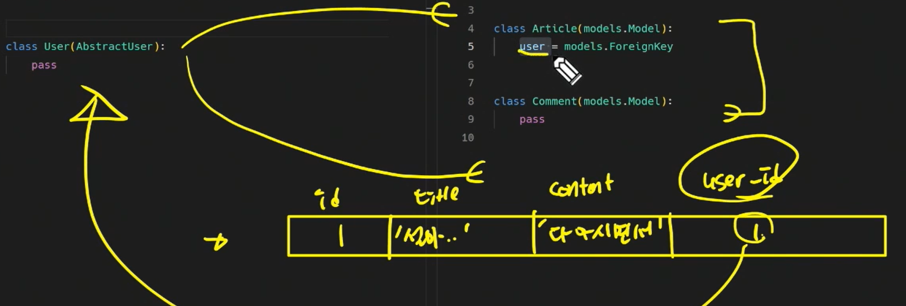


[3] 관계를 생각하면서 `article > models.py `완성

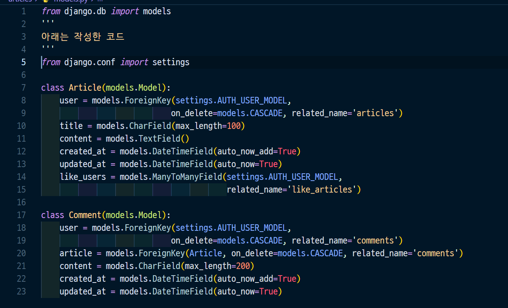


#### urls.py

[1] `project의 url 정의`

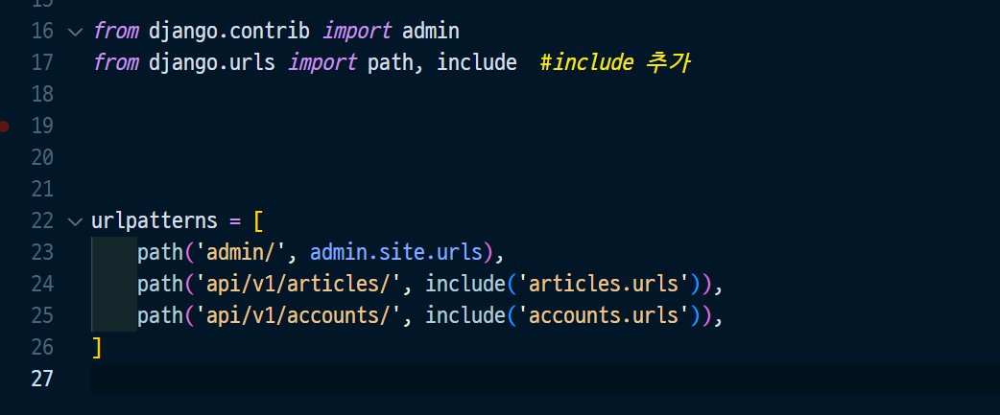


[2] `app의 url정의` - 서버 구동을 위해 최소한을 적어놓는다

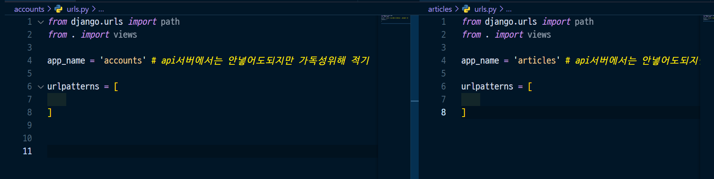


---

#### makemigrations, migrate, createsuperuser

``` bash
$ python manage.py makemigrations

$ python manage.py migrate

$ python manage.py createsuperuser
```


#### serializer


* model : 어떤 데이터를 CRUD할지 담당
* serializer : 클라에 어떤 데이터를 구성해서 줄지 선택 (JSON 표현 + Validation 검증 담당) 

* 중앙에 model 이 있고, 

  데이터를 들어올 때 : serializer가 먼저 필터링, validation도 해주고, 

  데이터를 잘 만들어서 내보낼 때 : JSON(key, value값)을 결정하는 역할

  

[1] ❗코드 양이 많아지면 serializers라는 폴더를 만들어서 하위에 파일로 분리 (파일명은 자유)

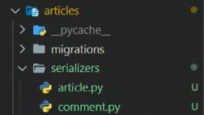


[2] `articles > serializers > article.py`

* 단일 Article JSON 

  * model serializers에 작성할 것들을 미리 사전에 생각해서 기획하고, 정리가 끝났어야함❗

  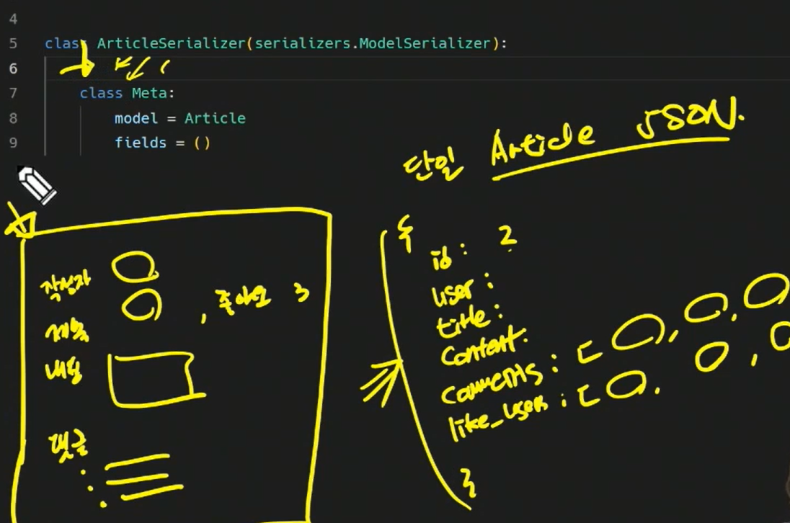


[3] `articles > serializers > article.py`
