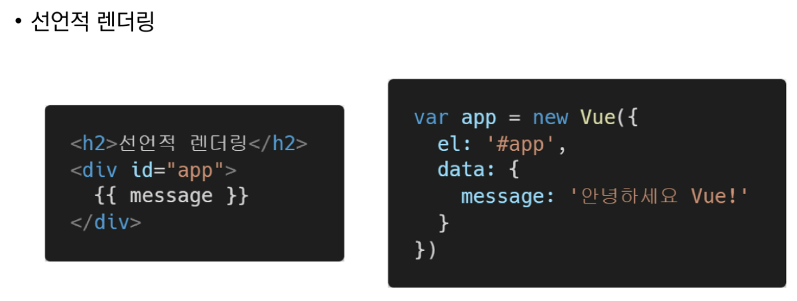
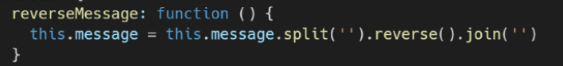
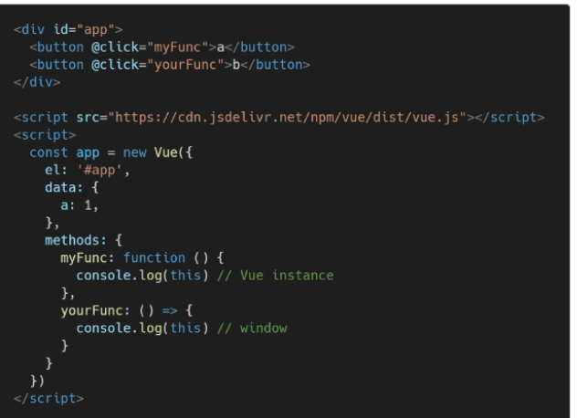
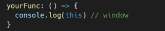
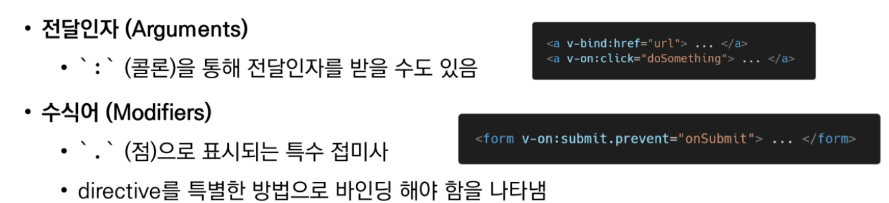
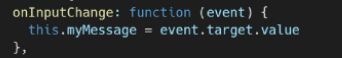
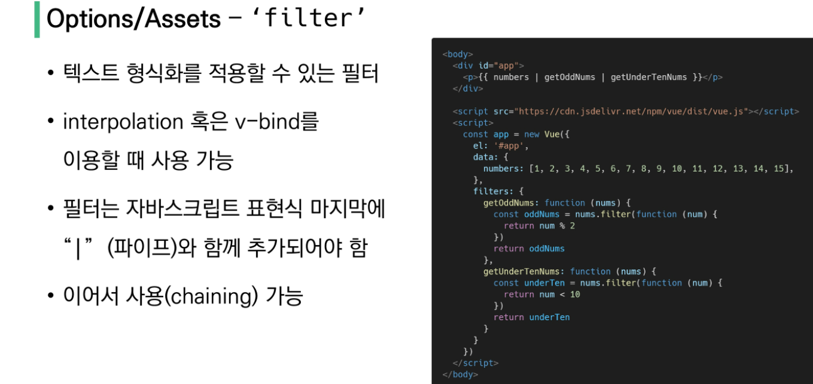
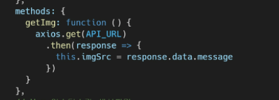

* FE : HTML, CSS, JS로 데이터를 볼 수 있게 해주고 이걸로 유저는 데이터와 상호작용을 함
  * 뷰, 리액트, 앵귤러

* Vue : SPA(Single Page Application)을 완벽하게 지원하는 JS 프레임워크
  * 앵귤러 개발자인 구글 Evan You에 의해 발표
  * 앵귤러보다 가볍고 간편~

* SPA 단일 페이지 애플리케이션 - 모바일 네이티브 앱같은 형태의 웹 페이지가 필요해짐

  * 현재 페이지를 동적으로 랜더링하는 웹 애플리케이션

  * 서버로부터 최초에 다 다운로드하고 이후에는 부분 동적 DOM 구성

  * 연속 페이지간의 UX 향상 (모바일 사용량이 증가하는 현재에 적합)

  * 동작원리 일부가 CSR(Client Side Rendering)의 구조를 따름 (모바일 앱과 비슷)

  * 과거엔 MPA(Mulit Page Application) - 웹사이트 요청에 따라 매번 새로운 페이지 응답 방식

    * 스마트폰 등장 이후 모바일 최적화의 필요성 대두 : CSR, SPA

    

  * CSR 장점

    *  서버, 클라이언트간 트래픽 감소 - 한 번 다운받고 그뒤로는 동적으로 dom그림
    * ux향상

  *  CSR 단점

    * SSR에 비해 최종 랜더링 시점이 느림, SEO(검색 엔진 최적화)에 어려움이 있다. 최초문서에 마크업이 X여서

* SSR : 서버에서 클라이언트에게 보여줄 페이지를 모두 구성하여 전달하는 방식
  * JS 웹 프레임워크 이전에 사용되던 전통적인 렌더링 방식
  * 초기 구동 빠르고, SEO에 적합
  * 모든 요청마다 새로운 페이지 구성해서 전달,  사용자 경험이 떨어짐

### 최종 html 생성주체가 누구인지에 따라 CSR SSR 결정

* 브라우저에 그릴 html을 서버가 만들면 ssr, 클라이언트가 만들면 csr
* django - axios는 ssr
* 특정요소 좋아요팔로우등은 js를 활용 csr

### Vue는 data를 하나로 관리할 수 있다

* dom 과 data가 연결되어 있고, data를 변경하면 dom은 알아서 변경
* 오직 data에 대한 관리 (developer exp 향상)만 신경쓰면 됨

### MVVM Pattern (애플리케이션 로직을 UI로 분리하기 위해 설계된 디자인 패턴)

* 구성요소는 model / view  / view model

* model

  * view에서 모델은 자바스크립트의 object              

  * vue 인스턴스의 data로 존재
  * data가 바뀌면 View(DOM)이 반응

* View
  * View는 DOM(HTML)이다
  * data의 변화에 따라서 바뀌는 대상
* View Model
  * 모든 vue 인스턴스
  * data와 dom관련 모든일을 처리
  * data를 얼만큼 잘 처리해서 dom에 보여줄 것인지 고민

### 코드 작성 방식 (Data가 변화하면 DOM이 변경)

* Data 로직 작성
* DOM 작성

* 메세지 뒤집기

### vue instance = vue component

* 모든 vue 앱은 vue함수로 새 인스턴스를 만드는 것으로 시작
* el : 인스턴스에 연결(mount)할 기존 dom요소 필요
  * css 선택자 문자열, html element로 작성
  * new를 이용한 인스턴스 생성때만 사용
* data : 인스턴스의 데이터 객체, 인스턴스의 상태 데이터 정의하는 곳
  * 

* methods : 인스턴스에 추가할 메서드
  * interpolation, v-on directive, this로 접근 가능
  * ❗주의 : 화살표 함수로 메서드 정의 x (화살표 함수가 부모 컨텍스트를 바인딩하기때문에 this는 vue인스턴스가 아님 ->  window다)

* this : 메서드 내에서 vue인스턴스를 가리킴
  * ❗주의 : data, method는 화살표함수로 정의하면 X 
  *  

### template syntax (보간법, directive)

* 렌더링 된 dom을 기본 vue 인스턴스의 데이터에 선언적으로 바인딩할 수 있는 html 기반 템플릿 구문 사용
* 보간법

* directive (디렉티브)
  * v- 접두사가 있는 특수 속성
  * 속성 값은 단일 js 표현식이 됨 (v-for예외)
  * 표현식의 값이 변경될 때 반응적으로 dom에 적용하는 역할을 함
  * 

* v- test
* v-html  xss공격에 취약할 수 있음 / 임의의 사용자로 입력받은 내용 v-html에 사용금지
* v-show 조건부 렌더링 중 하나 / 요소는 항상 렌더링되고 dom에 남아있음 / 엘리먼트에 display css속성 토글하는 것
  * css display : hidden / 렌더링 비용 높음 / 토글 비용 낮음
* v-if, v-else-if, v-else 조건에 따라 요소 렌더링 / directive의 표현식이 true 일때만 렌더링
  * 엘리먼트 및 포함된 directive는 토글하는동안 삭제되고 다시 작성됨
  * 전달인자가 false일 경우 렌더링 안됨 / 자주 변경되는 요소의 경우 다시 렌더링해야해서 렌더링비용증가할 수 있음

* v-for

  * key 속성과 함께 작성
  * 

  

* v-on 이벤트리스너 연결
  * @ 
  * ex) v-on:click -> @click

* v-bind html 요소의 속성에 vue 상태 데이터 값을 할당
  * 
  * :
  * ex) v-bind:href -> :href
* v-model : html form 요소의 값과 data를 양방향 바인딩

* computed : 데이터를 기반으로 하는 계산된 속성 (선언적)

* 

  

  * 함수가 아닌 함수의 반환값이 바인딩됨 (반드시 반환 값이 있어야함)
  * 종속된 데이터가 변경될 때만 함수 실행
  * computed대신 methods에 정의할 수도 있지만 차이점은 종속 대상에 따라 저장(캐싱)됨
  * 종속대상이 변하지 않는한 여러번 호출해도 계산되어 있는 결과를 반환
  * methods는 호출마다 렌더링할 때마다 항상 함수 실행

* watch : 데이터 감시 , 데이터 변화 시에 실행되는 함수
* 

* filter

* 

### lifecycle hooks

* 각 vue 인스턴스는 생성될 때 일련의 초기화 단계를 거침
* 이 과정에서 사용자 정의 로직을 실행할 수 있는 lifecycle hooks도 호출됨
* created는 vue인스턴스가 생성된 후 호출 (컴파일하기전에 호출)
* 

