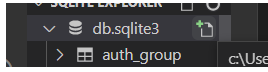
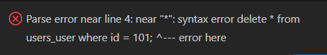
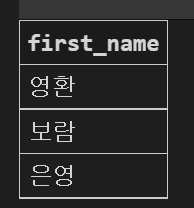

[TOC]

# SQL with django ORM

## 기본 준비 사항

* django app

  * 가상환경 세팅

    ``` bash
  $ python -m venv venv
    ```

  * 패키지 설치
  
    ``` bash
    $ source venv/Scripts/activate 
    ```
  
  * requirements.txt 설치
  
    ``` bash
    $ pip install -r requirements.txt
    ```
  
  * migrate
  
    ```bash
    $ python manage.py migrate
    ```
  
* 제공 받은 `users.csv` 파일은 db.sqlite3와 같은 곳에 위치하도록 이동

* `db.sqlite3` 활용

  * ctrl+shift+p 로 `open database` db.sqlite3 선택

  * `sqlite3`  실행
  
    ```bash
  $ sqlite3 db.sqlite3
    ```

  * 테이블 확인
  
    ```sqlite
    sqlite > .tables
    auth_group                  django_admin_log
    auth_group_permissions      django_content_type
    auth_permission             django_migrations
    auth_user                   django_session
    auth_user_groups            auth_user_user_permissions  
    users_user
    ```

  * csv 파일 data 로드 및 확인
  
    ```sqlite
    sqlite > .mode csv
    sqlite > .import users.csv users_user
    
    sqlite > SELECT COUNT(*) FROM users_user;
    100
    ```
  
  * shell_plus 사용
  
    ``` bash
    $ python manage.py shell_plus
    ```
  
  * db.sqlite3으로 new query
  
    
  
    

1. `users.csv` 를 `users_user`로 만드는 이유?

2. db.sqlite3에서는 auth_group, django_session 등으로 되어 있는데 언더바를 기준으로 테이블, db등의 의미가 있는 건가요?
3. orm시에 from users.models import User 를 사용하는데 이거는 users.model에서 User 테이블을 넣는건지?
4. 

---


## 문제

> ORM은 django extensions의 shell_plus에서,
>
> SQL은 수업에서 진행한 [SQLite 확장프로그램](https://marketplace.visualstudio.com/items?itemName=alexcvzz.vscode-sqlite) 사용 방식으로 진행

### 1. 기본 CRUD 로직

1. 모든 user 레코드 조회

   ```python
   # orm
   from users.models import User
   User.objects.all()
   ```

      ```sql
   -- sql
   select * from users_user;
      ```

2. user 레코드 생성

   ```python
   # orm
   User.objects.create(first_name='중구', last_name='이', age=30, country='충청남도', phone='010-1234-5678', balance=45000)
   ```

   ```sql
   -- sql
   INSERT INTO users_user(id, first_name, last_name, age, country, phone, balance)
   VALUES(101, '길동', '홍', 55, '경기도', '010-1928-2837', 5500);
   ```

   * 하나의 레코드를 빼고 작성 후 `NOT NULL` constraint 오류를 orm과 sql에서 모두 확인 해보세요.

3. 해당 user 레코드 조회

   - `102` 번 id의 전체 레코드 조회

   ```python
   # orm
   User.objects.get(pk=101)
   ```

   ```sql
   -- sql
   select * 
   from users_user 
   where id = 102;
   ```

4. 해당 user 레코드 수정

   - ORM: `102` 번 글의 `last_name` 을 '김' 으로 수정
   - SQL: `102` 번 글의 `first_name` 을 '철수' 로 수정

   ```python
   # orm
   user = User.objects.get(pk=101)
   user.last_name = '김'
   user.save()
   ```

      ```sql
   -- sql
   UPDATE users_user SET first_name='철수' WHERE id=101;
      ```

5. 해당 user 레코드 삭제

   - ORM: `102` 번 글 삭제
   - `SQL`:  `101` 번 글 삭제 

   ```python
   # orm
   user = User.objects.get(pk=101)
```
   
   ```sql
   -- sql
   delete from users_user 
   where id = 102;
   ```



---


### 2. 조건에 따른 쿼리문

1. 전체 인원 수 

   - `User` 의 전체 인원수

   ```python
   # orm
   User.objects.all().count()
   len(User.objects.all())  # 가급적 len()은 사용하지 말라고 공식문서에 나와있다.
   ```

   ```sql
   -- sql
   SELECT COUNT(*) FROM users_user;
   ```

2. 나이가 30인 사람의 이름

   - `ORM` : `.values` 활용
     - 예시: `User.objects.filter(조건).values(컬럼이름)`

   ```python
   # orm
   User.objects.filter(age=30).values('first_name')
   ######################################################
   # orm을 사용하면 다음과 같이 데이터 조작 가능
   user = User.objects.filter(age=30).values('first_name')
   user[0].get('first_name') # '영환'으로 출력
   ######################################################
   print(User.objects.filter(age=30).values('first_name').query) # .query로 확인가능
   # SELECT "users_user"."first_name" FROM "users_user" WHERE "users_user"."age" = 30 와 같이 출력됨
   ```

      ```sql
   -- sql
   SELECT first_name FROM users_user WHERE age = 30;
      ```

   

   

3. 나이가 30살 이상인 사람의 인원 수

   -  ORM: `__gte` , `__lte` , `__gt`, `__lt` -> 대소관계 활용

   ```python
   # orm
   User.objects.filter(age__gte=30).count()
   ```

      ```sql
   -- sql
   SELECT COUNT(*) FROM users_user WHERE age >= 30;
      ```

4. 나이가 20살 이하인 사람의 인원 수 

   ```python
   # orm
   User.objects.filter(age__lte=20).count()
   ```

   ```sql
   -- sql
   SELECT COUNT(*) FROM users_user WHERE age <= 20;
   ```

5. 나이가 30이면서 성이 김씨인 사람의 인원 수

   ```python
   # orm
   User.objects.filter(last_name='김', age=30).count() 
   ```

      ```sql
   -- sql
   SELECT COUNT(*) FROM users_user WHERE age=30 and last_name='김';
      ```

6. 나이가 30이거나 성이 김씨인 사람?

   ```python
   # orm
   User.objects.filter(Q(age=30) | Q(last_name='김')) 
   ```

   ```sql
   -- sql
   SELECT * FROM users_user WHERE age=30 or last_name='김';
   ```

7. 지역번호가 02인 사람의 인원 수

   - `ORM`: `__startswith` 은 기본적으로 SQL에서는 `%` wild card로 넘어간다.

   ```python
   # orm
   User.objects.filter(phone__startswith='02-').count()
   ```

      ```sql
   -- sql
   SELECT COUNT(*) FROM users_user WHERE phone LIKE '02-%';
      ```

8. 거주 지역이 강원도이면서 성이 황씨인 사람의 이름

   ```python
   # orm
   User.objects.filter(country='강원도', last_name='황').values('first_name') # 이걸로!

   # '은정'만 뽑아 올려면 다음과 같이 작성해야 한다.
   # <QuerySet [{'first_name': '은정'}]> => QuerySet의 첫 번째 요소 임을 주의!
   User.objects.filter(country='강원도', last_name='황').values('first_name').first().get('first_name')
   ```
   
      ```sql
   -- sql
   SELECT first_name FROM users_user WHERE country='강원도' and last_name='황';
      ```


---


### 3. 정렬 및 LIMIT, OFFSET

1. 나이가 많은 사람순으로 10명

   ```python
   # orm
   User.objects.order_by('-age')[:10]
   ```

      ```sql
   -- sql
   SELECT * FROM users_user ORDER BY age DESC LIMIT 10;
      ```

2. 잔액이 적은 사람순으로 10명

   ```python
   # orm
   User.objects.order_by('balance')[:10]
   ```

      ```sql
   -- sql
   SELECT * FROM users_user ORDER BY balance LIMIT 10;
      ```

3. 잔고는 오름차순, 나이는 내림차순으로 10명?

      ```python
   # orm
   User.objects.order_by('balance', '-age')[:10]
```
   
   ```sql
   -- sql
   SELECT * FROM users_user ORDER BY balance, age DESC LIMIT 10;
   ```
   
4. 성, 이름 내림차순 순으로 5번째 있는 사람

   ```python
   # orm
   User.objects.order_by('-last_name', '-first_name')[4]
```
   
      ```sql
   -- sql 
   -- OFFSET : 원하는 행만큼 뛰어넘기
   SELECT * FROM users_user ORDER BY last_name DESC, first_name DESC LIMIT 1 OFFSET 4;
      ```


---


### 4. 표현식

#### 4.1 Aggregate

> - https://docs.djangoproject.com/en/3.2/topics/db/aggregation/#aggregation
>- '종합', '집합', '합계' 등의 사전적 의미
> - 특정 필드 전체의 합, 평균 등을 계산할 때 사용
>- `Django_aggregation.md` 문서 참고

1. 전체 평균 나이

   ```python
   # orm
   from django.db.models import Avg, Max, Sum # shell_plus로 켜면 자동으로 import 해준다.
   # python 파일에서 작성할 때는 위 구문을 반드시 작성해줘야 한다.
   User.objects.aggregate(Avg('age'))
   User.objects.aggregate(avg_value=Avg('age')) # aggregate customizing
   ```

      ```sql
   -- sql
   SELECT AVG(age) FROM users_user;
      ```

2. 김씨의 평균 나이

   ```python
   # orm
   User.objects.filter(last_name='김').aggregate(Avg('age'))
   ```

      ```sql
   -- sql
   SELECT AVG(age) FROM users_user WHERE last_name='김';
      ```

3. 강원도에 사는 사람의 평균 계좌 잔고

   ```python
   # orm
   User.objects.filter(country='강원도').aggregate(Avg('balance'))
   ```

   ```sql
   -- sql
   SELECT AVG(balance) FROM users_user WHERE country='강원도';
   ```

4. 계좌 잔액 중 가장 높은 값

   ```python
   # orm
   User.objects.aggregate(Max('balance'))
   ```

      ```sql
   -- sql
   SELECT MAX(balance) FROM users_user;
      ```

5. 계좌 잔액 총액

   ```python
   # orm
   User.objects.aggregate(Max('balance'))
```
   
      ```sql
   -- sql
   SELECT SUM(balance) FROM users_user;
      ```


#### 4.2 Annotate

1. 지역별 인원 수

   ```PYTHON
   # orm
   
```
   
   ```SQL
   -- sql
SELECT country, count(*)
   FROM users_user
   GROUP BY country;
   ```
   
   