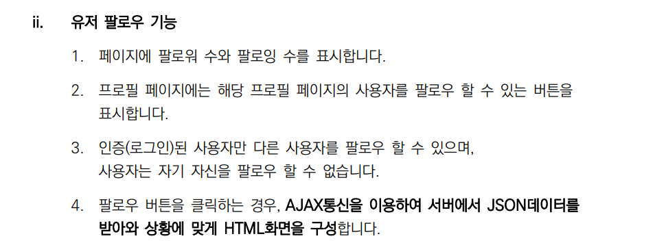
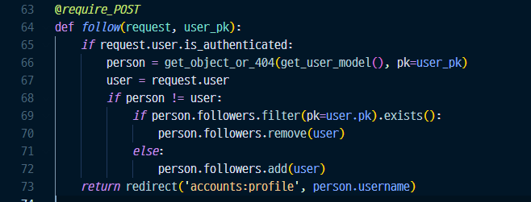
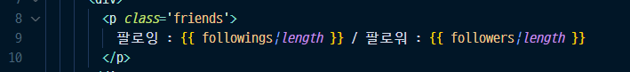
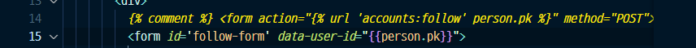
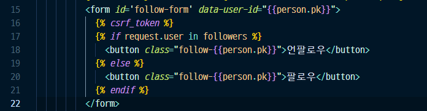

``` bash
$ python -m venv venv

$ source venv/Scripts/activate

$ pip install -r requirements.txt

$ python manage.py migrate

$ python manage.py loaddata movies/fixtures/movies.json
```


## 좋아요 기능

### 1. 우선 base.html에서 axios scr를 추가하고, block을 설정

``` html
 <script src="https://cdn.jsdelivr.net/npm/bootstrap@5.0.0-beta3/dist/js/bootstrap.bundle.min.js" integrity="sha384-JEW9xMcG8R+pH31jmWH6WWP0WintQrMb4s7ZOdauHnUtxwoG2vI5DkLtS3qm9Ekf" crossorigin="anonymous"></script>
 <script src="https://cdn.jsdelivr.net/npm/axios/dist/axios.min.js"></script>
 



```


* 선택 font awesome

``` html
<link rel="stylesheet" href="path/to/font-awesome/css/font-awesome.min.css">
```


### 2. 유저 팔로우 기능 view > template




> 1) accounts/views.py를 봄

* 스켈레톤 코드



* 바꿀 코드


> 2. accounts/profile.html

* p태그 추가



* form 태그 바꿔줌



* button class 바꿔줌

