# pjt 디버깅

1. 가상환경, requirements.txt 다운로드

2. migrate

3. 로드 데이터

🔴 유저 팔로우 기능 (뷰 고치고, 템플릿 script )

## accounts/views.py/ follow

4. 유저팔로우기능 (뷰 고치고, )

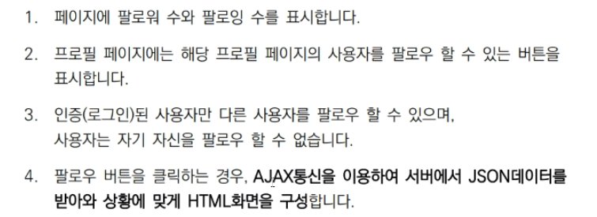

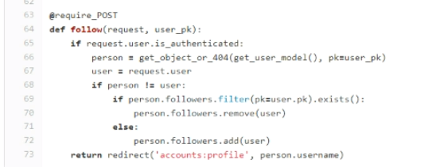

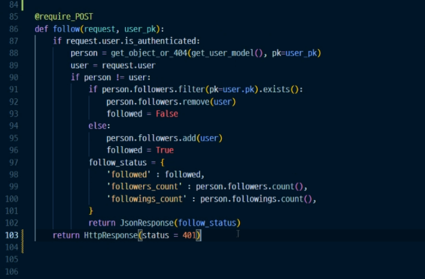

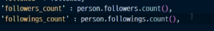

날 팔로잉하는 사람 수 / 내가 팔로우하는 사람 수

---

5. html 고치기

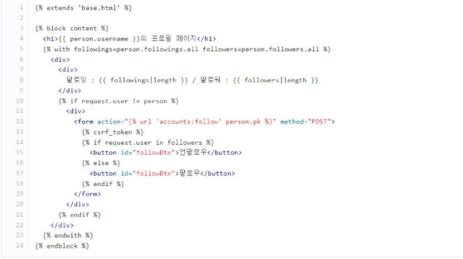

* script 넣기

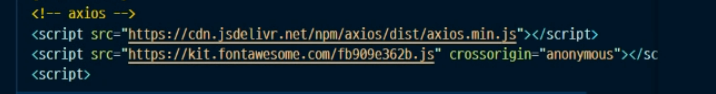

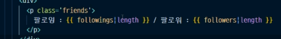

form 지우고

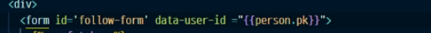

 

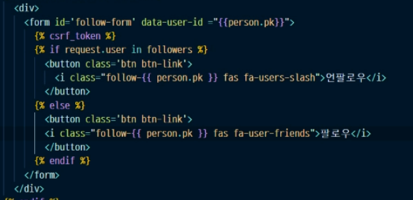

* 이제 스크립트를 짤거임

form을 처리함(여기서 비동기처리를 하니깐)

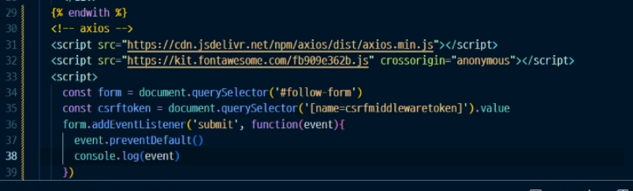

target > dataset > userId (2번 = test값이 들어온다.)

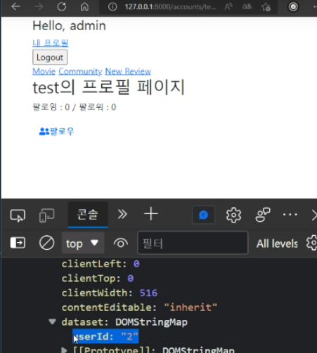

axios

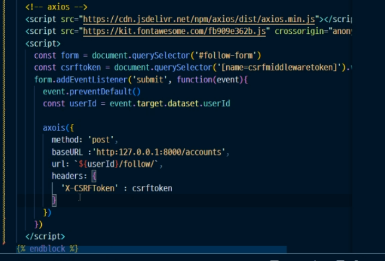

.then 으로 안에 내용을 바꿔줌

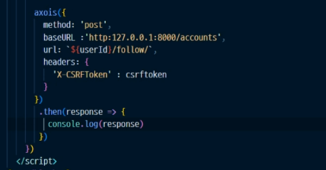

로 찍어줌

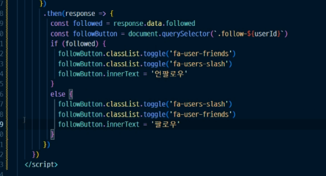

toggle, add, remove

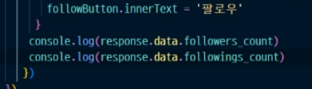

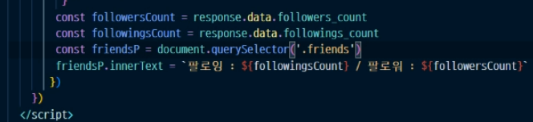

---

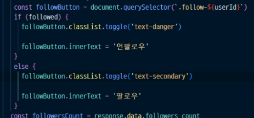

## 2. 좋아요

`views`

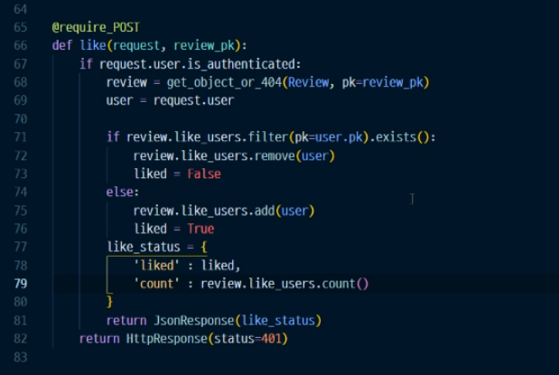

`templates`

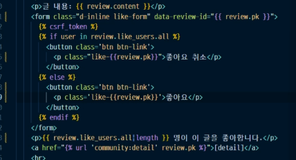

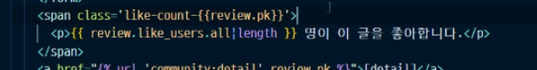

* axios

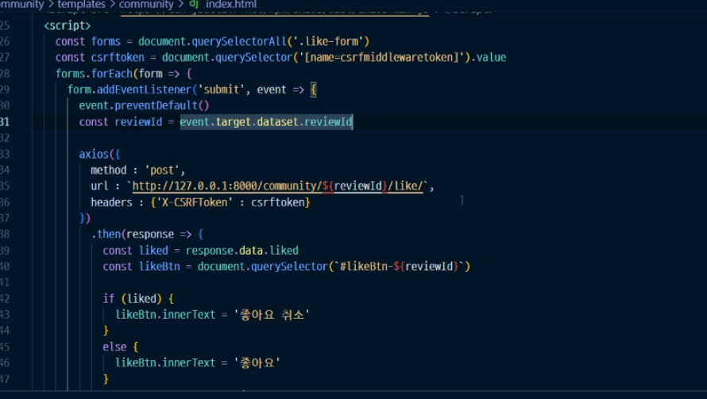

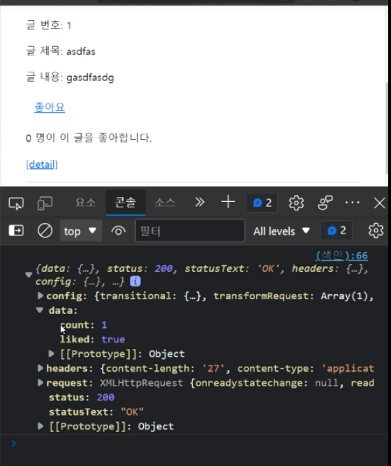

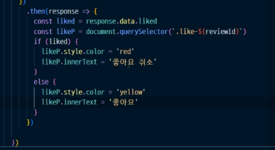

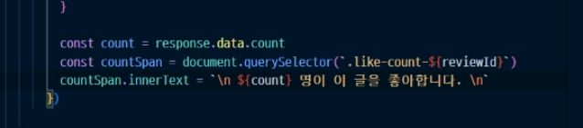

---

하트 클래스

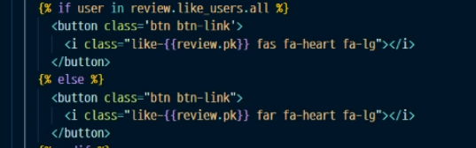

---

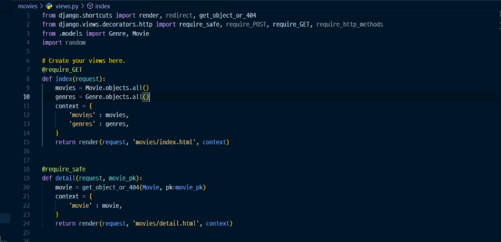

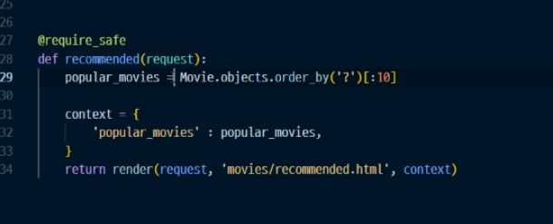

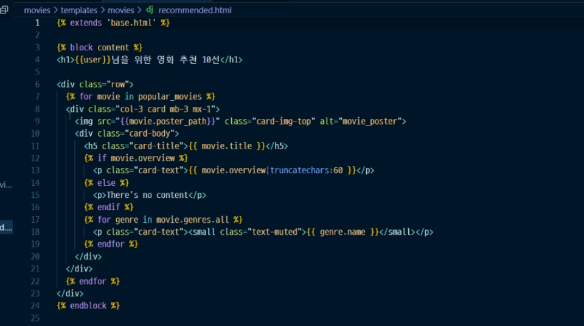

60자이내

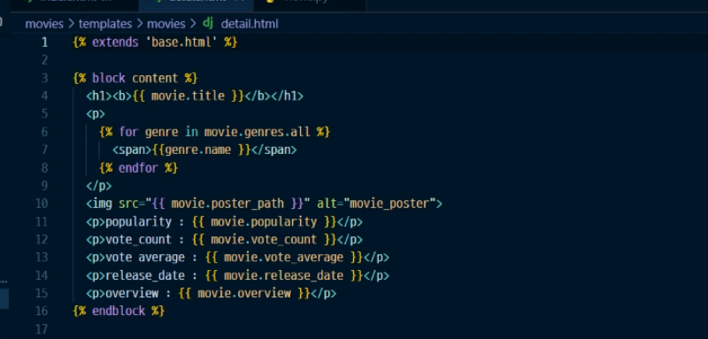

