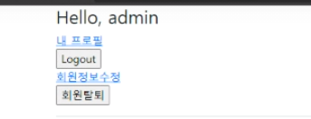
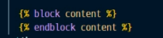
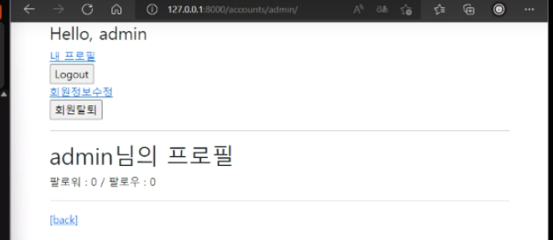
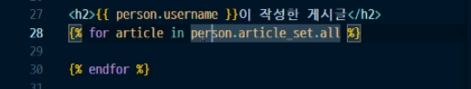
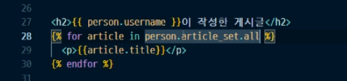
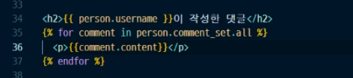
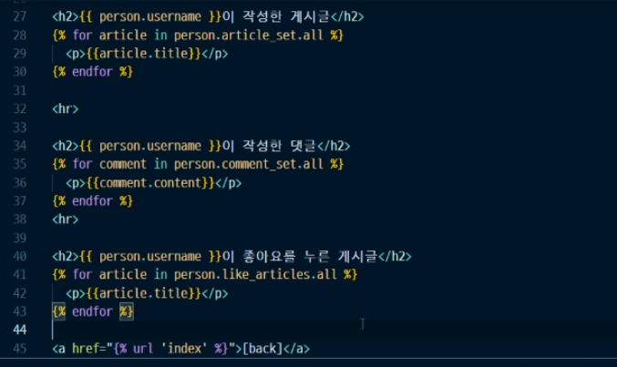
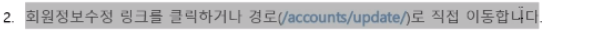
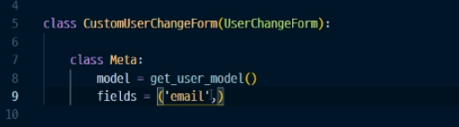

# 디버깅 예시

## 1. 회원정보에서 반환

if -else 이후에 반환되는게 뭔지 알고 있니? 

53~56 번째 줄 수정 (인덴테이션)

## 2. 로그인 진행

template 보고, view보고

---

1. `templates > profile.html`

2. view 이상없음

3. base.html  도 보고,  index.html도 이상없네

4. `templates > profile.html` 에 

이렇게 바꾸기 ! 바디로 되어있음

5. 여기까지의 결과 

6. 

`1.게시글 역참조를 할 수 있니?`

`2. 게시글 완성 코드` 

`3. 댓글 완성 코드` 

`4. 좋아요 코드 `

`5. 전체 코드`

---

## 3. 회원정보에서 이메일 주소만 바꾸게 설정해라!

