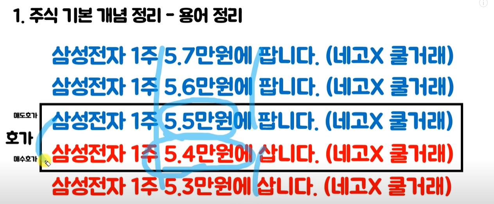
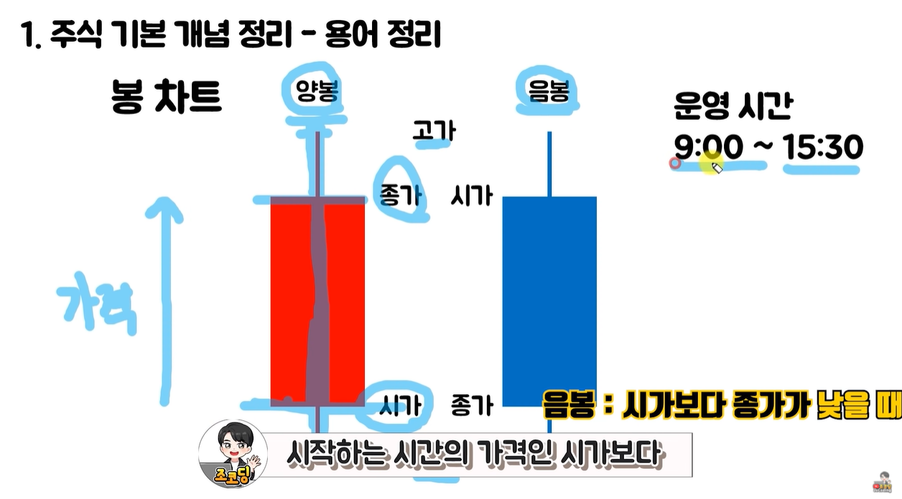
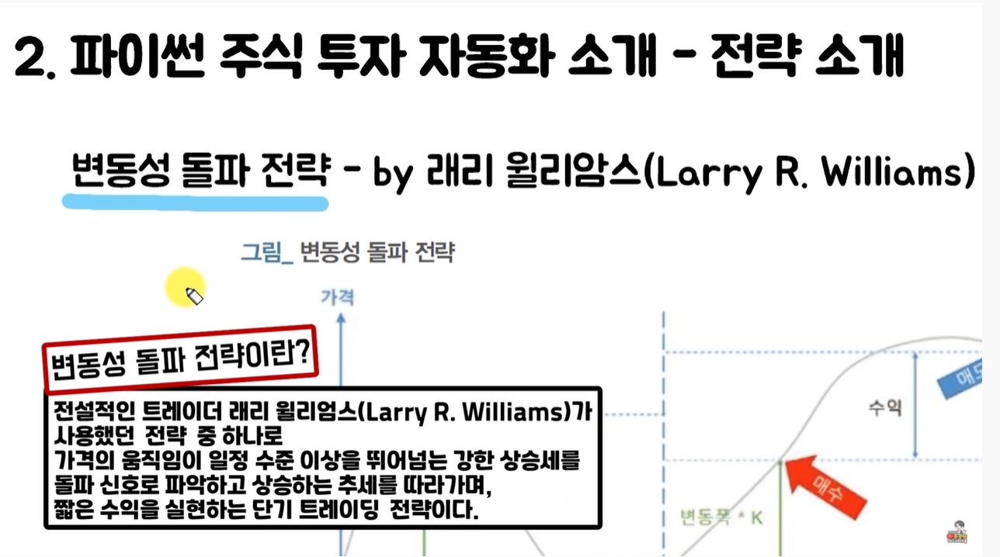
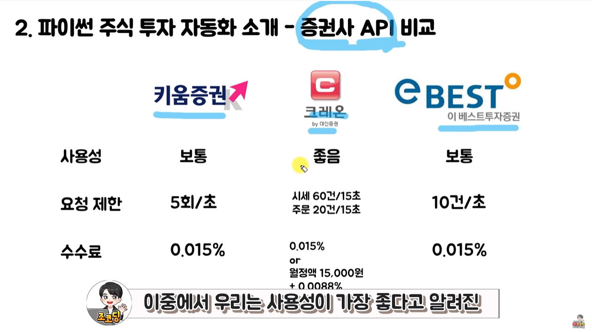
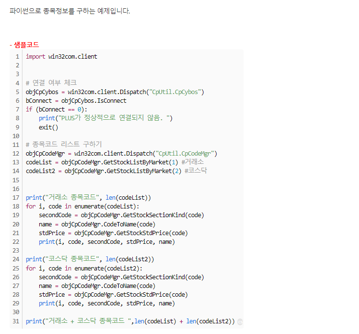
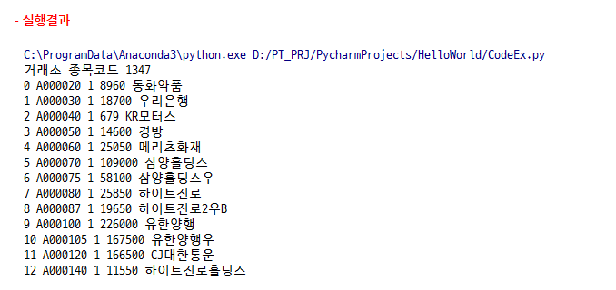
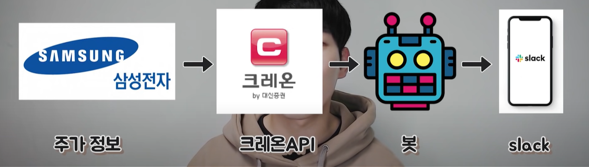
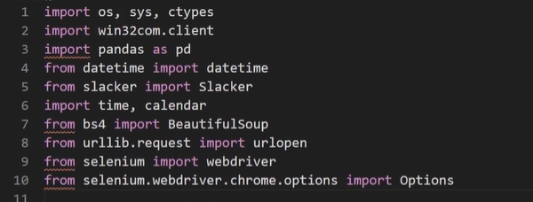
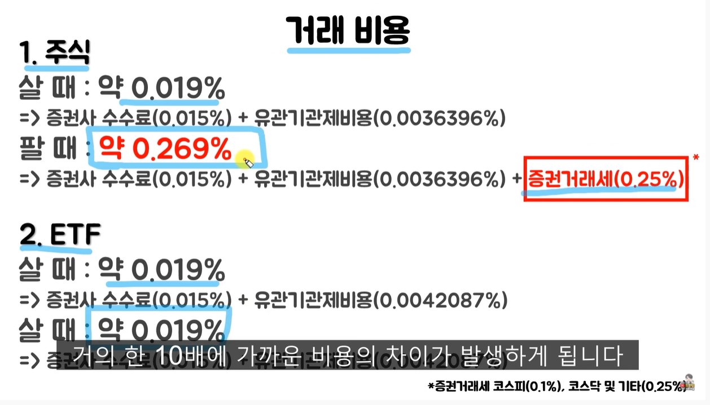
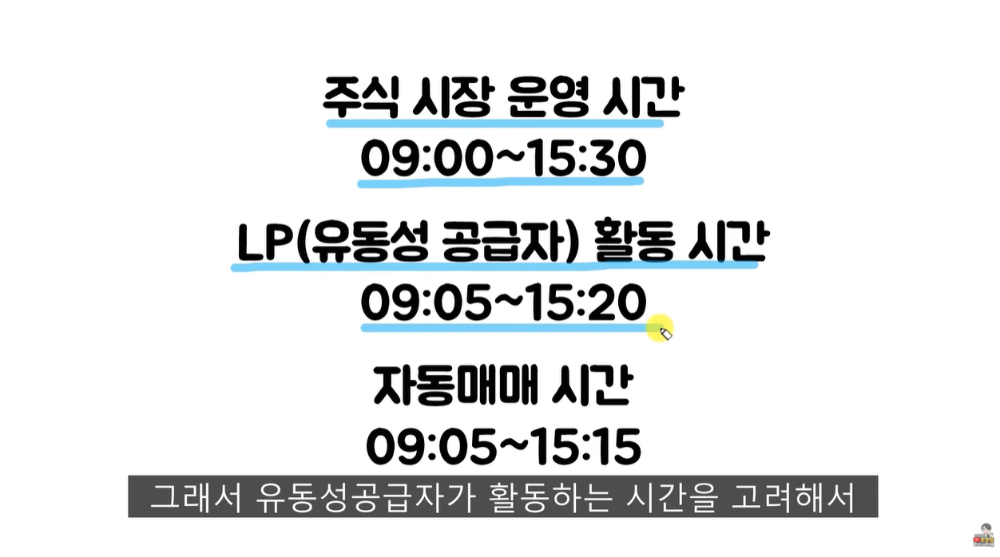

호가 : 부르는 가격

매도 호가 : 파는 것 중에 가장 싼 가격 (파란색)

매수 호가 : 사는 것 중에 가장 비싼 가격 (빨간색)

음봉 : 파란봉 

양봉 : 빨간봉

꼬리 : 최저가, 최고가

대신증권 크레온 API를 연결해놓고, 작업스케쥴러로 자동 매수/매도, 슬랙으로 알림을 주기

투자 전략 구현 - 변동성 돌파 전략 (전설적인 트레이더 래리 윌리엄스가 사용했던 전략 중 하나로 가격의 움직임이 일정 수준 이상을 뛰어넘는 강한 상승세를 돌파 신호로 파악하고 상승하는 추세를 따라가며, 짧은 수익을 실현하는 단기 트레이딩 전략)

사용성이 가장 좋다고 알려진 대신 증권의 크레온 api를 사용하기로 함

크레온 홈트레이드시스템(hts)설치 및 계좌개설

증권계좌 비대면 개설  

증권사 api는 윈도우 환경에서만 동작 (aws로 윈도우 서버를 빌릴 수도 있음)

https://www.creontrade.com/

✔️ 크레온 api를 사용하기 위해서는 윈도우환경에서만 동작하고, 파이썬 32bit를 설치해야한다.

✔️ 파이썬을 관리자 권한으로 실행함 --> win32com 모듈을 사용하기 위해 32bit를 설치한 것이었음

✔️ 크레온 api에서 주식종목, 주식현재가 조회 예제를 참고하여 

✔️ 이번에 싸피 스타트캠프에서 슬랙을 사용한 알림을 주고 받는 것을 보고 고도화시켜보았습니다.  

자동화된 bot을 만들어서 다른 외부 프로그램과 연계,  

✔️ Oauth Token

✔️ slacker 설치

✔️ 래리 윌리암스의 변동성 돌파 전략 :  어제 가장 높은 가격(고가), 저가를 변동폭이라고 보고 

오늘 시가를 기준으로 변동폭의 k배만큼 올랐을 때를 돌파신호로 판단하고 매수해줌.

종가에 무조건 매도하는 단기 트레이딩 전략,

✔️ 매수 매도가 자주 일어나게 되어 수수료나 비용, 세금 등이 중요할 수 있음

단기 트레이딩으로 자주 매매해야할 때는 증권거래세를 내는 주식보다는, 증권거래세를 내지 않는 etf가 훨씬 유리할 수 있음

✔️ get_stock_balance()로 보유한 모든 종목 조회

dddd

  
