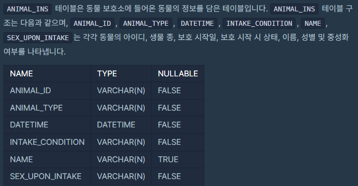
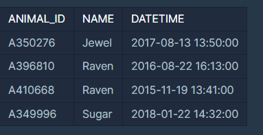

``` 
ANIMAL_INS 테이블은 동물 보호소에 들어온 동물의 정보를 담은 테이블입니다. ANIMAL_INS 테이블 구조는 다음과 같으며, ANIMAL_ID, ANIMAL_TYPE, DATETIME, INTAKE_CONDITION, NAME, SEX_UPON_INTAKE는 각각 동물의 아이디, 생물 종, 보호 시작일, 보호 시작 시 상태, 이름, 성별 및 중성화 여부를 나타냅니다.
```



>  모든 레코드 조회

``` mysql
SELECT * FROM ANIMAL_INS ORDER BY ANIMAL_ID
```


>  최댓값 구하기

``` mysql
SELECT MAX(DATETIME) FROM ANIMAL_INS 
```


> 이름이 없는 동물의 아이디

* NULL 값 찾을 때는 `is NULL`

``` mysql
SELECT ANIMAL_ID 
FROM ANIMAL_INS 
WHERE NAME is NULL
ORDER BY ANIMAL_ID
```


> 이름이 있는 동물의 아이디

* 동물 보호소에 들어온 동물 중, 이름이 있는 동물의 ID를 조회하는 SQL 문을 작성해주세요. 단, ID는 오름차순 정렬되어야 합니다.

``` mysql
SELECT ANIMAL_ID
FROM ANIMAL_INS
WHERE NAME IS NOT NULL
ORDER BY ANIMAL_ID
```


> 역순 정렬하기

* 동물 보호소에 들어온 모든 동물의 이름과 보호 시작일을 조회하는 SQL문을 작성해주세요. 이때 결과는 ANIMAL_ID 역순으로 보여주세요. SQL을 실행하면 다음과 같이 출력되어야 합니다.


알파벳도 오름차순은 A - Z 까지, 내림차순은 Z - A까지

* 역순 = DESC

``` mysql
SELECT NAME, DATETIME 
FROM ANIMAL_INS
ORDER BY ANIMAL_ID DESC;
```


> 아픈 동물 찾기

* 동물 보호소에 들어온 동물 중 아픈 동물[1](https://programmers.co.kr/learn/courses/30/lessons/59036#fn1)의 아이디와 이름을 조회하는 SQL 문을 작성해주세요. 이때 결과는 아이디 순으로 조회해주세요.

``` mysql
SELECT ANIMAL_ID, NAME
FROM ANIMAL_INS
WHERE INTAKE_CONDITION = 'SICK'
ORDER BY ANIMAL_ID
```


> 어린 동물 찾기

* `INTAKE_CONDITION`이 Aged가 아닌 경우를 뜻함

* `!=` 은 자동으로 `<>`으로 변환되지만, 보여주는 것을 위해서는 `<>`로 작성하는 것이 좋음 

``` mysql
SELECT ANIMAL_ID, NAME
FROM ANIMAL_INS
WHERE INTAKE_CONDITION <> 'Aged'
```


> 동물의 아이디와 이름

* 동물 보호소에 들어온 모든 동물의 아이디와 이름을 ANIMAL_ID순으로 조회하는 SQL문을 작성해주세요. SQL을 실행하면 다음과 같이 출력되어야 합니다.

``` mysql
SELECT ANIMAL_ID, NAME
FROM ANIMAL_INS
```


> 여러 기준으로 정렬하기

* 동물 보호소에 들어온 모든 동물의 아이디와 이름, 보호 시작일을 이름 순으로 조회하는 SQL문을 작성해주세요. 단, 이름이 같은 동물 중에서는 보호를 나중에 시작한 동물을 먼저 보여줘야 합니다.
* 이름을 사전 순으로 정렬하면 다음과 같으며, 'Jewel', 'Raven', 'Sugar'
* 'Raven'이라는 이름을 가진 개와 고양이가 있으므로, 이 중에서는 보호를 나중에 시작한 개를 먼저 조회합니다.



``` mysql
SELECT ANIMAL_ID, NAME, DATETIME
FROM ANIMAL_INS
ORDER BY NAME, DATETIME DESC;
```


> 상위 n개 레코드

동물 보호소에 가장 먼저 들어온 동물의 이름을 조회하는 SQL 문을 작성해주세요.

``` mysql
SELECT NAME
FROM ANIMAL_INS
ORDER BY DATETIME ASC
LIMIT 1;
```


