``` 
ANIMAL_INS 테이블은 동물 보호소에 들어온 동물의 정보를 담은 테이블입니다. ANIMAL_INS 테이블 구조는 다음과 같으며, ANIMAL_ID, ANIMAL_TYPE, DATETIME, INTAKE_CONDITION, NAME, SEX_UPON_INTAKE는 각각 동물의 아이디, 생물 종, 보호 시작일, 보호 시작 시 상태, 이름, 성별 및 중성화 여부를 나타냅니다.
```


> * 고양이와 개는 몇 마리 있을까
>
> 동물 보호소에 들어온 동물 중 고양이와 개가 각각 몇 마리인지 조회하는 SQL문을 작성해주세요. 
> 이때 고양이를 개보다 먼저 조회해주세요.

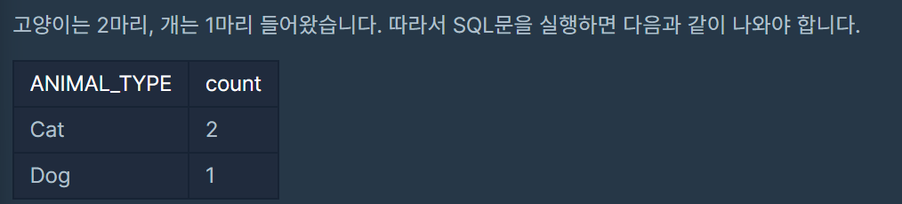

``` mysql
SELECT ANIMAL_TYPE, COUNT(ANIMAL_TYPE) as count
FROM ANIMAL_INS
GROUP BY ANIMAL_TYPE
ORDER BY ANIMAL_TYPE;
```


> * 루시와 엘라 찾기
>
> 동물 보호소에 들어온 동물 중 이름이 Lucy, Ella, Pickle, Rogan, Sabrina, Mitty인 동물의 아이디와 이름, 성별 및 중성화 여부를 조회하는 SQL 문을 작성해주세요. 이때 결과는 아이디 순으로 조회해주세요.
>
> 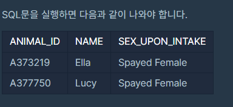

``` mysql
SELECT ANIMAL_ID, NAME, SEX_UPON_INTAKE
FROM ANIMAL_INS
WHERE NAME = 'Lucy' or NAME = 'Ella' or NAME = 'Pickle' or NAME = 'Rogan' or NAME = 'Sabrina' or NAME = 'Mitty'
ORDER BY ANIMAL_ID;
```


> - 최솟값 구하기
>
> 동물 보호소에 가장 먼저 들어온 동물은 언제 들어왔는지 조회하는 SQL 문을 작성해주세요.
>
> 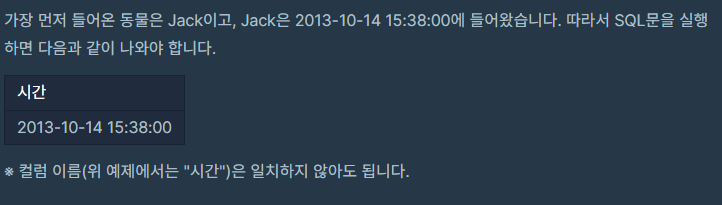

``` mysql
SELECT DATETIME as '시간'
FROM ANIMAL_INS
ORDER BY DATETIME
LIMIT 1;
```


> - 동명 동물 수 찾기
>
> 동물 보호소에 들어온 동물 이름 중 두 번 이상 쓰인 이름과 해당 이름이 쓰인 횟수를 조회하는 SQL문을 작성해주세요. 이때 결과는 이름이 없는 동물은 집계에서 제외하며, 결과는 이름 순으로 조회해주세요.
>
> 

``` mysql
SELECT NAME, COUNT(NAME) AS COUNT
FROM ANIMAL_INS
WHERE NAME IS NOT NULL
GROUP BY NAME
HAVING COUNT(NAME) > 1
ORDER BY NAME ASC;
```

* GROUP BY는 조건을 HAVING 절로 써야한다


> - 이름에 el이 들어가는 동물 찾기
>
> 동물 보호소에 들어온 동물 이름 중, 이름에 "EL"이 들어가는 개의 아이디와 이름을 조회하는 SQL문을 작성해주세요. 이때 결과는 이름 순으로 조회해주세요. 단, 이름의 대소문자는 구분하지 않습니다.
>
> 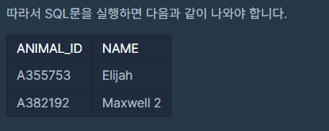

``` mysql
SELECT ANIMAL_ID, NAME 
FROM ANIMAL_INS
WHERE ANIMAL_TYPE = 'Dog'
AND UPPER(NAME) LIKE UPPER('%el%')
ORDER BY NAME
```

* MYSQL은 LIKE 로 검사시 대소문자 구분을 하지 않습니다.

``` mysql
SELECT ANIMAL_ID, NAME
FROM ANIMAL_INS 
WHERE ANIMAL_TYPE = "Dog" AND NAME LIKE "%EL%" 
ORDER BY NAME ASC
```


> - 중성화 여부 파악하기
>
> 중성화된 동물은 `SEX_UPON_INTAKE` 컬럼에 'Neutered' 또는 'Spayed'라는 단어가 들어있습니다. 동물의 아이디와 이름, 중성화 여부를 아이디 순으로 조회하는 SQL문을 작성해주세요. 이때 중성화가 되어있다면 'O', 아니라면 'X'라고 표시해주세요.
>
> 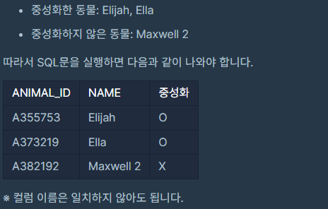

``` mysql
SELECT ANIMAL_ID, NAME, 
CASE WHEN SEX_UPON_INTAKE LIKE "%NE%" 
OR SEX_UPON_INTAKE LIKE "SP%"
THEN 'O' ELSE 'X' 
END AS "중성화 여부" 
FROM ANIMAL_INS
```

* case문은 조건에 따라 값을 정한다

CASE WHEN ~~~~ THEN

``` mysql
CASE 컬럼  

WHEN 조건1 THEN 값1 

WHEN 조건2 THEN 값2 

ELSE 값3 

END `필드이름`
```

* 컬럼이 조건1 일때는 값1 을 조건2일때는 값2를 반환하고 조건에 맞지 않는 경우에는 값3 을 반환하는것

  


> - 동물 수 구하기
>
>  동물 보호소에 동물이 몇 마리 들어왔는지 조회하는 SQL 문을 작성해주세요.
>
> 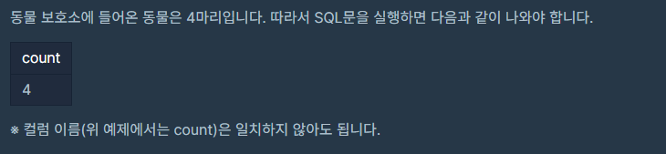

``` mysql
SELECT COUNT(ANIMAL_ID) as count
FROM ANIMAL_INS;
```


> - NULL 처리하기
>
> 입양 게시판에 동물 정보를 게시하려 합니다. 동물의 생물 종, 이름, 성별 및 중성화 여부를 아이디 순으로 조회하는 SQL문을 작성해주세요. 이때 프로그래밍을 모르는 사람들은 NULL이라는 기호를 모르기 때문에, 이름이 없는 동물의 이름은 "No name"으로 표시해 주세요.
>
> 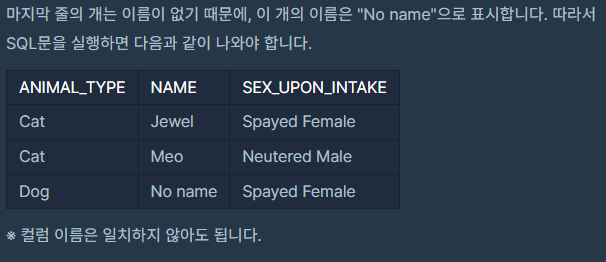

``` mysql
SELECT ANIMAL_TYPE, IFNULL(NAME, "No name") AS NAME, SEX_UPON_INTAKE 
FROM ANIMAL_INS
```

* IFNULL(`검사할값` ,  `조건에 부합하면 출력할 내용`)


> - 중복 제거하기
>
> 동물 보호소에 들어온 동물의 이름은 몇 개인지 조회하는 SQL 문을 작성해주세요. 이때 이름이 NULL인 경우는 집계하지 않으며 중복되는 이름은 하나로 칩니다.
>
> 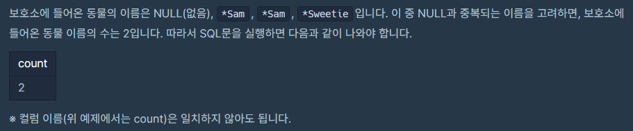

```mysql
```


> - DATETIME에서 DATE로 형 변환
>
> `ANIMAL_INS` 테이블에 등록된 모든 레코드에 대해, 각 동물의 아이디와 이름, 들어온 날짜[1](https://programmers.co.kr/learn/courses/30/lessons/59414#fn1)를 조회하는 SQL문을 작성해주세요. 이때 결과는 아이디 순으로 조회해야 합니다.
>
> 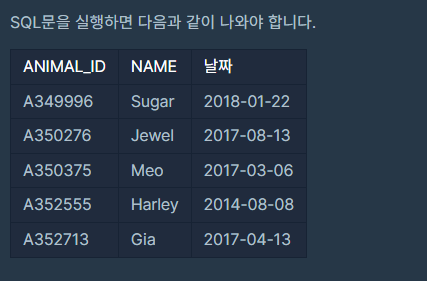

``` mysql

```


----

## 새로운 테이블 ANIMAL_OUTS

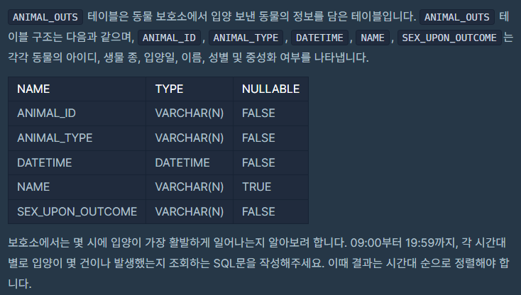


> - 입양 시각 구하기(1)
>
> 보호소에서는 몇 시에 입양이 가장 활발하게 일어나는지 알아보려 합니다. 09:00부터 19:59까지, 각 시간대별로 입양이 몇 건이나 발생했는지 조회하는 SQL문을 작성해주세요. 이때 결과는 시간대 순으로 정렬해야 합니다.
>
> 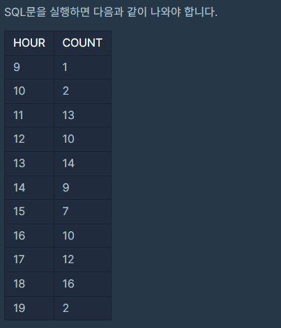

``` mysql
SELECT HOUR(DATETIME) AS 'HOUR', COUNT(HOUR(DATETIME)) AS 'COUNT' 
FROM ANIMAL_OUTS 
WHERE HOUR(DATETIME) >= 9 AND HOUR(DATETIME) <= 19 
GROUP BY HOUR(DATETIME) 
ORDER BY HOUR(DATETIME)
```

시간대 별로 구분을 해야하기 때문에 HOUR를 이용해야합니다.

HOUR에 DATETIME을 넣어주면 시간만 뽑아줍니다.


