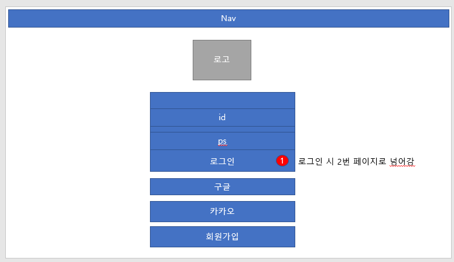
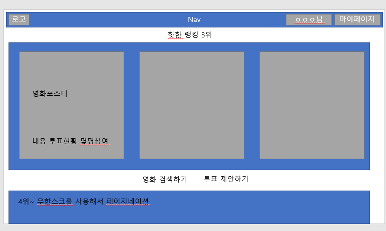

프로젝트 : movieproject

앱 : Account, Community , Movie 


`앱 : 테이블`

account : User

Community : Article, Comment, Choice, Vote

Movie : Genre, Movie

----





----


---

시나리오 : 

* tmbi api를 통해서 영화의 장르, 각 영화를 받아와야한다.
* 사용자가 사이트에서 영화를 검색할 수 있다. 
* 장르로 영화를 추천받을 수 있다.

* 유저는 회원가입, 로그인을 통해 영화 게시물을 작성할 수 있다. (구글api 로그인 기능을 사용할 수 있음)

* 유저는 회원 정보를 수정할 수 있다.

  

* 게시물의 내용은 A / B를 투표하는 것으로, 제목,  A / B에 대한 내용, 사진이 들어간다. (제목, 내용은 필수 / 사진은 없다면, 기본 값) - 관련 테이블 `community > models.py`

* 게시물은 쓴 사람만 지울 수 있다.

* 한명의 유저는 여러개의 게시물에 [좋아요 버튼]을 누를 수 있다. - 토글 가능

* 하나의 게시글에는 여러개의 댓글을 알 수 있고 대댓글을 달 수 있다.

* 댓글도 쓴 사람만 지울 수 있다.


``` python
# account > models.py

from django.db import models
from django.contrib.auth.models import AbstractUser

class User(AbstractUser):
    pass

```


``` python
# community > models.py

from django.conf import settings
from django.db import models
from movies.models import Movie

class Article(models.Model):
    user = models.ForeignKey(settings.AUTH_USER_MODEL, on_delete=models.CASCADE, related_name='articles')
    title = models.CharField(max_length=100)
    movie = models.ForeignKey(Movie, on_delete=models.CASCADE, related_name='articles')
    like_user = models.ManyToManyField(settings.AUTH_USER_MODEL, related_name='like_articles')
    created_at = models.DateTimeField(auto_now_add=True)
    updated_at = models.DateTimeField(auto_now=True)
    #content_a = models.TextField()
    #content_b = models.TextField()
    #img_a = models.ImageField(upload_to="", blank=True) # 기본 이미지도 주고 싶은데..
    #img_b = models.ImageField(upload_to="", blank=True) # 기본 이미지도 주고 싶은데..
    
    def __str__(self):
        return self.title

class Comment(models.Model):
    user = models.ForeignKey(settings.AUTH_USER_MODEL, on_delete=models.CASCADE, related_name='comments')
    article = models.ForeignKey(Article, on_delete=models.CASCADE, related_name='comments')
    content = models.CharField(max_length=200)
    # 대댓글 => reply = models.ForeignKey('self', on_delete = models.SET_NULL, null=True)
    created_at = models.DateTimeField(auto_now_add=True)
    updated_at = models.DateTimeField(auto_now=True)

    def __str__(self):
        return self.content


# 투표에 대한 선택
class Choice(models.Model):
    article = models.ForeignKey(Article, on_delete=models.CASCADE, related_name='choices')
    content = models.CharField(max_length=100)
    img = models.TextField()


# 투표 데이터
class Vote(models.Model):
    user = models.ForeignKey(settings.AUTH_USER_MODEL, on_delete=models.CASCADE, related_name='votes')
    article = models.ForeignKey(Article, on_delete=models.CASCADE, related_name='votes')
    chioce = models.ForeignKey(Choice, on_delete=models.CASCADE)


```


``` python
from django.db import models
from community.models import Article

class Genre(models.Model):
    genre_code = models.IntegerField()
    genre = models.CharField(max_length=100)

    def __str__(self):
        return self.genre


class Movie(models.Model):
    title = models.CharField(max_length=100)
    overview = models.TextField()
    release_date = models.DateTimeField()
    poster_path = models.URLField(null=True, blank=True)
    article = models.ForeignKey(Article, on_delete=models.CASCADE, related_name='movies')
    genre = models.ManyToManyField(Genre, blank=True, related_name='movies')
    
    def __str__(self):
        return self.title

```

