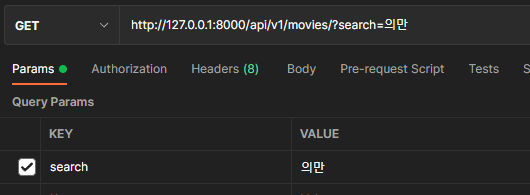

# api

토큰 : 3e75738bf0e9c651209fa8aa73eb1b4bed98f51c

## account

><POST> api/v1/accounts/signup/

요청

``` json
{
    "username" : "test",
    "password1": "test1234test",
    "password2": "test1234test"
}
```

응답 

``` json
{
    "key": "00ba4a6e8162820c4da84af520f1e9fec80c555f"
}
```


> <POST> api/v1/accounts/login/

요청

``` json
{
    "username" : "test",
    "password": "test1234test"
}
```

응답

``` json
{
    "key": "00ba4a6e8162820c4da84af520f1e9fec80c555f"
}
```


## community

> <GET> api/v1/community/article/

요청

``` json

```

응답 

``` json
[
    {
        "pk": 2,
        "user": {
            "pk": 2,
            "username": "test"
        },
        "title": "test가 만든 제목1",
        "movie": {
            "title": "아바타",
            "overview": "가까운 미래, 지구는 에너지 고갈 문제를 해결하기 위해 머나먼 행성 판도라에서 대체 자원을 채굴하기 시작한다. 하지만 판도라의 독성을 지닌 대기로 인해 자원 획득에 어려움을 겪게 된 인류는 판도라의 토착민 나비의 외형에 인간의 의식을 주입, 원격 조종이 가능한 새로운 생명체를 탄생시키는 프로그램을 개발한다. 한편 하반신이 마비된 전직 해병대원 제이크 설리는 아바타 프로그램에 참가할 것을 제안받는다. 그 곳에서 자신의 아바타를 통해 자유롭게 걸을 수 있게 된 제이크는 자원 채굴을 막으려는 나비의 무리에 침투하라는 임무를 부여받는데...",
            "release_date": "2009-12-10",
            "vote_average": 7.5,
            "poster_path": "/zygmx5abXeDpr3fWYX4jlXFZ1wh.jpg",
            "genre": "['액션', '모험', '판타지', 'SF']"
        },
        "comment_count": 0,
        "like_count": 0
    },
    {
        "pk": 1,
        "user": {
            "pk": 1,
            "username": "admin"
        },
        "title": "admin이 만든 게시글 1",
        "movie": {
            "title": "언차티드",
            "overview": "평범한 삶을 살던 네이선은 인생을 바꿀 뜻밖의 제안을 받는다. 그의 미션은 크루와 함께 사라진 형과 500년 전 잃어버린 천문학적인 가치를 지닌 트레져를 찾아내는 것. 그러나 몬카다의 위협 속, 누구보다 빠르게 미지의 세계에 닿기 위해 결단을 내려야만 하는데…",
            "release_date": "2022-02-10",
            "vote_average": 7.2,
            "poster_path": "/2R8smeSDkPx6TKIRveKPXi0JVI6.jpg",
            "genre": "['액션', '모험']"
        },
        "comment_count": 0,
        "like_count": 0
    }
]
```


> <post> api/v1/community/article/create_article/

요청

``` json
{
    "movie_pk": 19995,
    "title": "test가 만든 제목1",
    "choices": [
        {
            "content": "선택1",
            "img": "file"
        },
        {
            "content": "선택2",
            "img": "file"
        }
    ]
    
}
```

응답 

``` json
{
    "pk": 2,
    "user": {
        "pk": 2,
        "username": "test"
    },
    "title": "test가 만든 제목1",
    "movie": {
        "title": "아바타",
        "overview": "가까운 미래, 지구는 에너지 고갈 문제를 해결하기 위해 머나먼 행성 판도라에서 대체 자원을 채굴하기 시작한다. 하지만 판도라의 독성을 지닌 대기로 인해 자원 획득에 어려움을 겪게 된 인류는 판도라의 토착민 나비의 외형에 인간의 의식을 주입, 원격 조종이 가능한 새로운 생명체를 탄생시키는 프로그램을 개발한다. 한편 하반신이 마비된 전직 해병대원 제이크 설리는 아바타 프로그램에 참가할 것을 제안받는다. 그 곳에서 자신의 아바타를 통해 자유롭게 걸을 수 있게 된 제이크는 자원 채굴을 막으려는 나비의 무리에 침투하라는 임무를 부여받는데...",
        "release_date": "2009-12-10",
        "vote_average": 7.5,
        "poster_path": "/zygmx5abXeDpr3fWYX4jlXFZ1wh.jpg",
        "genre": "['액션', '모험', '판타지', 'SF']"
    },
    "choices": [
        {
            "article": {
                "pk": 2,
                "user": {
                    "pk": 2,
                    "username": "test"
                },
                "title": "test가 만든 제목1",
                "movie": {
                    "title": "아바타",
                    "overview": "가까운 미래, 지구는 에너지 고갈 문제를 해결하기 위해 머나먼 행성 판도라에서 대체 자원을 채굴하기 시작한다. 하지만 판도라의 독성을 지닌 대기로 인해 자원 획득에 어려움을 겪게 된 인류는 판도라의 토착민 나비의 외형에 인간의 의식을 주입, 원격 조종이 가능한 새로운 생명체를 탄생시키는 프로그램을 개발한다. 한편 하반신이 마비된 전직 해병대원 제이크 설리는 아바타 프로그램에 참가할 것을 제안받는다. 그 곳에서 자신의 아바타를 통해 자유롭게 걸을 수 있게 된 제이크는 자원 채굴을 막으려는 나비의 무리에 침투하라는 임무를 부여받는데...",
                    "release_date": "2009-12-10",
                    "vote_average": 7.5,
                    "poster_path": "/zygmx5abXeDpr3fWYX4jlXFZ1wh.jpg",
                    "genre": "['액션', '모험', '판타지', 'SF']"
                },
                "comment_count": 0,
                "like_count": 0
            },
            "content": "선택1",
            "img": "/media/file"
        },
        {
            "article": {
                "pk": 2,
                "user": {
                    "pk": 2,
                    "username": "test"
                },
                "title": "test가 만든 제목1",
                "movie": {
                    "title": "아바타",
                    "overview": "가까운 미래, 지구는 에너지 고갈 문제를 해결하기 위해 머나먼 행성 판도라에서 대체 자원을 채굴하기 시작한다. 하지만 판도라의 독성을 지닌 대기로 인해 자원 획득에 어려움을 겪게 된 인류는 판도라의 토착민 나비의 외형에 인간의 의식을 주입, 원격 조종이 가능한 새로운 생명체를 탄생시키는 프로그램을 개발한다. 한편 하반신이 마비된 전직 해병대원 제이크 설리는 아바타 프로그램에 참가할 것을 제안받는다. 그 곳에서 자신의 아바타를 통해 자유롭게 걸을 수 있게 된 제이크는 자원 채굴을 막으려는 나비의 무리에 침투하라는 임무를 부여받는데...",
                    "release_date": "2009-12-10",
                    "vote_average": 7.5,
                    "poster_path": "/zygmx5abXeDpr3fWYX4jlXFZ1wh.jpg",
                    "genre": "['액션', '모험', '판타지', 'SF']"
                },
                "comment_count": 0,
                "like_count": 0
            },
            "content": "선택2",
            "img": "/media/file"
        }
    ],
    "comments": []
}
```


> <GET> api/v1/community/article/<int:article_pk>/

요청 params로 criteria value 값을 pk, vote, like_count 

```json
http://127.0.0.1:8000/api/v1/community/article/?criteria=votes
```

응답

``` json
[
    {
        "pk": 3,
        "user": {
            "pk": 1,
            "username": "admin"
        },
        "title": "안녕하세요",
        "movie": {
            "title": "씽2게더",
            "overview": "대국민 오디션 이후 각자의 자리에서 꿈을 이루고 있는 버스터 문(매튜 맥커너히)과 크루들에게 레드 쇼어 시티에서 전 세계가 주목하는 사상 최고의 쇼가 펼쳐진다는 소식이 들려오고 버스터 문과 크루들은 도전에 나선다. 그러나 최고의 스테이지에 서기 위한 경쟁은 이전과는 비교도 할 수 없을 만큼 치열하고, 버스터 문은 완벽한 라이브를 위해 종적을 감춘 레전드 뮤지션 클레이(보노)를 캐스팅하겠다는 파격 선언을 하는데!",
            "release_date": "2021-12-01",
            "vote_average": 8.1,
            "poster_path": "/xe8dVB2QiCxLWFV77V4dpZcOvYB.jpg",
            "genre": "['애니메이션', '코미디', '가족', '음악']"
        },
        "comment_count": 0,
        "like_count": 0,
        "vote_count": 1
    },
    {
        "pk": 1,
        "user": {
            "pk": 1,
            "username": "admin"
        },
        "title": "admin ㅇㅇㅇ admin 게시물을 test가 만든 제목 변경합니다",
        "movie": {
            "title": "아바타",
            "overview": "가까운 미래, 지구는 에너지 고갈 문제를 해결하기 위해 머나먼 행성 판도라에서 대체 자원을 채굴하기 시작한다. 하지만 판도라의 독성을 지닌 대기로 인해 자원 획득에 어려움을 겪게 된 인류는 판도라의 토착민 나비의 외형에 인간의 의식을 주입, 원격 조종이 가능한 새로운 생명체를 탄생시키는 프로그램을 개발한다. 한편 하반신이 마비된 전직 해병대원 제이크 설리는 아바타 프로그램에 참가할 것을 제안받는다. 그 곳에서 자신의 아바타를 통해 자유롭게 걸을 수 있게 된 제이크는 자원 채굴을 막으려는 나비의 무리에 침투하라는 임무를 부여받는데...",
            "release_date": "2009-12-10",
            "vote_average": 7.5,
            "poster_path": "/zygmx5abXeDpr3fWYX4jlXFZ1wh.jpg",
            "genre": "['액션', '모험', '판타지', 'SF']"
        },
        "comment_count": 2,
        "like_count": 1,
        "vote_count": 0
    }
]
```


> <PUT> api/v1/community/article/<int:article_pk>/

요청

``` json
{
    "movie_pk" : "19995",
    "title": "해당 사용자 정보 보고, 게시물을 test가 만든 제목 변경합니다",
    "choices": [
        {
            "content": "선택지도 변경",
            "img": "file"
        },
        {
            "content": "선택지도 변경2",
            "img": "file"
        }
    ]
    
}
```

응답 

``` json
{
    "result": {
        "message": "수정되었습니다. "
    }
}
```


> <DELETE> api/v1/community/article/<int:article_pk>/

요청

``` json

```

응답 

``` json
# 게시물 사용자와 reqeust.user가 다를 때
{
    "error": "접근 권한이 없습니다."
}

# 게시물 사용자와 request.user가 같을 때
{
    "delete": "게시글 [test]이 삭제되었습니다."
}
```


> <POST> api/v1/community/article/<int:article_pk>/like/

요청

``` json

```

응답 

``` json
{
    "meesage": "게시글 admin ㅇㅇㅇ admin 게시물을 test가 만든 제목 변경합니다에 '좋아요'가 되었습니다."
}


{
    "meesage": "게시글 admin ㅇㅇㅇ admin 게시물을 test가 만든 제목 변경합니다에 '좋아요'가 취소되었습니다."
}
```


> <POST> api/v1/community/article/<int:article_pk>/comments/

요청

``` json
{
    "content" : "댓글 추가하기"
}
```

응답 

``` json
{
    "pk": 1,
    "user": {
        "pk": 2,
        "username": "test"
    },
    "content": "댓글 추가하기",
    "article": {
        "movie_title": "아바타",
        "title": "admin ㅇㅇㅇ admin 게시물을 test가 만든 제목 변경합니다",
        "created_at": "2022-05-23T13:14:43.497654+09:00"
    }
}
```


> <GET> api/v1/community/article/<int:article_pk>/comments/comment_list/

요청

``` json

```

응답 

``` json
[
    {
        "pk": 2,
        "user": {
            "pk": 2,
            "username": "test"
        },
        "content": "댓글2개째생성",
        "article": {
            "movie_title": "아바타",
            "title": "admin ㅇㅇㅇ admin 게시물을 test가 만든 제목 변경합니다",
            "created_at": "2022-05-23T13:14:43.497654+09:00"
        }
    },
    {
        "pk": 1,
        "user": {
            "pk": 2,
            "username": "test"
        },
        "content": "댓글 추가하기",
        "article": {
            "movie_title": "아바타",
            "title": "admin ㅇㅇㅇ admin 게시물을 test가 만든 제목 변경합니다",
            "created_at": "2022-05-23T13:14:43.497654+09:00"
        }
    }
]
```


> <PUT> api/v1/community/article/<int:article_pk>/comments/<int:comment_pk>/

요청

``` json
{
    "content" : "댓글 수정하기"
}
```

응답 

``` json
{
    "pk": 1,
    "user": {
        "pk": 2,
        "username": "test"
    },
    "content": "댓글 수정하기",
    "article": {
        "movie_title": "아바타",
        "title": "admin ㅇㅇㅇ admin 게시물을 test가 만든 제목 변경합니다",
        "created_at": "2022-05-23T13:14:43.497654+09:00"
    }
}
```


> <DELETE> api/v1/community/article/<int:article_pk>/comments/<int:comment_pk>/

요청

``` json

```

응답 

``` json
{
    "delete": "1번 댓글이 삭제되었습니다"
}
```


> <post> api/v1/community/article/<int:article_pk>/comments/<int:comment_pk>/like/

요청

``` json
```

응답 

``` json
{
    "meesage": "댓글 [admin이 쓴 댓글임]에 '좋아요'가 되었습니다."
}


{
    "meesage": "댓글 [admin이 쓴 댓글임]에 '좋아요'가 취소되었습니다."
}
```


> <POST> /api/v1/community/article/<article_pk>/vote/

요청

``` json
{
    "choice" : "int"
}
```

응답

``` json
{
    "message": "1에 대한 투표가 완료되었습니다!"
}


{
    "message": "이미 투표를 완료했습니다!"
}
```


----

## movies/

> <GET> /api/v1/movies/?search=

요청 예시




응답

``` json
[
    {
        "title": "배신의 만찬",
        "overview": "CIA 요원이자 전 연인(크리스 파인, 탠디 뉴턴)이 구출 임무를 실패하고 몇 년이 지난 뒤 재회하고, 업무와 개인적인 감정을 구분하지 못한다. 국제 스파이 행위, 도덕적 딜레마, 그리고 치명적인 배신을 다룬 눈을 뗄 수 없는 이야기다.",
        "release_date": "2022-04-08",
        "vote_average": 6.0,
        "poster_path": "/g4tMniKxol1TBJrHlAtiDjjlx4Q.jpg",
        "genre": "['스릴러', '액션']"
    }
]
```

