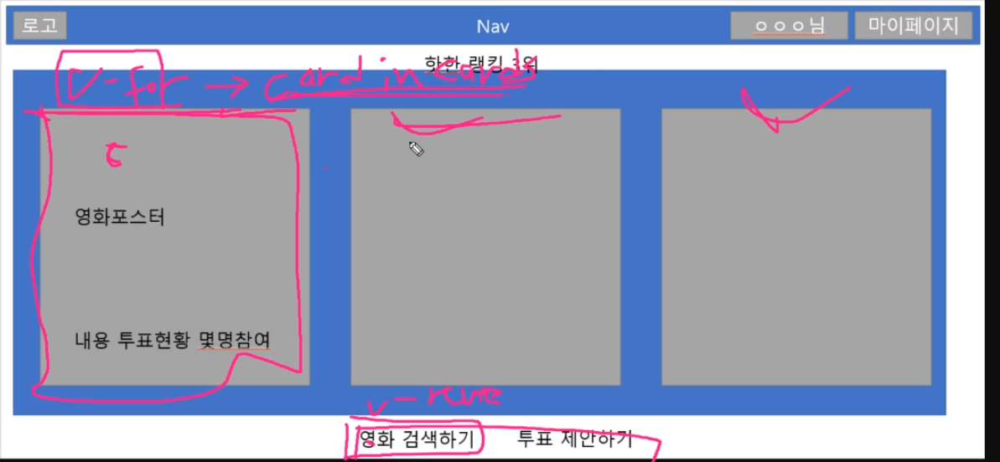
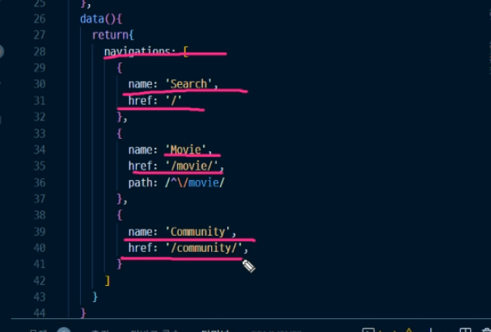
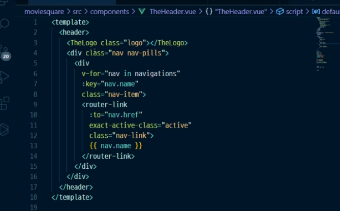
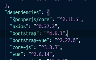
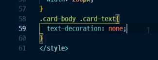

nav d-flex justify-content-between

align-items-around 

container : 안에 들어있는 내용에 따라 크기가 달라짐 (같은 비율로 늘어나고 줄어들게끔)

h1 mg-0 


가로배열

d-flex / inline-block (가로로 쌓임)





^\ (정규표현식) 아이디에 맞춰서 이동됨



nav-pills 


set. timeout

lodash sample

----


flex-direction 정렬방향 : row, row-reverse, column, column-reverse


ㅋㅋㅋㅋㅋㅋㅋ




댓글삭제, 영화 검색, 게시글 검색,

게시글 업데이트,

추천


부트스트랩 뷰 2.22.0

부트스트랩 4.6.1ㅇㅇㅇㅇㅇ

``` css
# 마우스 올렸을 때 색깔 바꾸기

a: hover {
    color : 색깔
}


# 밑줄 색 지우기
text-decoration : none;

# 

```


$ npm install package.json --


```
$ npm install bootstrap -v  4.6.1
npm install bootstrap -Version 4.6.1
```

```
npm install vue bootstrap-vue -v 2.22.0 bootstrap -v 4.6.1
```