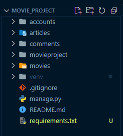
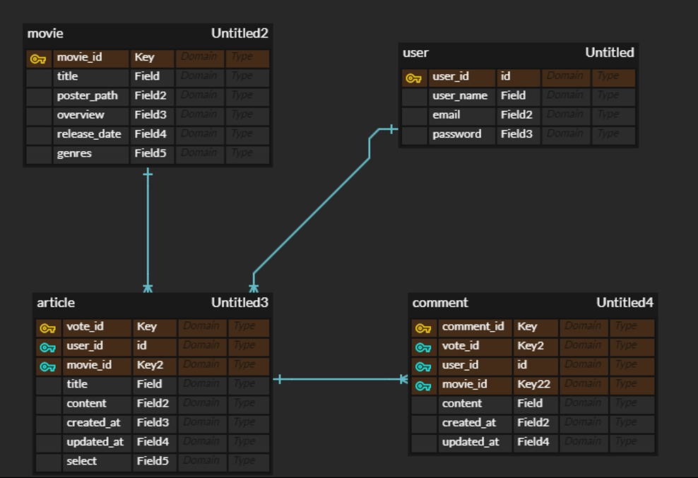
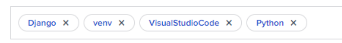

# `movieproject` 진행과정

## `backend` - Django drf

### [0] 프로젝트, 앱 구조, branch 이름 등

* 프로젝트 `movieproject`
  * 앱 `accounts` , `articles` `comments`, `movies` 

###  


* DB




* branch 
  * backend : 백앤드 branch 
  * backend-dev : 백앤드 개발 중인 branch 
  * frontend : 프론트앤드 branch 
  * frontend-dev : 프론트앤드 개발 중인 branch 


---

### [1] 가상환경 설정, 패키지 설치, 프로젝트 시작, gitignore 

``` bash
$ python -m venv venv

$ source venv/Scripts/activate

$ pip install -r requirements.txt

$ pip freeze > requirements.txt

$ django-admin startproject movieproject .

$ touch .gitignore
```

* [gitignoreio](https://www.toptal.com/developers/gitignore/api/django,venv,visualstudiocode,python) 사이트 파일 저장 


### [2] git init, add, branch 설정 (참고 코드)

``` bash
$ git init

$ git add .

$ git commit -m "Init django project"

# branch 확인 
$ git branch

# git branch `브랜치이름`
$ git branch backend

# backend 브랜치로 이동 (backend)
$ git checkout backend
```


### [3] `movieproject > settings.py` 

* INSTALLED_APPS 

``` python
INSTALLED_APPS = [
    # local apps
    'accounts',
    'articles',
    'comments',
    'movies',

    # 3rd party apps
    'django_extensions',
    'rest_framework',

    # django native apps
    'django.contrib.admin',
    'django.contrib.auth',
    'django.contrib.contenttypes',
    'django.contrib.sessions',
    'django.contrib.messages',
    'django.contrib.staticfiles',
]
```

* LANGUAGE_CODE, TIME_ZONE

``` python
LANGUAGE_CODE = 'ko-kr'

TIME_ZONE = 'Asia/Seoul'
```

* AUTH_USER_MODEL

``` python
AUTH_USER_MODEL = 'accounts.User'
```


### [4] makemigrations, migrate, createupseruser

```  bash
$ python manage.py makemigrations

$ python manage.py migrate

$ python manage.py createsuperuser
```


### [5] `admin`

* `accounts > admin.py`

``` python
from django.contrib import admin
from .models import User

admin.site.register(User)
```

* `articles > admin.py`

``` python
from django.contrib import admin
from .models import Article, Comment

admin.site.register(Article)
admin.site.register(Comment)
```

* `movies > admin.py`

``` python
from django.contrib import admin
from .models import Movie

admin.site.register(Movie)
```


### [6] `urls`

*  `movieproject > urls.py`

``` python
from django.contrib import admin
from django.urls import path, include

urlpatterns = [
    path('admin/', admin.site.urls),
    path('api/v1/articles/', include('articles.urls')),
    path('api/v1/accounts/', include('accounts.urls')),
]
```

* `accounts > urls.py`


* `articles > urls.py`


* `comments > urls.py`


* `movies > urls.py`


